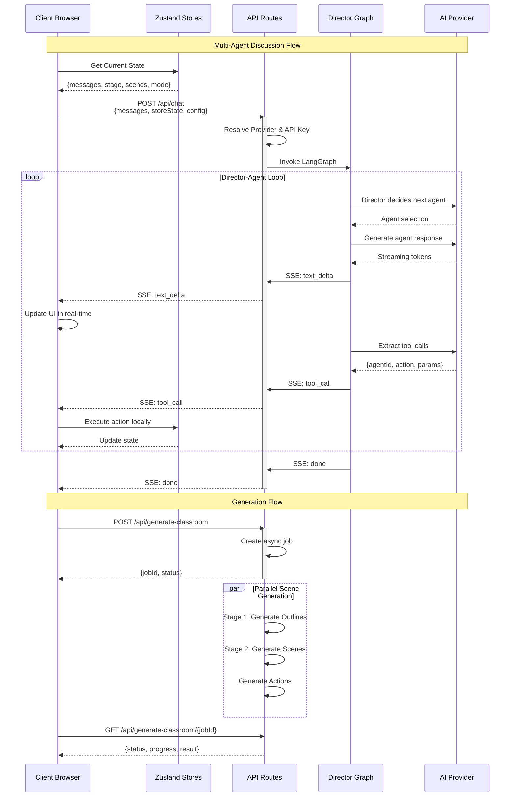

# Architecture Overview

## 1. High-Level Architecture

### 1.1 System Architecture Description

OpenMAIC is a sophisticated AI-powered interactive classroom platform built on **Next.js 16** with **React 19** and **TypeScript 5**. The architecture follows a **stateless server design** with a rich client-side state management system, enabling seamless multi-agent orchestration and real-time classroom experiences.

The system is organized into three primary architectural layers:

1. **Presentation Layer** (React Components): UI components built with Radix UI primitives and Tailwind CSS 4
2. **Business Logic Layer** (lib/): Core domain logic including generation, orchestration, playback, and action engines
3. **Data Layer** (Zustand Stores): Client-side state management with persistent storage

### 1.2 Client-Server Separation (Stateless Design)

OpenMAIC implements a **strictly stateless server architecture** where all session state is maintained on the client:

#### Server-Side Responsibilities
- **API Route Handlers** (`app/api/`): Stateless endpoints that process requests and return responses
- **Generation Pipeline**: Two-stage content generation (outlines → scenes)
- **Multi-Agent Orchestration**: LangGraph-based director pattern for agent coordination
- **Provider Abstraction**: Unified interface for multiple LLM providers (OpenAI, Anthropic, Google, etc.)

#### Client-Side Responsibilities
- **State Management**: Zustand stores manage all application state (stage, scenes, canvas, settings)
- **Playback Engine**: State machine controlling lecture playback and live interaction
- **Action Engine**: Executes agent actions (speech, whiteboard, effects)
- **UI Rendering**: React components with ProseMirror for rich text editing

#### Stateless Communication Pattern
```typescript
// Client sends full state with each request
interface StatelessChatRequest {
  messages: UIMessage[];              // Conversation history
  storeState: {                        // Current application state
    stage: Stage;
    scenes: Scene[];
    currentSceneId: string;
    mode: 'autonomous' | 'playback';
  };
  config: {
    agentIds: string[];
    sessionType?: 'discussion' | 'roundtable' | 'qa';
  };
  apiKey: string;
  baseUrl?: string;
  model?: string;
}

// Server returns SSE stream of events
interface StatelessEvent {
  type: 'text_delta' | 'tool_call' | 'agent_end' | 'done';
  data: unknown;
}
```

**Key Benefits of Stateless Design:**
- **Horizontal Scalability**: No server-side session state to synchronize
- **Simplified Deployment**: Easy containerization and serverless deployment
- **Resilience**: Server failures don't lose session state
- **Flexibility**: Clients can reconnect to any server instance

### 1.3 Component Relationships

The system consists of several interconnected subsystems:

```
┌─────────────────────────────────────────────────────────────┐
│                     Client Browser                           │
│  ┌───────────────────────────────────────────────────────┐  │
│  │              React Components (UI)                     │  │
│  │  ┌──────────────┐  ┌──────────────┐  ┌────────────┐  │  │
│  │  │ Slide Editor │  │ Scene Render │  │ Chat Panel │  │  │
│  │  └──────────────┘  └──────────────┘  └────────────┘  │  │
│  └───────────────────────────────────────────────────────┘  │
│                          ↓                                    │
│  ┌───────────────────────────────────────────────────────┐  │
│  │              Zustand Stores (State)                   │  │
│  │  ┌──────────┐  ┌──────────┐  ┌──────────────────┐   │  │
│  │  │   Stage  │  │  Canvas  │  │     Settings     │   │  │
│  │  └──────────┘  └──────────┘  └──────────────────┘   │  │
│  └───────────────────────────────────────────────────────┘  │
│                          ↓                                    │
│  ┌───────────────────────────────────────────────────────┐  │
│  │            Business Logic Engines                      │  │
│  │  ┌──────────────┐  ┌──────────────┐  ┌────────────┐  │  │
│  │  │PlaybackEngine│  │ActionEngine  │  │ Generation │  │  │
│  │  └──────────────┘  └──────────────┘  └────────────┘  │  │
│  └───────────────────────────────────────────────────────┘  │
└─────────────────────────────────────────────────────────────┘
                          ↓↑ (SSE + JSON)
┌─────────────────────────────────────────────────────────────┐
│              Next.js Server (Stateless)                      │
│  ┌───────────────────────────────────────────────────────┐  │
│  │               API Routes (app/api/)                   │  │
│  │  ┌──────────┐  ┌──────────┐  ┌──────────────────┐   │  │
│  │  │  /chat   │  │/generate │  │ /generate-classroom│  │  │
│  │  └──────────┘  └──────────┘  └──────────────────┘   │  │
│  └───────────────────────────────────────────────────────┘  │
│                          ↓                                    │
│  ┌───────────────────────────────────────────────────────┐  │
│  │              Core Logic (lib/)                        │  │
│  │  ┌──────────────────┐  ┌────────────────────────┐    │  │
│  │  │ DirectorGraph    │  │ GenerationPipeline     │    │  │
│  │  │ (LangGraph)      │  │ (Two-stage)            │    │  │
│  │  └──────────────────┘  └────────────────────────┘    │  │
│  └───────────────────────────────────────────────────────┘  │
│                          ↓                                    │
│  ┌───────────────────────────────────────────────────────┐  │
│  │               Provider Layer                           │  │
│  │  ┌──────────┐  ┌──────────┐  ┌──────────────────┐   │  │
│  │  │  OpenAI  │  │Anthropic │  │     Gemini       │   │  │
│  │  └──────────┘  └──────────┘  └──────────────────┘   │  │
│  └───────────────────────────────────────────────────────┘  │
└─────────────────────────────────────────────────────────────┘
```

---

## 2. Architecture Diagrams

### 2.1 System Architecture Diagram

```mermaid
graph TB
    subgraph "Client Layer"
        UI[React Components]
        Store[Zustand Stores]
        Engines[Business Logic Engines]
    end

    subgraph "UI Components"
        SlideEditor[Slide Renderer/Editor]
        SceneRender[Scene Renderers]
        ChatPanel[Chat Components]
        Settings[Settings Panel]
        Whiteboard[Whiteboard Canvas]
    end

    subgraph "State Management"
        StageStore[Stage Store<br/>stage, scenes, chats]
        CanvasStore[Canvas Store<br/>selection, viewport]
        SettingsStore[Settings Store<br/>providers, TTS]
        SnapshotStore[Snapshot Store<br/>history cache]
    end

    subgraph "Client Engines"
        Playback[Playback Engine<br/>State Machine]
        Action[Action Engine<br/>Execute Actions]
        Audio[Audio Player<br/>TTS/ASR]
    end

    subgraph "Server Layer - Stateless"
        API[API Routes]
        Orchestrator[LangGraph Director]
        Generator[Generation Pipeline]
        Providers[AI Providers]
    end

    subgraph "API Endpoints"
        ChatAPI[/api/chat<br/>SSE Stream]
        GenAPI[/api/generate/*<br/>Content Gen]
        ClassroomAPI[/api/generate-classroom<br/>Async Jobs]
    end

    subgraph "Core Server Logic"
        DirectorGraph[Director Graph<br/>Multi-Agent Orchestration]
        PromptBuilder[Prompt Builder<br/>Context Assembly]
        StatelessGen[Stateless Generate<br/>Single-Pass]
        OutlineGen[Outline Generator<br/>Stage 1]
        SceneGen[Scene Generator<br/>Stage 2]
    end

    subgraph "External Services"
        OpenAI[OpenAI API]
        Anthropic[Anthropic API]
        Gemini[Google Gemini]
        TTS[TTS Providers]
        Media[Media Gen APIs]
    end

    UI --> Store
    Store --> Engines
    Engines --> Store
    UI --> Engines

    SlideEditor --> StageStore
    SceneRender --> StageStore
    ChatPanel --> StageStore
    Settings --> SettingsStore
    Whiteboard --> CanvasStore

    Playback --> Action
    Action --> Audio
    Playback --> StageStore
    Action --> CanvasStore

    Engines --> API
    API --> Orchestrator
    API --> Generator

    ChatAPI --> DirectorGraph
    ChatAPI --> StatelessGen
    GenAPI --> OutlineGen
    GenAPI --> SceneGen

    DirectorGraph --> PromptBuilder
    DirectorGraph --> StatelessGen
    StatelessGen --> Providers
    OutlineGen --> Providers
    SceneGen --> Providers

    Providers --> OpenAI
    Providers --> Anthropic
    Providers --> Gemini
    Providers --> TTS
    Providers --> Media

    style UI fill:#e1f5fe
    style Store fill:#fff3e0
    style Engines fill:#f3e5f5
    style API fill:#e8f5e9
    style Orchestrator fill:#fce4ec
    style Generator fill:#fff9c4
    style Providers fill:#e0f2f1
```

### 2.2 Client-Server Communication Flow



### 2.3 Data Flow Diagram

```mermaid
graph LR
    subgraph "Input Layer"
        UserInput[User Input<br/>Topic/PDF]
        PDF[PDF Parser<br/>MinerU/pdf.js]
        WebSearch[Web Search<br/>Optional]
    end

    subgraph "Generation Pipeline"
        Stage1[Stage 1: Outline<br/>Generation]
        Outlines[Scene Outlines<br/>10-20 items]
        Stage2[Stage 2: Scene<br/>Generation]
        Scenes[Full Scenes<br/>with Actions]
    end

    subgraph "Data Models"
        Stage[Stage<br/>{id, name, scenes}]
        Scene[Scene<br/>{type, content, actions}]
        Slide[Slide Content<br/>{canvas, elements}]
        Quiz[Quiz Content<br/>{questions}]
        Interactive[Interactive<br/>{html, iframe}]
        PBL[PBL Content<br/>{project, milestones}]
        Actions[Actions<br/>{speech, wb, effects}]
    end

    subgraph "Storage"
        IndexedDB[(IndexedDB<br/>Local Storage)]
        StageStore[Stage Store<br/>Zustand]
        CanvasStore[Canvas Store<br/>Zustand]
    end

    subgraph "Output Layer"
        Playback[Playback Engine<br/>Execute Actions]
        Renderer[Scene Renderers<br/>Display Content]
        Export[Export<br/>PPTX/HTML]
    end

    UserInput --> Stage1
    PDF --> Stage1
    WebSearch --> Stage1

    Stage1 --> Outlines
    Outlines --> Stage2
    Stage2 --> Scenes

    Scenes --> Scene
    Scene --> Slide
    Scene --> Quiz
    Scene --> Interactive
    Scene --> PBL
    Scene --> Actions

    Scene --> Stage
    Stage --> StageStore
    Actions --> StageStore

    Slide --> CanvasStore

    StageStore --> IndexedDB
    CanvasStore --> IndexedDB

    StageStore --> Playback
    Actions --> Playback
    Playback --> Renderer

    StageStore --> Export

    style UserInput fill:#e3f2fd
    style Stage1 fill:#fff3e0
    style Stage2 fill:#fff3e0
    style Stage fill:#f1f8e9
    style Playback fill:#e1f5fe
    style Renderer fill:#e1f5fe
```

---

## 3. Design Patterns

### 3.1 Key Architectural Patterns

#### 3.1.1 Zustand Store Pattern

OpenMAIC uses **Zustand** for client-side state management, providing a lightweight and performant alternative to Redux.

**Store Structure:**
```typescript
// lib/store/stage.ts
interface StageState {
  // Core data
  stage: Stage | null;
  scenes: Scene[];
  chats: ChatSession[];
  currentSceneId: string | null;
  mode: 'autonomous' | 'playback';

  // Actions
  setStage: (stage: Stage) => void;
  addScene: (scene: Scene) => void;
  updateScene: (sceneId: string, updates: Partial<Scene>) => void;
  // ...
}

export const useStageStore = create<StageState>()((set, get) => ({
  stage: null,
  scenes: [],
  // ...
}));
```

**Key Benefits:**
- **Minimal Boilerplate**: No actions, reducers, or dispatch
- **Type Safety**: Full TypeScript support with proper inference
- **Performance**: Selective subscriptions prevent unnecessary re-renders
- **Persistence**: Built-in middleware for localStorage/IndexedDB sync
- **DevTools**: Integration with Redux DevTools

**Usage Pattern:**
```typescript
// Selective subscription (component only re-renders when stage changes)
const stage = useStageStore((state) => state.stage);

// Multiple selections
const { stage, scenes, currentSceneId } = useStageStore(
  (state) => ({
    stage: state.stage,
    scenes: state.scenes,
    currentSceneId: state.currentSceneId,
  })
);

// Actions
const addScene = useStageStore((state) => state.addScene);
```

#### 3.1.2 LangGraph State Machine Pattern

The multi-agent orchestration uses **LangGraph's StateGraph** for managing agent conversations.

**Director Graph Topology:**
```typescript
const OrchestratorState = Annotation.Root({
  // Input (immutable)
  messages: Annotation<UIMessage[]>,
  availableAgentIds: Annotation<string[]>,
  maxTurns: Annotation<number>,
  languageModel: Annotation<LanguageModel>,

  // Mutable (updated by nodes)
  currentAgentId: Annotation<string | null>,
  turnCount: Annotation<number>,
  agentResponses: Annotation<AgentTurnSummary[]>,
  shouldEnd: Annotation<boolean>,
});

const graph = new StateGraph(OrchestratorState)
  .addNode('director', directorNode)
  .addNode('agent_generate', agentGenerateNode)
  .addEdge(START, 'director')
  .addConditionalEdges(
    'director',
    shouldContinue,
    {
      next_agent: 'agent_generate',
      end: END,
    }
  )
  .addEdge('agent_generate', 'director');
```

**Single vs Multi-Agent Adaptation:**
- **Single Agent**: Pure code logic (no LLM overhead)
  - Turn 0: Dispatch the sole agent
  - Turn 1+: Cue user to speak
- **Multi Agent**: LLM-based director
  - Analyzes conversation context
  - Selects next agent or user turn
  - Decides when to end discussion

#### 3.1.3 Action Engine Pattern

A unified action system allows both online (streaming) and offline (playback) paths to execute the same actions.

**Action Categories:**
```typescript
// Fire-and-forget (immediate return)
type FireAndForgetAction =
  | SpotlightAction    // Focus on element
  | LaserAction;       // Point at element

// Synchronous (await completion)
type SyncAction =
  | SpeechAction       // TTS playback
  | WbDrawTextAction   // Whiteboard drawing
  | WbDrawShapeAction  // Shape rendering
  | DiscussionAction;  // Multi-agent discussion
```

**Execution Pattern:**
```typescript
class ActionEngine {
  async execute(action: Action): Promise<void> {
    switch (action.type) {
      case 'spotlight':
        this.executeSpotlight(action); // Fire-and-forget
        return;

      case 'speech':
        return this.executeSpeech(action); // Wait for TTS

      case 'wb_draw_text':
        await this.ensureWhiteboardOpen();
        return this.executeWbDrawText(action);
    }
  }
}
```

#### 3.1.4 Scene Context Pattern

A React Context-based API provides extensible scene data management.

**Generic Scene Provider:**
```typescript
interface SceneContextValue<T = unknown> {
  sceneId: string;
  sceneType: Scene['type'];
  sceneData: T;
  updateSceneData: (updater: (draft: T) => void) => void;
  subscribe: (callback: () => void) => () => void;
  getSnapshot: () => T;
}

export function SceneProvider({ children }: { children: React.ReactNode }) {
  const currentScene = useStageStore((state) => /* ... */);
  const updateScene = useStageStore((state) => state.updateScene);

  // Immer for immutable updates
  const updateSceneData = useCallback(
    (updater: (draft: unknown) => void) => {
      const newContent = produce(currentScene.content, updater);
      updateScene(currentScene.id, { content: newContent });
    },
    [currentScene, updateScene]
  );

  return (
    <SceneContext.Provider value={/* ... */}>
      {children}
    </SceneContext.Provider>
  );
}
```

**Usage in Components:**
```typescript
function SlideRenderer() {
  const { sceneData, updateSceneData } = useSceneData<SlideContent>();

  const handleTextChange = (elementId: string, newText: string) => {
    updateSceneData((draft) => {
      const element = draft.canvas.elements.find(e => e.id === elementId);
      if (element) element.content = newText;
    });
  };

  return <Canvas elements={sceneData.canvas.elements} />;
}
```

#### 3.1.5 Stage API Pattern

A facade pattern provides a clean interface for AI agents to manipulate stage content.

**API Structure:**
```typescript
const api = createStageAPI(stageStore);

// Scene management
api.scene.create({ type: 'slide', title: 'Introduction' });
api.scene.update(sceneId, { title: 'Updated' });
api.scene.delete(sceneId);

// Element manipulation
api.element.add(sceneId, { type: 'text', content: 'Hello' });
api.element.update(sceneId, elementId, { content: 'World' });
api.element.delete(sceneId, elementId);

// Canvas effects
api.canvas.spotlight(sceneId, elementId, { radius: 100 });
api.canvas.laser(sceneId, elementId, { color: '#ff0000' });
api.canvas.zoom(sceneId, { elementId, scale: 1.5 });

// Navigation
api.navigation.gotoScene(sceneId);
api.navigation.nextScene();
api.navigation.prevScene();

// Whiteboard
api.whiteboard.open();
api.whiteboard.drawText({ content: 'Formula', x: 100, y: 100 });
api.whiteboard.drawShape({ shape: 'circle', x: 200, y: 200 });
api.whiteboard.clear();
```

### 3.2 Stateless Server Architecture Rationale

The decision to use a **stateless server architecture** was driven by several key requirements:

#### 3.2.1 Horizontal Scalability
```typescript
// No server-side session state
// Any server instance can handle any request
export async function POST(req: NextRequest) {
  const { messages, storeState, config } = await req.json();
  // Process request independently
  // Return response
  // No session to maintain
}
```

**Benefits:**
- Deploy to multiple server instances without session synchronization
- Support serverless platforms (Vercel, AWS Lambda)
- Handle traffic spikes with auto-scaling

#### 3.2.2 Simplified Deployment
```yaml
# docker-compose.yml - No Redis/database required
services:
  openmaic:
    image: openmaic:latest
    environment:
      - OPENAI_API_KEY=${OPENAI_API_KEY}
      - ANTHROPIC_API_KEY=${ANTHROPIC_API_KEY}
```

**Benefits:**
- Single container deployment
- No external dependencies (Redis, PostgreSQL)
- Easy local development and testing

#### 3.2.3 Resilience & Fault Tolerance
- Server failures don't lose session state
- Clients can retry requests safely
- No session replication overhead

#### 3.2.4 Flexibility & Extensibility
```typescript
// Client-driven provider configuration
const request = {
  model: 'gpt-4o',                    // User's choice
  baseUrl: 'https://api.openai.com/v1', // Custom endpoint
  apiKey: 'sk-...',                   // Per-request key
};
```

**Benefits:**
- Support for custom LLM endpoints
- Per-request provider configuration
- Easy A/B testing of models

#### 3.2.5 Trade-offs

**Pros:**
- ✅ Simple deployment
- ✅ Horizontal scalability
- ✅ No session synchronization
- ✅ Fault tolerance

**Cons:**
- ❌ Larger request payloads (full state sent each time)
- ❌ Client-side storage complexity (IndexedDB)
- ❌ No server-side analytics/monitoring of sessions

---

## 4. Module Organization

### 4.1 Frontend Structure (app/)

The Next.js App Router organizes the frontend into pages and API routes.

```
app/
├── api/                          # Server API routes (18+ endpoints)
│   ├── chat/                     # Multi-agent discussion (SSE)
│   │   └── route.ts
│   ├── generate/                 # Content generation endpoints
│   │   ├── agent-profiles/       # Generate agent personas
│   │   ├── image/                # Image generation
│   │   ├── scene-actions/        # Action generation
│   │   ├── scene-content/        # Scene content generation
│   │   ├── scene-outlines-stream/# # Streaming outline generation
│   │   └── tts/                  # Text-to-speech
│   ├── generate-classroom/       # Async classroom generation
│   │   ├── route.ts              # Submit job
│   │   └── [jobId]/              # Poll job status
│   ├── parse-pdf/                # PDF parsing
│   ├── pbl/                      # Project-based learning
│   ├── transcription/            # Speech-to-text
│   ├── web-search/               # Web search integration
│   └── ...                       # Other utility endpoints
├── classroom/                    # Classroom playback page
│   └── [id]/
│       └── page.tsx              # Dynamic route for classroom ID
├── generation-preview/           # Generation preview page
├── globals.css                   # Global styles
├── layout.tsx                    # Root layout (providers)
└── page.tsx                      # Home page (generation input)
```

**Key API Endpoints:**

| Endpoint | Method | Purpose | Streaming |
|----------|--------|---------|-----------|
| `/api/chat` | POST | Multi-agent discussion | ✅ SSE |
| `/api/generate/scene-outlines-stream` | POST | Generate lesson outlines | ✅ SSE |
| `/api/generate/scene-content` | POST | Generate scene content | ❌ |
| `/api/generate/scene-actions` | POST | Generate action list | ❌ |
| `/api/generate-classroom` | POST | Submit async job | ❌ |
| `/api/generate-classroom/[jobId]` | GET | Poll job status | ❌ |
| `/api/parse-pdf` | POST | Parse PDF to text/images | ❌ |
| `/api/transcription` | POST | Speech-to-text | ✅ |

### 4.2 Backend API Structure (lib/)

The core business logic is organized into focused modules.

```
lib/
├── action/                       # Action execution engine
│   ├── engine.ts                 # Main ActionEngine class
│   └── parsers/                  # Action parsing utilities
├── ai/                           # AI provider abstraction
│   ├── providers.ts              # Provider registry
│   └── model-config.ts           # Model capabilities
├── api/                          # Stage API (agent toolkit)
│   ├── stage-api.ts              # Main facade
│   ├── stage-api-scene.ts        # Scene operations
│   ├── stage-api-element.ts      # Element operations
│   ├── stage-api-canvas.ts       # Canvas effects
│   └── stage-api-whiteboard.ts   # Whiteboard operations
├── generation/                   # Content generation pipeline
│   ├── outline-generator.ts      # Stage 1: Outlines
│   ├── scene-generator.ts        # Stage 2: Scenes
│   ├── action-parser.ts          # Parse actions from AI
│   ├── scene-builder.ts          # Assemble scene objects
│   ├── prompt-formatters.ts      # Format prompts
│   ├── prompts/                  # Prompt templates
│   └── pipeline-runner.ts        # Orchestrate pipeline
├── orchestration/                # Multi-agent orchestration
│   ├── director-graph.ts         # LangGraph state machine
│   ├── director-prompt.ts        # Director decision logic
│   ├── prompt-builder.ts         # Build conversation prompts
│   ├── tool-schemas.ts           # Tool definitions
│   ├── stateless-generate.ts     # Single-pass generation
│   ├── ai-sdk-adapter.ts         # LangGraph ↔ AI SDK bridge
│   └── registry/                 # Agent registry
├── playback/                     # Playback engine
│   ├── engine.ts                 # State machine
│   ├── derived-state.ts          # Computed state
│   └── types.ts                  # Engine types
├── store/                        # Zustand stores
│   ├── stage.ts                  # Stage, scenes, chats
│   ├── canvas.ts                 # Canvas UI state
│   ├── settings.ts               # Settings, providers
│   ├── snapshot.ts               # History cache
│   ├── keyboard.ts               # Keyboard shortcuts
│   └── media-generation.ts       # Media generation state
├── types/                        # TypeScript definitions
│   ├── stage.ts                  # Stage, Scene types
│   ├── action.ts                 # Action types
│   ├── chat.ts                   # Chat message types
│   ├── generation.ts             # Generation types
│   ├── provider.ts               # Provider types
│   └── ...                       # Other type definitions
├── hooks/                        # React custom hooks (10+)
│   ├── use-scene-generator.ts    # Scene generation hook
│   ├── use-browser-tts.ts        # Browser TTS
│   ├── use-browser-asr.ts        # Browser ASR
│   ├── use-canvas-operations.ts  # Canvas operations
│   └── ...                       # Other hooks
├── contexts/                     # React contexts
│   ├── scene-context.tsx         # Scene data context
│   └── media-stage-context.tsx   # Media stage context
├── audio/                        # TTS/ASR providers
├── media/                        # Image/video generation
├── pdf/                          # PDF parsing
├── web-search/                   # Web search integration
├── storage/                      # Storage abstraction
├── export/                       # PPTX/HTML export
├── pbl/                          # Project-based learning
├── prosemirror/                  # Rich text editor
└── utils/                        # Utility functions
```

**Module Responsibilities:**

| Module | Responsibility | Key Classes/Functions |
|--------|---------------|----------------------|
| `action/` | Execute agent actions | `ActionEngine.execute()` |
| `ai/` | LLM provider abstraction | `getModel()`, `PROVIDERS` |
| `api/` | Agent toolkit for content manipulation | `createStageAPI()` |
| `generation/` | Two-stage content generation | `generateOutlines()`, `generateFullScenes()` |
| `orchestration/` | Multi-agent coordination | `DirectorGraph`, `statelessGenerate()` |
| `playback/` | Classroom playback state machine | `PlaybackEngine` |
| `store/` | Client-side state management | Zustand stores |
| `types/` | Centralized type definitions | All TypeScript interfaces |

### 4.3 Shared Libraries (lib/)

The shared libraries contain reusable business logic and utilities.

#### 4.3.1 Generation Pipeline

```typescript
// lib/generation/pipeline-types.ts
export interface GenerationCallbacks {
  onProgress?: (progress: GenerationProgress) => void;
  onStageComplete?: (stage: 1 | 2 | 3, result: unknown) => void;
  onError?: (error: string) => void;
}

// Two-stage pipeline
export async function runGenerationPipeline(
  input: GenerationInput,
  store: StageStore,
  aiCall: AICallFn,
  callbacks?: GenerationCallbacks
): Promise<GenerationResult<string[]>> {
  // Stage 1: Generate outlines
  const outlines = await generateOutlines(input, aiCall, callbacks);

  // Stage 2: Generate full scenes (parallel)
  const sceneIds = await generateFullScenes(outlines, store, aiCall, callbacks);

  return { success: true, data: sceneIds };
}
```

#### 4.3.2 Multi-Agent Orchestration

```typescript
// lib/orchestration/director-graph.ts
const graph = new StateGraph(OrchestratorState)
  .addNode('director', directorNode)
  .addNode('agent_generate', agentGenerateNode)
  .addEdge(START, 'director')
  .addConditionalEdges('director', shouldContinue, {
    next_agent: 'agent_generate',
    end: END,
  })
  .addEdge('agent_generate', 'director');

// Single vs multi-agent adaptation
async function directorNode(
  state: OrchestratorStateType,
  config: LangGraphRunnableConfig
): Promise<Partial<OrchestratorStateType>> {
  if (state.availableAgentIds.length === 1) {
    // Single agent: pure code logic
    return handleSingleAgent(state);
  } else {
    // Multi agent: LLM-based decision
    return handleMultiAgent(state, config);
  }
}
```

#### 4.3.3 Playback Engine

```typescript
// lib/playback/engine.ts
export class PlaybackEngine {
  private mode: EngineMode = 'idle';

  // State machine transitions
  async start(): Promise<void> {
    this.mode = 'playing';
    await this.executeNextAction();
  }

  pause(): void {
    this.mode = 'paused';
    this.saveState();
  }

  async resume(): Promise<void> {
    this.mode = 'playing';
    await this.executeNextAction();
  }

  // Live discussion mode
  async enterLiveMode(topicState: TopicState): Promise<void> {
    this.saveState();
    this.mode = 'live';
    // Trigger multi-agent discussion
  }
}
```

#### 4.3.4 Action Engine

```typescript
// lib/action/engine.ts
export class ActionEngine {
  async execute(action: Action): Promise<void> {
    switch (action.type) {
      // Fire-and-forget
      case 'spotlight':
        this.executeSpotlight(action);
        return;

      // Synchronous
      case 'speech':
        return this.executeSpeech(action);

      case 'wb_draw_text':
        return this.executeWbDrawText(action);

      case 'discussion':
        return this.executeDiscussion(action);
    }
  }
}
```

### 4.4 Component Organization

```
components/
├── slide-renderer/              # Canvas-based slide editor/renderer
│   ├── Editor/
│   │   └── Canvas/              # Interactive editing canvas
│   └── components/
│       ├── element/             # Element renderers
│       │   ├── text.tsx
│       │   ├── image.tsx
│       │   ├── shape.tsx
│       │   ├── chart.tsx
│       │   └── table.tsx
│       └── ...
├── scene-renderers/            # Quiz, Interactive, PBL renderers
├── generation/                 # Lesson generation UI
├── chat/                       # Chat panel & session management
├── settings/                   # Settings panel
├── whiteboard/                 # SVG-based whiteboard
├── agent/                      # Agent avatar, config, info bar
├── ui/                         # Base UI primitives (shadcn/ui)
└── ...                         # Other components
```

---

## 5. Technology Stack

### 5.1 Core Framework

| Technology | Version | Purpose |
|------------|---------|---------|
| **Next.js** | 16.1.2 | React framework with App Router |
| **React** | 19.2.3 | UI library |
| **TypeScript** | 5.x | Type safety |
| **Zustand** | 5.0.10 | State management |
| **Tailwind CSS** | 4.x | Styling |

### 5.2 AI & Orchestration

| Technology | Version | Purpose |
|------------|---------|---------|
| **Vercel AI SDK** | 6.0.42 | LLM abstraction |
| **LangGraph** | 1.1.1 | Multi-agent orchestration |
| **LangChain Core** | 1.1.16 | LangGraph dependencies |
| **@ai-sdk/openai** | 3.0.13 | OpenAI integration |
| **@ai-sdk/anthropic** | 3.0.23 | Anthropic integration |
| **@ai-sdk/google** | 3.0.13 | Google Gemini integration |

### 5.3 UI Libraries

| Technology | Version | Purpose |
|------------|---------|---------|
| **Radix UI** | Latest | Accessible components |
| **@base-ui/react** | 1.1.0 | Base UI primitives |
| **shadcn/ui** | 3.6.3 | UI component library |
| **@xyflow/react** | 12.10.0 | Flow diagrams |
| **motion** | 12.27.5 | Animations |
| **sonner** | 2.0.7 | Toast notifications |

### 5.4 Rich Text & Editing

| Technology | Version | Purpose |
|------------|---------|---------|
| **ProseMirror** | Latest | Rich text editor |
| **Katex** | 0.16.33 | LaTeX rendering |
| **Temml** | 0.13.1 | Math rendering |

### 5.5 Export & Media

| Technology | Version | Purpose |
|------------|---------|---------|
| **pptxgenjs** | Custom | PowerPoint generation |
| **mathml2omml** | Custom | MathML to Office Math |
| **jszip** | 3.10.1 | ZIP file generation |
| **file-saver** | 2.0.5 | File downloads |

### 5.6 Storage & Data

| Technology | Version | Purpose |
|------------|---------|---------|
| **Dexie** | 4.2.1 | IndexedDB wrapper |
| **immer** | 11.1.3 | Immutable updates |

---

## 6. Key Architectural Decisions

### 6.1 Why Next.js App Router?

- **Server Components**: Reduce client bundle size
- **Streaming Support**: Built-in SSE for real-time updates
- **API Routes**: Collocated backend logic
- **File-based Routing**: Simple organization

### 6.2 Why Zustand over Redux?

- **Less Boilerplate**: No actions/reducers/dispatch
- **Better TypeScript**: Full type inference
- **Smaller Bundle**: ~3KB vs Redux Toolkit ~20KB
- **Simpler Mental Model**: Direct state access

### 6.3 Why LangGraph over Custom Orchestration?

- **Visual Debugging**: LangSmith integration
- **State Management**: Built-in state reducers
- **Conditional Routing**: Declarative flow control
- **Streaming**: Native support for streaming outputs

### 6.4 Why Stateless Server?

- **Scalability**: No session synchronization
- **Simplicity**: Single container deployment
- **Flexibility**: Per-request provider configuration
- **Resilience**: Fault tolerance without data loss

---

## 7. Data Flow Summary

### 7.1 Generation Flow

```
User Input (Topic/PDF)
    ↓
API: /api/generate-classroom
    ↓
Stage 1: Outline Generation
    - Analyze input
    - Generate 10-20 scene outlines
    ↓
Stage 2: Scene Generation (Parallel)
    - For each outline:
        - Generate content (slide/quiz/interactive/pbl)
        - Generate actions (speech, whiteboard, effects)
    ↓
Store Scenes in Zustand
    ↓
Persist to IndexedDB
```

### 7.2 Playback Flow

```
User: Click "Play"
    ↓
PlaybackEngine.start()
    ↓
For each action in scene.actions:
    - ActionEngine.execute(action)
    - Update UI (canvas, whiteboard, chat)
    - Wait for completion (if synchronous)
    ↓
Next scene or end
```

### 7.3 Discussion Flow

```
User: Send message
    ↓
API: /api/chat (POST)
    - Send: {messages, storeState, config}
    ↓
DirectorGraph (LangGraph)
    - Director selects next agent
    - Agent generates response
    - Extract tool calls (actions)
    ↓
SSE Stream to Client
    - text_delta events
    - tool_call events
    ↓
Client executes actions locally
    - Update Zustand stores
    - Re-render UI
```

---

## 8. Extension Points

### 8.1 Adding New Scene Types

1. Define type in `lib/types/stage.ts`:
```typescript
export interface MyCustomContent {
  type: 'my_custom';
  // Custom fields
}
```

2. Create renderer in `components/scene-renderers/`:
```typescript
export function MyCustomRenderer() {
  const { sceneData } = useSceneData<MyCustomContent>();
  // Render custom content
}
```

3. Register in scene router (if needed)

### 8.2 Adding New Actions

1. Define action type in `lib/types/action.ts`:
```typescript
export interface MyCustomAction extends ActionBase {
  type: 'my_custom';
  // Custom fields
}
```

2. Implement in `lib/action/engine.ts`:
```typescript
case 'my_custom':
  return this.executeMyCustom(action);
```

3. Add tool schema in `lib/orchestration/tool-schemas.ts`

### 8.3 Adding New AI Providers

1. Add provider config in `lib/ai/providers.ts`:
```typescript
export const PROVIDERS: Record<ProviderId, ProviderConfig> = {
  my_provider: {
    id: 'my_provider',
    name: 'My Provider',
    type: 'openai', // or 'anthropic', 'google'
    defaultBaseUrl: 'https://api.example.com/v1',
    requiresApiKey: true,
    models: [/* ... */],
  },
};
```

2. Provider is automatically available in settings

### 8.4 Adding New Agents

1. Define agent config:
```typescript
const myAgent: AgentConfig = {
  id: 'my_agent',
  name: 'My Agent',
  role: 'Expert',
  persona: 'You are an expert in...',
  avatar: '/avatars/my-agent.png',
};
```

2. Register in agent registry or pass in request

---

## 9. Security Considerations

### 9.1 API Key Management

- **Server-side defaults**: Environment variables
- **Client-side override**: Per-request API keys
- **SSRF protection**: Validate custom base URLs in production
- **No logging**: API keys never logged

### 9.2 Content Security

- **XSS prevention**: React's built-in escaping
- **CSP headers**: Configurable in Next.js
- **Input validation**: Zod schemas for API requests

### 9.3 Rate Limiting

- **Vercel**: Built-in rate limiting
- **Self-hosted**: Configure reverse proxy (nginx, etc.)

---

## 10. Performance Optimization

### 10.1 Code Splitting

- **Dynamic imports**: Route-based splitting
- **Lazy loading**: Components loaded on demand
- **Standalone output**: Minimal server bundle

### 10.2 State Management

- **Selective subscriptions**: Components only re-render when needed
- **Memoization**: Expensive computations cached
- **Debouncing**: Search input debounced

### 10.3 Generation Optimization

- **Parallel scene generation**: All scenes generated concurrently
- **Streaming responses**: Real-time feedback
- **Action caching**: Reuse generated actions

---

## Conclusion

OpenMAIC's architecture is designed for **scalability, maintainability, and extensibility**. The stateless server design enables horizontal scaling, while Zustand stores provide performant client-side state management. The LangGraph-based orchestration system allows sophisticated multi-agent interactions, and the unified action system ensures consistent behavior across streaming and playback modes.

The modular organization allows easy addition of new scene types, actions, agents, and AI providers without modifying core logic. This architecture supports the project's goal of providing an immersive, multi-agent learning experience that can be deployed anywhere from a single container to a global serverless platform.
