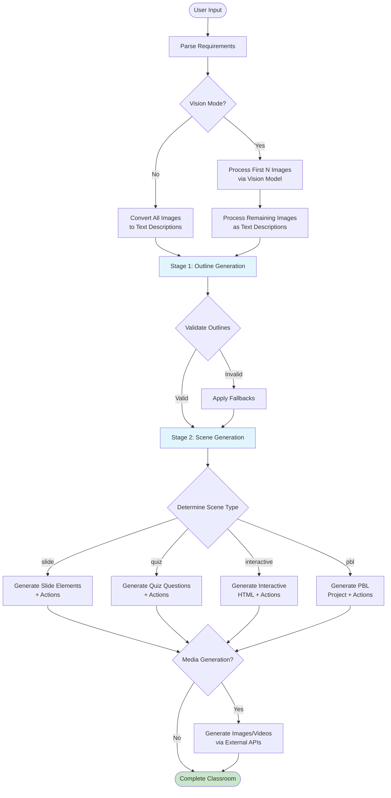
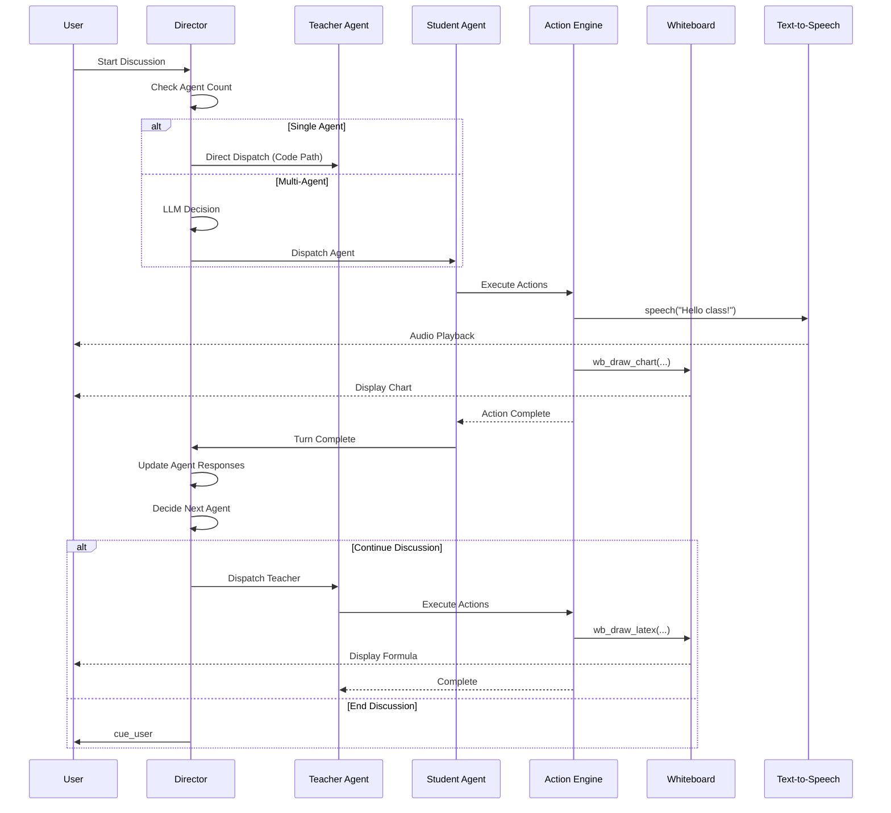
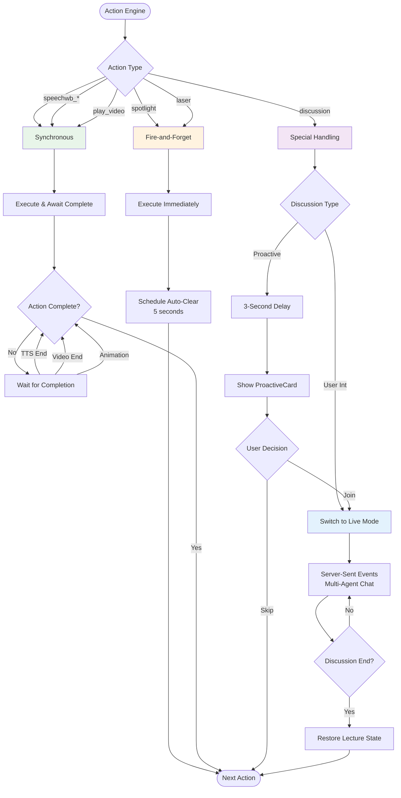
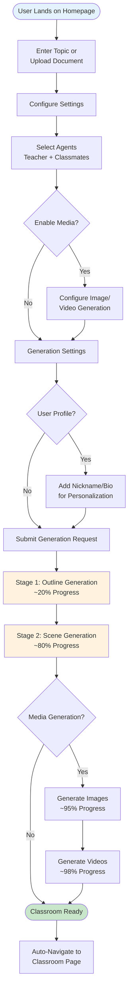
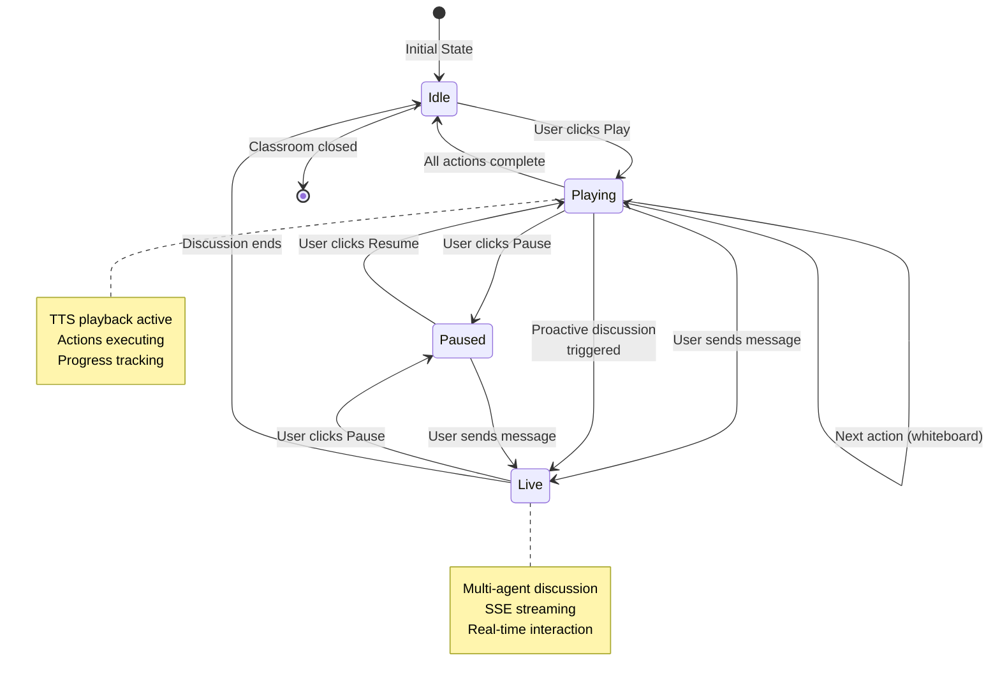
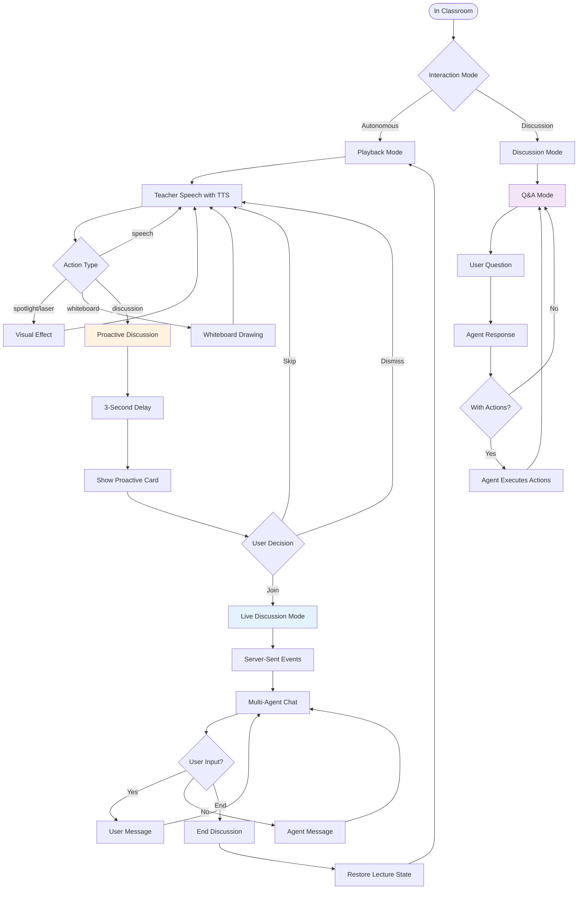

# Core Features

OpenMAIC transforms any topic or document into an immersive, interactive learning experience through a sophisticated multi-agent system. This document provides an expert-level analysis of the platform's core feature modules, their interactions, and implementation architecture.

## Feature Modules

### 1. Lesson Generation (Two-Stage Pipeline)

OpenMAIC implements a sophisticated two-stage generation pipeline that converts user requirements into rich, interactive classroom content.

#### Stage 1: Outline Generation

**Purpose**: Analyze user input and generate structured scene outlines

**Input Processing**:
- User requirements (free-form text description)
- Optional PDF documents with extracted text and images
- User profile (nickname, bio) for personalization
- Language preference (zh-CN or en-US)
- Media generation flags (image/video generation enabled/disabled)

**Generation Process**:
```typescript
// Core outline generation flow
generateSceneOutlinesFromRequirements(
  requirements: UserRequirements,
  pdfText: string | undefined,
  pdfImages: PdfImage[] | undefined,
  aiCall: AICallFn,
  callbacks?: GenerationCallbacks,
  options?: {
    visionEnabled?: boolean;
    imageMapping?: ImageMapping;
    imageGenerationEnabled?: boolean;
    videoGenerationEnabled?: boolean;
  }
)
```

**Vision Mode Integration**:
- First N images processed via vision model (MAX_VISION_IMAGES = 5)
- Remaining images converted to text descriptions
- Fallback to text-only mode if vision unavailable

**Output Structure**:
```typescript
interface SceneOutline {
  id: string;
  type: 'slide' | 'quiz' | 'interactive' | 'pbl';
  title: string;
  description: string;
  keyPoints: string[];
  teachingObjective?: string;
  estimatedDuration?: number;
  order: number;
  language?: 'zh-CN' | 'en-US';
  suggestedImageIds?: string[];
  mediaGenerations?: MediaGenerationRequest[];
  quizConfig?: QuizConfig;
  interactiveConfig?: InteractiveConfig;
  pblConfig?: PBLConfig;
}
```

**Fallback Mechanisms**:
- Interactive scenes without `interactiveConfig` → fallback to slide
- PBL scenes without `pblConfig` or language model → fallback to slide
- Ensures graceful degradation when advanced features unavailable

#### Stage 2: Scene Content Generation

**Purpose**: Transform outlines into full scenes with actions, elements, and media

**Generation Strategies**:

1. **Slide Scenes**: Two-step generation process
   - Step 1: Generate slide elements (text, images, shapes, charts, formulas)
   - Step 2: Generate action sequence (speech, spotlight, laser, whiteboard)

2. **Quiz Scenes**: Direct question generation
   - Single/multiple choice questions
   - Short answer questions
   - Difficulty-based selection (easy/medium/hard)

3. **Interactive Scenes**: Scientific modeling approach
   - Extract core formulas and mechanisms
   - Generate interactive HTML simulations
   - Post-process for error correction

4. **PBL Scenes**: Project-based learning structure
   - Define project topic and description
   - Generate milestones and deliverables
   - Create role-based collaboration framework

**Cross-Page Context Management**:
```typescript
interface SceneGenerationContext {
  pageIndex: number;           // Current page (1-based)
  totalPages: number;          // Total number of pages
  allTitles: string[];         // All page titles in order
  previousSpeeches: string[];  // Speech texts from previous page only
}
```

Maintains speech coherence across scenes by tracking previous page content only, preventing context window bloat while ensuring continuity.

**Action Generation**:
- Parses structured output for action specifications
- Supports 12+ action types (speech, whiteboard, spotlight, laser, etc.)
- Validates actions against scene type constraints
- Filters disallowed actions per agent configuration

### 2. Multi-Agent Orchestration

OpenMAIC's multi-agent system is built on LangGraph, enabling sophisticated agent interactions and role-based conversations.

#### Architecture Overview

**Graph Topology**:
```
START → director ──(end)──→ END
          │
          └─(next)→ agent_generate ──→ director (loop)
```

**Unified Director Strategy**:

1. **Single Agent Mode** (Code-only, zero LLM calls):
   - Turn 0: Dispatch the sole agent
   - Turn 1+: Cue user for follow-up input
   - Optimal for simple Q&A scenarios

2. **Multi-Agent Mode** (LLM-based with code fast-paths):
   - Turn 0 with triggerAgentId: Dispatch trigger agent (skip LLM)
   - Otherwise: LLM decides next agent / USER / END
   - Enables complex multi-agent discussions

#### Director Decision Process

**State Management**:
```typescript
interface OrchestratorStateType {
  // Input (set once at graph entry)
  messages: UIMessage<ChatMessageMetadata>[];
  storeState: StoreState;
  availableAgentIds: string[];
  maxTurns: number;
  languageModel: LanguageModel;
  thinkingConfig?: ThinkingConfig;
  discussionContext?: { topic: string; prompt?: string };
  triggerAgentId?: string;
  userProfile?: { nickname?: string; bio?: string };

  // Mutable (updated by nodes)
  currentAgentId: string | null;
  turnCount: number;
  agentResponses: AgentTurnSummary[];
  whiteboardLedger: WhiteboardActionRecord[];
  shouldEnd: boolean;
  totalActions: number;
}
```

**Decision Factors**:
- Conversation history and summaries
- Previous agent responses (last 3 turns)
- Whiteboard action history
- User profile (nickname, bio)
- Current scene context
- Discussion topic and prompts
- Turn limits

**Agent Selection Logic**:
- Validates agent exists in available agents
- Checks turn count against maxTurns
- Supports cueing USER for input
- Handles agent exhaustion gracefully

#### Agent Generation Node

**Structured Output Parsing**:
- Interleaved text and action streaming
- Real-time action validation
- Scene-type-aware action filtering
- Whiteboard action tracking for director context

**Event Streaming**:
```typescript
type StatelessEvent =
  | { type: 'agent_start'; data: AgentInfo }
  | { type: 'text_delta'; data: { content: string; messageId?: string } }
  | { type: 'action'; data: ParsedAction }
  | { type: 'thinking'; data: { stage: 'director' | 'agent_loading' } }
  | { type: 'cue_user'; data: { fromAgentId?: string } }
  | { type: 'done'; data: CompletionSummary }
  | { type: 'error'; data: { message: string } };
```

**Action Execution**:
- Fire-and-forget actions (spotlight, laser) dispatch immediately
- Synchronous actions (speech, whiteboard) await completion
- Scene-type validation prevents invalid actions
- Agent permission filtering via allowedActions

### 3. Real-time Interaction

#### Playback Engine State Machine

**Core States**:
- **idle**: Initial state, no active playback
- **playing**: Active lecture playback with TTS
- **paused**: Playback paused (resumable)
- **live**: Real-time agent discussion

**State Transitions**:
```
                  start()                  pause()
   idle ──────────────────→ playing ──────────────→ paused
     ▲                         ▲                       │
     │                         │  resume()             │
     │                         └───────────────────────┘
     │
     │  handleEndDiscussion()
     │                         confirmDiscussion()
     │                         / handleUserInterrupt()
     │                              │
     │                              ▼         pause()
     └──────────────────────── live ──────────────→ paused
                                ▲                    │
                                │ resume / user msg  │
                                └────────────────────┘
```

**Action Processing Loop**:
```typescript
private async processNext(): Promise<void> {
  // 1. Check scene boundaries
  // 2. Get current action
  // 3. Notify progress (for snapshot)
  // 4. Advance cursor
  // 5. Execute action based on type:
  //    - speech: Play TTS, schedule onEnd callback
  //    - spotlight/laser: Fire-and-forget, continue immediately
  //    - discussion: Show ProactiveCard after 3s delay
  //    - whiteboard: Await completion, then continue
  //    - play_video: Await video end, then continue
}
```

**Lecture State Preservation**:
- Saves sceneIndex and actionIndex before discussion
- Restores exact position after discussion ends
- Handles user interruptions gracefully
- Supports pause/resume with TTS state preservation

#### Discussion Management

**Proactive Discussions** (Agent-initiated):
- Triggered by discussion actions in scene
- 3-second delay before showing ProactiveCard
- User can Join, Skip, or dismiss
- Once consumed, won't re-trigger on replay

**User Interruptions**:
- Immediate transition to live mode
- Saves lecture state for resumption
- Aborts pending TTS and timers
- Sends user message to agent system

**Discussion Lifecycle**:
1. Trigger: Discussion action encountered
2. Delay: 3-second grace period
3. Prompt: Show ProactiveCard to user
4. Decision: User joins or skips
5. Live: Multi-agent discussion via SSE
6. End: User or system terminates discussion
7. Restore: Return to saved lecture position

### 4. Export Capabilities

#### PowerPoint (.pptx) Export

**Element Conversion**:
- **Text**: HTML → formatted text props with font, color, size
- **Images**: Base64/embedded URLs with positioning
- **Shapes**: SVG paths converted to PowerPoint shapes
- **Charts**: ECharts → native PowerPoint charts
- **Tables**: Cell data with themes and borders
- **LaTeX**: KaTeX → Office Math Markup Language (OMML)

**Conversion Pipeline**:
```typescript
// HTML to PowerPoint text formatting
function formatHTML(html: string, ratioPx2Pt: Pt): TextProps[]

// SVG path to PowerPoint coordinates
function getLineElementPath(element: PPTLineElement): SVGPoints

// LaTeX to Office Math
function latexToOmml(latex: string): OMMLDocument
```

**Layout Preservation**:
- Aspect ratio maintained (1000x562 coordinate system)
- Relative positioning (percentage-based)
- Background gradients and images
- Element stacking order

#### Interactive HTML Export

**Self-Contained Pages**:
- Embedded CSS and JavaScript
- Interactive simulations fully functional
- Quiz questions with client-side validation
- No external dependencies

**Content Types**:
- Slides with animations
- Interactive quizzes
- Scientific simulations
- PBL project interfaces

### 5. Whiteboard & Collaborative Tools

#### Whiteboard Actions

**Drawing Primitives**:
- **Text**: HTML content with font and color styling
- **Shapes**: Rectangle, circle, triangle with fill colors
- **Charts**: Bar, column, line, pie, ring, area, radar, scatter
- **LaTeX**: Mathematical formulas via KaTeX rendering
- **Tables**: Multi-column data with themes
- **Lines**: Straight and curved lines with arrow markers

**Action Flow**:
```typescript
// Auto-open whiteboard if closed
if (action.type.startsWith('wb_') && !whiteboardOpen) {
  await executeWbOpen();
}

// Execute drawing action
await executeWbDrawText(action);
await delay(800); // Wait for fade-in animation
```

**Whiteboard Lifecycle**:
1. Open: 2-second spring animation
2. Draw: 800ms fade-in per element
3. Clear: Cascade exit animation (380ms + 55ms per element)
4. Close: 500ms ease-out tween

#### Collaborative Features

**Agent Whiteboard Usage**:
- Real-time drawing during discussions
- Step-by-step problem solving
- Concept illustrations and diagrams
- Formula derivations

**User Interaction**:
- Manual drawing tools
- Element manipulation
- Save whiteboard state
- Export to image

## Feature Interaction Diagrams

### Lesson Generation Pipeline Flowchart



### Multi-Agent Interaction Sequence Diagram



### Action Execution Flow



## Content Types

### Slides with Animations

**Element Types**:
- **Text**: Rich HTML content with font styling, colors, paragraphs
- **Images**: Embedded or referenced images with filters and effects
- **Shapes**: SVG-based shapes with fills, gradients, and borders
- **Charts**: 8 chart types with data visualization
- **Tables**: Multi-row/column with themes and styling
- **LaTeX**: Mathematical formulas via KaTeX
- **Lines**: Straight and curved lines with arrow markers
- **Videos**: Embedded video players with controls

**Animation System**:
- **In animations**: Fade in, slide in, zoom in (click-triggered)
- **Out animations**: Fade out, slide out, zoom out
- **Attention animations**: Pulse, shake, spin
- **Triggers**: Click, meantime, auto

**Slide Types**:
- Cover slides with title and subtitle
- Content slides with structured information
- Transition slides between sections
- Summary slides with key takeaways

### Interactive Quizzes

**Question Types**:
- **Single Choice**: One correct answer
- **Multiple Choice**: Multiple correct answers
- **Short Answer**: Text input with validation

**Quiz Structure**:
```typescript
interface QuizQuestion {
  id: string;
  type: 'single' | 'multiple' | 'text';
  question: string;
  options?: string[];
  correctAnswers: string[];
  explanation?: string;
  difficulty: 'easy' | 'medium' | 'hard';
  points?: number;
}
```

**Grading System**:
- Immediate feedback on submission
- AI-powered grading for short answers
- Explanation display for incorrect answers
- Score calculation and tracking

**Quiz Actions**:
- Automatic question display
- User input capture
- Validation and feedback
- Progress tracking

### Simulations

**Interactive HTML Generation**:
- Scientific modeling approach
- Core formula extraction
- Mechanism identification
- Constraint definition
- Error prevention rules

**Simulation Types**:
- Physics simulators (motion, forces, energy)
- Flowcharts and process diagrams
- Interactive calculators
- Data visualization tools
- Concept exploration tools

**Technical Implementation**:
```typescript
interface ScientificModel {
  core_formulas: string[];
  mechanism: string[];
  constraints: string[];
  forbidden_errors: string[];
}

interface GeneratedInteractiveContent {
  html: string;
  scientificModel?: ScientificModel;
}
```

**Post-Processing**:
- Syntax error correction
- Runtime error detection
- Performance optimization
- Cross-browser compatibility

### Project-Based Learning (PBL)

**PBL Structure**:
- Project topic and description
- Target skills to develop
- Milestones and deliverables
- Role-based collaboration
- Progress tracking

**Project Configuration**:
```typescript
interface PBLProjectConfig {
  topic: string;
  description: string;
  targetSkills: string[];
  milestones: PBLMilestone[];
  roles: PBLRole[];
  language: 'zh-CN' | 'en-US';
}
```

**Agent Roles**:
- Project manager (coordination)
- Subject matter expert (guidance)
- Peer reviewer (feedback)
- Team member (collaboration)

**Deliverables**:
- Milestone submissions
- Code artifacts
- Documentation
- Presentations
- Peer reviews

## User Workflows

### Classroom Creation Flow



**Creation Options**:

1. **Topic-Based**:
   - Free-form text description
   - Duration specification
   - Learning objectives (optional)

2. **Document-Based**:
   - PDF upload with parsing
   - Image extraction and OCR
   - Content summarization

3. **Personalization**:
   - User nickname and bio
   - Learning style preferences
   - Difficulty level adjustment

**Generation Progress**:
- Real-time progress updates
- Stage-by-stage feedback
- Error handling and retries
- Cancellation support

### Playback Interaction Flow



**Playback Controls**:
- **Play/Pause**: Start or pause lecture playback
- **Stop**: Return to idle state
- **Next Scene**: Skip to next scene
- **Previous Scene**: Return to previous scene
- **Speed Control**: Adjust playback speed (0.5x - 2x)

**Navigation Features**:
- Scene thumbnails with preview
- Progress bar with scrubbing
- Keyboard shortcuts (Space, arrows, ESC)
- Mobile touch gestures

### Discussion/Q&A Flow



**Q&A Mode Features**:
- Free-form question input
- Multi-modal responses (speech, whiteboard, slides)
- Context-aware answers
- Follow-up question support

**Discussion Mode Features**:
- Agent-initiated topics
- Roundtable debates
- Role-based perspectives
- Whiteboard collaboration

**Proactive Discussions**:
- Triggered by predefined discussion actions
- Contextual to current lecture content
- Optional participation
- State preservation for resumption

---

## Technical Implementation Notes

### Performance Optimizations

1. **Streaming Generation**:
   - Server-Sent Events (SSE) for real-time updates
   - Incremental content delivery
   - Progressive rendering

2. **Media Management**:
   - Lazy loading for images and videos
   - IndexedDB for blob storage
   - Placeholder generation during async creation

3. **Action Execution**:
   - Fire-and-forget for non-blocking effects
   - Parallel processing where possible
   - Efficient timer management

### Error Handling

1. **Generation Failures**:
   - Automatic retries with exponential backoff
   - Graceful fallbacks to simpler content types
   - User-friendly error messages

2. **Playback Errors**:
   - TTS failure → reading time estimation
   - Media loading failures → skip action
   - Network interruptions → pause and retry

3. **Discussion Errors**:
   - Agent timeout → cue user
   - Action validation failures → skip action
   - SSE disconnection → auto-reconnect

### State Management

1. **Lecture State**:
   - Scene and action indices
   - Consumed discussions set
   - Saved positions for interruptions
   - Playback mode tracking

2. **Agent State**:
   - Turn summaries for context
   - Whiteboard action history
   - Director state persistence
   - Response aggregation

3. **User Preferences**:
   - Selected agents
   - Playback speed
   - TTS voice settings
   - UI theme and language

This comprehensive feature set enables OpenMAIC to deliver rich, interactive learning experiences that adapt to user needs while maintaining technical excellence and performance.
