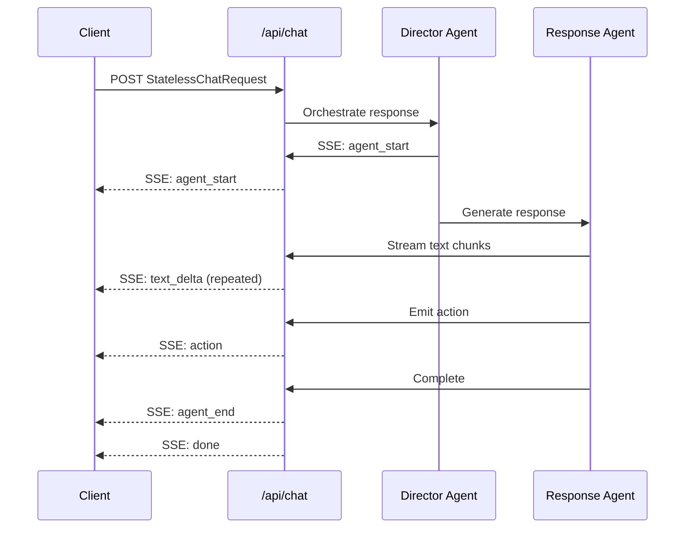
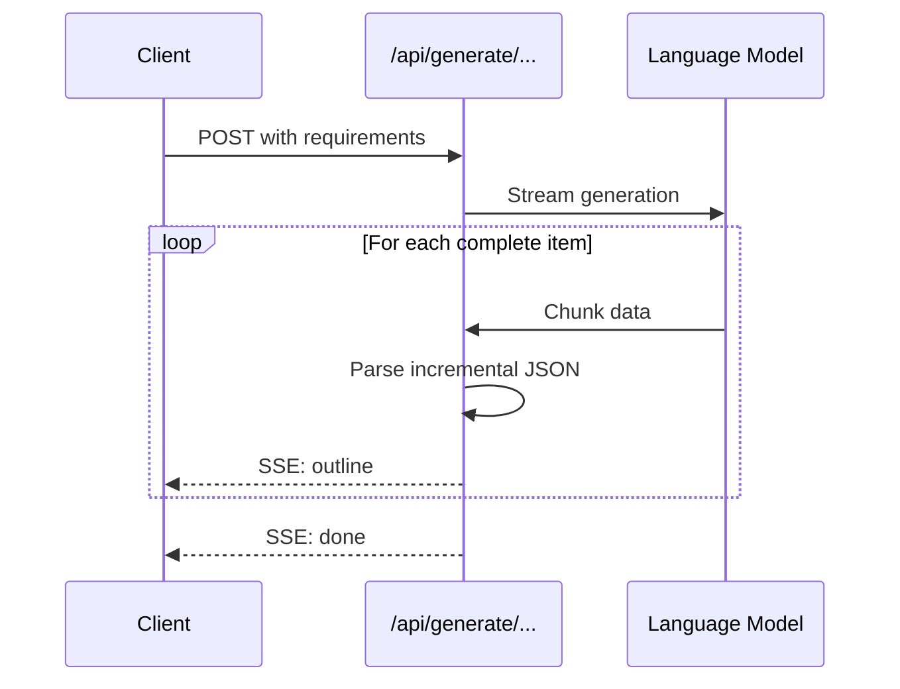
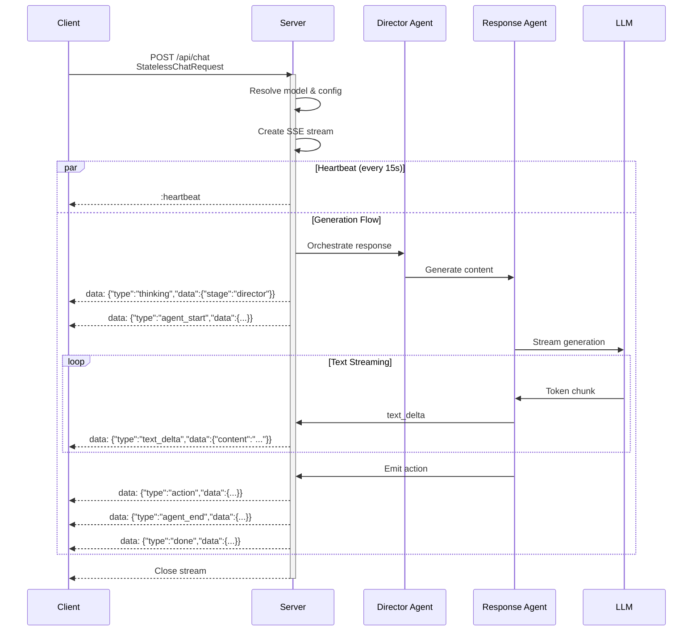
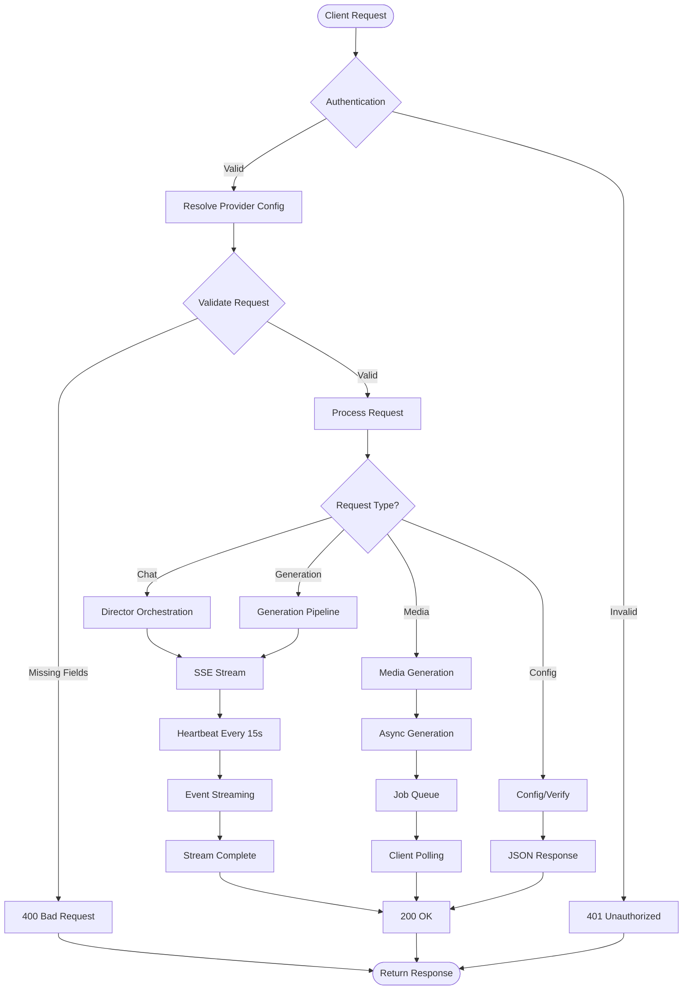
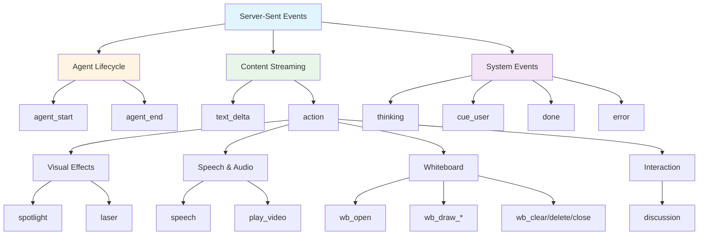

# Communication Protocols

## 1. Protocol Architecture

### 1.1 HTTP + SSE Streaming

OpenMAIC uses a hybrid communication architecture combining HTTP REST endpoints with Server-Sent Events (SSE) for real-time streaming:

- **REST Endpoints**: Stateless JSON request/response for stateless operations
- **SSE Streams**: Unidirectional server-to-client streaming for generation events
- **Stateless Design**: All session state maintained on the client; server is fully stateless

**Key Characteristics:**

```typescript
// SSE Response Headers
{
  'Content-Type': 'text/event-stream',
  'Cache-Control': 'no-cache',
  Connection: 'keep-alive'
}
```

**SSE Event Format:**
```
data: {"type":"event_type","data":{...}}

:heartbeat
```

### 1.2 SSE Event Types

The system uses 8 primary SSE event types for stateless chat communication:

| Event Type | Purpose | Data Structure |
|------------|---------|----------------|
| `agent_start` | Signals beginning of agent response | `{messageId, agentId, agentName, agentAvatar?, agentColor?}` |
| `agent_end` | Signals completion of agent response | `{messageId, agentId}` |
| `text_delta` | Streaming text content incrementally | `{content, messageId?}` |
| `action` | Tool/action invocation | `{actionId, actionName, params, agentId, messageId?}` |
| `thinking` | AI thinking state indicator | `{stage: 'director'\|'agent_loading', agentId?}` |
| `cue_user` | Requests user input/intervention | `{fromAgentId?, prompt?}` |
| `done` | Stream completion | `{totalActions, totalAgents, agentHadContent?, directorState?}` |
| `error` | Error notification | `{message}` |

**Additional Outline Generation Events:**

| Event Type | Purpose | Data Structure |
|------------|---------|----------------|
| `outline` | Individual scene outline | SceneOutline object + index |
| `retry` | Retry notification | `{attempt, maxAttempts}` |

### 1.3 Request/Response Patterns

**Pattern 1: Stateless Chat (Multi-Agent)**



**Pattern 2: Generation Pipeline (Streaming)**



## 2. API Endpoints Documentation

### 2.1 Core Chat & Communication

#### POST /api/chat
**Purpose**: Stateless multi-agent chat with SSE streaming

**Request**:
```typescript
interface StatelessChatRequest {
  messages: UIMessage<ChatMessageMetadata>[];
  storeState: {
    stage: Stage | null;
    scenes: Scene[];
    currentSceneId: string | null;
    mode: 'autonomous' | 'playback';
    whiteboardOpen: boolean;
  };
  config: {
    agentIds: string[];
    sessionType?: 'qa' | 'discussion';
    discussionTopic?: string;
    discussionPrompt?: string;
    triggerAgentId?: string;
    agentConfigs?: AgentConfig[];
  };
  directorState?: DirectorState;
  userProfile?: { nickname?: string; bio?: string };
  apiKey: string;
  baseUrl?: string;
  model?: string;
}
```

**Response**: SSE stream of `StatelessEvent` objects

**Features**:
- Multi-agent orchestration with director pattern
- Real-time text streaming
- Action execution with structured output
- Thinking state visualization
- Automatic retry with exponential backoff

---

#### POST /api/pbl/chat
**Purpose**: PBL runtime chat with @mention routing

**Request**:
```typescript
interface PBLChatRequest {
  message: string;
  agent: PBLAgent;
  currentIssue: PBLIssue | null;
  recentMessages: { agent_name: string; message: string }[];
  userRole: string;
  agentType?: 'question' | 'judge';
}
```

**Response**:
```typescript
{
  message: string;
  agentName: string;
}
```

**Use Case**: Student-teacher interaction during PBL runtime

### 2.2 Generation APIs

#### POST /api/generate/scene-outlines-stream
**Purpose**: Stream scene outline generation from requirements

**Request Body**:
```typescript
{
  requirements: UserRequirements;
  pdfText?: string;
  pdfImages?: PdfImage[];
  imageMapping?: ImageMapping;
  researchContext?: string;
  agents?: AgentInfo[];
}
```

**Headers**:
- `x-model`: Model identifier
- `x-api-key`: API key
- `x-base-url`: Custom base URL
- `x-image-generation-enabled`: "true"/"false"
- `x-video-generation-enabled`: "true"/"false"

**Response**: SSE stream
- Event `outline`: Individual SceneOutline objects
- Event `done`: All outlines array
- Event `error`: Error message

**Retry Logic**: Up to 3 attempts with exponential backoff

---

#### POST /api/generate/scene-content
**Purpose**: Generate full scene content (slides/quiz/interactive/pbl)

**Request Body**:
```typescript
{
  outline: SceneOutline;
  allOutlines: SceneOutline[];
  pdfImages?: PdfImage[];
  imageMapping?: ImageMapping;
  stageInfo: {
    name: string;
    description?: string;
    language?: string;
    style?: string;
  };
  stageId: string;
  agents?: AgentInfo[];
}
```

**Response**:
```typescript
{
  content: GeneratedSlideContent | GeneratedQuizContent | GeneratedInteractiveContent | GeneratedPBLContent;
  effectiveOutline: SceneOutline;
}
```

**Timeout**: 300 seconds

---

#### POST /api/generate/scene-actions
**Purpose**: Generate teaching actions for a scene

**Request Body**:
```typescript
{
  scene: Scene;
  context: {
    stage: Stage;
    allScenes: Scene[];
    previousSpeeches?: string[];
  };
  agents?: AgentInfo[];
}
```

**Response**: Action[] array

---

#### POST /api/generate/image
**Purpose**: Generate images from text prompts

**Headers**:
- `x-image-provider`: Provider ID (default: 'seedream')
- `x-api-key`: API key
- `x-base-url`: Custom base URL
- `x-image-model`: Model identifier

**Request Body**:
```typescript
interface ImageGenerationOptions {
  prompt: string;
  negativePrompt?: string;
  width?: number;
  height?: number;
  aspectRatio?: string;
  style?: string;
}
```

**Response**:
```typescript
{
  result: ImageGenerationResult;
}
```

**Timeout**: 60 seconds

---

#### POST /api/generate/video
**Purpose**: Generate videos from text prompts

**Implementation**: Similar to image generation with video-specific providers

**Timeout**: 300 seconds

---

#### POST /api/generate/tts
**Purpose**: Generate text-to-speech audio

**Request Body**:
```typescript
{
  text: string;
  audioId: string;
  ttsProviderId: TTSProviderId;
  ttsVoice: string;
  ttsSpeed?: number;
  ttsApiKey?: string;
  ttsBaseUrl?: string;
}
```

**Response**:
```typescript
{
  audioId: string;
  base64: string;  // Base64-encoded audio
  format: string;  // Audio format (mp3, wav, etc.)
}
```

**Timeout**: 30 seconds

**Note**: 'browser-native-tts' must be handled client-side (rejected by server)

---

#### POST /api/generate/agent-profiles
**Purpose**: Generate AI agent profiles for courses

**Request Body**: User requirements and context

**Response**: Array of agent configurations

### 2.3 Media & Document Processing

#### POST /api/parse-pdf
**Purpose**: Extract text and images from PDF documents

**Request**: FormData with:
- `pdf`: File
- `providerId`: PDFProviderId
- `apiKey`: string (optional)
- `baseUrl`: string (optional)

**Response**:
```typescript
{
  data: ParsedPdfContent;
}
```

**ParsedPdfContent Structure**:
```typescript
{
  text: string;
  images: PdfImage[];
  metadata: {
    pageCount: number;
    fileName: string;
    fileSize: number;
  };
}
```

---

#### POST /api/transcription
**Purpose**: Transcribe audio to text (ASR)

**Request**: FormData with:
- `audio`: File
- `providerId`: ASRProviderId
- `language`: string (default: 'auto')
- `apiKey`: string (optional)
- `baseUrl`: string (optional)

**Response**:
```typescript
{
  text: string;
}
```

**Timeout**: 60 seconds

---

#### GET /api/proxy-media
**Purpose**: Proxy media requests to bypass CORS

**Query Parameters**: Media URL and configuration

**Use Case**: Fetching external media resources

---

#### GET /api/azure-voices
**Purpose**: List available Azure TTS voices

**Response**: Array of voice objects with locale, gender, and style information

### 2.4 Classroom & Session Management

#### POST /api/classroom
**Purpose**: Persist classroom (stage + scenes) to storage

**Request Body**:
```typescript
{
  stage: Stage;
  scenes: Scene[];
}
```

**Response** (201 Created):
```typescript
{
  id: string;
  url: string;
}
```

---

#### GET /api/classroom?id={id}
**Purpose**: Retrieve persisted classroom

**Response**:
```typescript
{
  classroom: {
    id: string;
    stage: Stage;
    scenes: Scene[];
  };
}
```

---

#### POST /api/generate-classroom
**Purpose**: Async classroom generation with job queue

**Request Body**: Generation requirements

**Response**:
```typescript
{
  jobId: string;
  status: 'pending' | 'processing' | 'completed' | 'failed';
}
```

---

#### GET /api/generate-classroom/{jobId}
**Purpose**: Poll async generation job status

**Response**: Job status with result or error

### 2.5 Configuration & Verification

#### GET /api/server-providers
**Purpose**: Get server-configured providers

**Response**:
```typescript
{
  providers: ProviderConfig[];
  tts: TTSProviderConfig[];
  asr: ASRProviderConfig[];
  pdf: PDFProviderConfig[];
  image: ImageProviderConfig[];
  video: VideoProviderConfig[];
  webSearch: WebSearchProviderConfig[];
}
```

**Use Case**: Display available providers in settings UI

---

#### POST /api/verify-model
**Purpose**: Test LLM connection with minimal message

**Request Body**:
```typescript
{
  apiKey?: string;
  baseUrl?: string;
  model: string;
  providerType?: string;
  requiresApiKey?: boolean;
}
```

**Response**:
```typescript
{
  message: 'Connection successful';
  response: string;  // LLM response
}
```

**Error Handling**: Provides user-friendly error messages for common failures:
- 401: "API key is invalid or expired"
- 404: "Model not found or API endpoint error"
- 429: "API rate limit exceeded"
- ENOTFOUND/ECONNREFUSED: "Cannot connect to API server"

---

#### POST /api/verify-image-provider
**Purpose**: Test image generation provider

**Implementation**: Similar to model verification with image-specific test

---

#### POST /api/verify-video-provider
**Purpose**: Test video generation provider

---

#### POST /api/verify-pdf-provider
**Purpose**: Test PDF parsing provider

### 2.6 Web Search

#### POST /api/web-search
**Purpose**: Perform web search using Tavily API

**Request Body**:
```typescript
{
  query: string;
  apiKey?: string;
}
```

**Response**:
```typescript
{
  answer: string;
  sources: SearchSource[];
  context: string;  // Formatted for LLM
  query: string;
  responseTime: number;
}
```

**Error**: Returns 400 if TAVILY_API_KEY not configured

### 2.7 Utilities

#### GET /api/health
**Purpose**: Health check endpoint

**Response**:
```typescript
{
  status: 'ok';
  version: string;  // From package.json
}
```

---

#### POST /api/quiz-grade
**Purpose**: Grade quiz submissions with AI feedback

**Request Body**: Quiz answers and correct responses

**Response**: Grading results with explanations

## 3. Data Structures

### 3.1 StatelessChatRequest

The core request structure for stateless multi-agent chat:

```typescript
interface StatelessChatRequest {
  // Conversation history (client-maintained)
  messages: UIMessage<ChatMessageMetadata>[];

  // Current application state
  storeState: {
    stage: Stage | null;
    scenes: Scene[];
    currentSceneId: string | null;
    mode: 'autonomous' | 'playback';
    whiteboardOpen: boolean;
  };

  // Agent configuration
  config: {
    agentIds: string[];
    sessionType?: 'qa' | 'discussion';
    discussionTopic?: string;
    discussionPrompt?: string;
    triggerAgentId?: string;
    agentConfigs?: Array<{
      id: string;
      name: string;
      role: string;
      persona: string;
      avatar: string;
      color: string;
      allowedActions: string[];
      priority: number;
      isGenerated?: boolean;
      boundStageId?: string;
    }>;
  };

  // Accumulated director state from previous turns
  directorState?: DirectorState;

  // User profile for personalization
  userProfile?: {
    nickname?: string;
    bio?: string;
  };

  // OpenAI-compatible API credentials
  apiKey: string;
  baseUrl?: string;
  model?: string;
}
```

**Key Design Decisions**:
- **Stateless**: Server stores no session state
- **Client-Owned State**: All history and state sent per-request
- **Director State**: Enables multi-agent orchestration without server storage

### 3.2 Director State

Accumulated state maintained across conversation turns:

```typescript
interface DirectorState {
  turnCount: number;
  agentResponses: AgentTurnSummary[];
  whiteboardLedger: WhiteboardActionRecord[];
}
```

**Purpose**: Track conversation history for multi-agent coordination

### 3.3 Action Types

OpenMAIC defines **28 action types** across two categories:

#### Fire-and-Forget Actions (2 types)
Execute immediately without blocking:

```typescript
type FireAndForgetLastAction =
  | SpotlightAction     // Focus on element, dim rest
  | LaserAction;        // Point at element with laser
```

#### Synchronous Actions (26 types)
Must complete before next action:

**Speech & Audio:**
```typescript
SpeechAction           // Teacher narration (wait for TTS)
PlayVideoAction        // Start video playback
```

**Whiteboard (13 actions):**
```typescript
WbOpenAction           // Open whiteboard
WbDrawTextAction       // Draw text
WbDrawShapeAction      // Draw shape (rectangle, circle, triangle)
WbDrawChartAction      // Draw chart (bar, line, pie, etc.)
WbDrawLatexAction      // Draw LaTeX formula
WbDrawTableAction      // Draw table
WbDrawLineAction       // Draw line/arrow
WbClearAction          // Clear all
WbDeleteAction         // Delete specific element
WbCloseAction          // Close whiteboard
```

**Interaction:**
```typescript
DiscussionAction       // Trigger roundtable discussion
```

**Action Constants:**
```typescript
const FIRE_AND_FORGET_ACTIONS: ActionType[] = ['spotlight', 'laser'];

const SLIDE_ONLY_ACTIONS: ActionType[] = ['spotlight', 'laser'];

const SYNC_ACTIONS: ActionType[] = [
  'speech',
  'play_video',
  'wb_open',
  'wb_draw_text',
  'wb_draw_shape',
  'wb_draw_chart',
  'wb_draw_latex',
  'wb_draw_table',
  'wb_draw_line',
  'wb_clear',
  'wb_delete',
  'wb_close',
  'discussion',
];
```

### 3.4 Message Formats

#### UIMessage with Metadata

```typescript
interface UIMessage<T = {}> {
  id: string;
  role: 'user' | 'assistant' | 'system';
  content: string;
  createdAt?: number;
  metadata?: T;
}

interface ChatMessageMetadata {
  senderName?: string;
  senderAvatar?: string;
  originalRole?: 'teacher' | 'agent' | 'user';
  actions?: MessageAction[];
  agentId?: string;
  agentColor?: string;
  createdAt?: number;
  interrupted?: boolean;
}
```

#### Message Actions

```typescript
interface MessageAction {
  id: string;
  label: string;
  icon?: string;
  variant?: 'spotlight' | 'highlight' | 'reset' | 'insert' | 'draw';
}
```

### 3.5 Store State Structure

```typescript
interface StoreState {
  stage: Stage | null;
  scenes: Scene[];
  currentSceneId: string | null;
  mode: 'autonomous' | 'playback';
  whiteboardOpen: boolean;
}

interface Stage {
  id: string;
  name: string;
  description?: string;
  language: 'zh-CN' | 'en-US';
  style?: string;
  createdAt: number;
  updatedAt: number;
}

interface Scene {
  id: string;
  type: 'slide' | 'quiz' | 'interactive' | 'pbl';
  title: string;
  content: SceneContent;
  actions: Action[];
  order: number;
}
```

## 4. Communication Diagrams

### 4.1 SSE Communication Sequence



### 4.2 API Request Flow



### 4.3 Message Type Taxonomy



## 5. Streaming Details

### 5.1 Event Types Deep Dive

#### agent_start
Marks the beginning of an agent's response turn:

```typescript
{
  type: 'agent_start';
  data: {
    messageId: string;        // Unique message ID
    agentId: string;          // Agent identifier
    agentName: string;        // Display name
    agentAvatar?: string;     // Avatar URL
    agentColor?: string;      // Color for UI
  };
}
```

**Client Action**: Create new message bubble, display agent avatar

#### text_delta
Streams text content incrementally:

```typescript
{
  type: 'text_delta';
  data: {
    content: string;          // Text chunk to append
    messageId?: string;       // Target message (if not current)
  };
}
```

**Client Action**: Append to current message text, trigger typewriter effect

**Streaming Optimization**:
- Chunks are typically 1-10 characters
- Client-side buffer reassembles full text
- Enables smooth typewriter animation

#### action
Signals a tool/action invocation:

```typescript
{
  type: 'action';
  data: {
    actionId: string;         // Unique action ID
    actionName: string;       // Action type
    params: Record<string, unknown>;  // Action parameters
    agentId: string;          // Executing agent
    messageId?: string;       // Associated message
  };
}
```

**Client Action**: Execute action, display badge in UI

**Action Execution Flow**:
1. Client receives action event
2. Validates action parameters
3. Executes via StageAPI
4. Displays action badge
5. Waits for completion (if synchronous)

#### thinking
Indicates AI processing state:

```typescript
{
  type: 'thinking';
  data: {
    stage: 'director' | 'agent_loading';
    agentId?: string;
  };
}
```

**Client Action**: Show loading/thinking indicator

**Stages**:
- `director`: Director agent is orchestrating
- `agent_loading`: Response agent is generating

#### done
Signals stream completion:

```typescript
{
  type: 'done';
  data: {
    totalActions: number;
    totalAgents: number;
    agentHadContent?: boolean;
    directorState?: DirectorState;
  };
}
```

**Client Action**: Close stream, save directorState for next request

#### error
Reports stream errors:

```typescript
{
  type: 'error';
  data: {
    message: string;
  };
}
```

**Client Action**: Display error message, clean up resources

### 5.2 Heartbeat Mechanism

Prevents connection timeouts during long-running generations:

```typescript
const HEARTBEAT_INTERVAL_MS = 15_000;

// Server sends heartbeat comment
:heartbeat

// Client ignores (SSE comments are not dispatched to JS)
```

**Implementation Details**:
- Interval: 15 seconds
- Format: SSE comment (`:` prefix)
- Purpose: Keep connection alive through proxies/load balancers
- Client Impact: None (comments ignored by EventSource)

**Why Heartbeats Matter**:
- Some proxies close idle connections after 30-120 seconds
- Generation can take 30-300 seconds
- Heartbeat ensures stream stays open

### 5.3 Retry Logic with Exponential Backoff

**For Scene Outline Generation**:

```typescript
const MAX_STREAM_RETRIES = 2;

// Retry loop
for (let attempt = 1; attempt <= MAX_STREAM_RETRIES + 1; attempt++) {
  try {
    const result = streamLLM(streamParams, 'scene-outlines-stream');
    // Process stream...
    if (parsedOutlines.length > 0) break;  // Success
  } catch (error) {
    if (attempt <= MAX_STREAM_RETRIES) {
      // Notify client of retry
      controller.enqueue(encoder.encode(`data: ${JSON.stringify({
        type: 'retry',
        attempt,
        maxAttempts: MAX_STREAM_RETRIES + 1
      })}\n\n`));
      continue;  // Retry
    }
  }
}
```

**Retry Events**:
```typescript
{
  type: 'retry';
  attempt: number;        // Current attempt (1-based)
  maxAttempts: number;    // Total attempts
}
```

**Client Action**: Display retry indicator, maintain loading state

**Exponential Backoff**:
- Not explicitly implemented (immediate retry)
- Could be added: `delay = Math.min(1000 * Math.pow(2, attempt), 10000)`

### 5.4 Stream Processing Architecture

**Client-Side Stream Buffer**:

```typescript
class StreamBuffer {
  // Queue of items to process
  private items: BufferItem[] = [];
  private readIndex = 0;

  // Character-by-character reveal
  private charCursor = 0;

  // Configurable pacing
  private readonly tickMs: number;          // Default: 30ms
  private readonly charsPerTick: number;    // Default: 1

  // Push methods add items to queue
  pushAgentStart(data: AgentStartItem): void;
  pushText(messageId: string, delta: string): void;
  pushAction(data: ActionItem): void;

  // Tick loop processes queue
  private tick(): void {
    // Reveal text character-by-character
    // Fire actions when reached
    // Advance to next item when complete
  }
}
```

**Pacing Control**:
- `tickMs`: Milliseconds between ticks (default: 30ms ≈ 33 chars/s)
- `charsPerTick`: Characters revealed per tick (default: 1)
- `postTextDelayMs`: Pause after text completes (default: 0)
- `actionDelayMs`: Delay after action (default: 0)

**Unified Callbacks**:
```typescript
interface StreamBufferCallbacks {
  onAgentStart(data: AgentStartItem): void;
  onTextReveal(messageId: string, partId: string, revealedText: string, isComplete: boolean): void;
  onActionReady(messageId: string, data: ActionItem): void;
  onLiveSpeech(text: string | null, agentId: string | null): void;
  onSpeechProgress(ratio: number | null): void;
  onThinking(data: { stage: string; agentId?: string } | null): void;
  onDone(data: DoneData): void;
  onError(message: string): void;
}
```

### 5.5 SSE Parser Implementation

**Server-Side Event Stream Processing**:

```typescript
async function processSSEStream(
  response: Response,
  sessionId: string,
  buffer: StreamBuffer,
  signal?: AbortSignal
): Promise<void> {
  const reader = response.body?.getReader();
  const decoder = new TextDecoder();
  let sseBuffer = '';

  while (true) {
    const { done, value } = await reader.read();
    if (done) break;

    const chunk = decoder.decode(value, { stream: true });
    sseBuffer += chunk;

    // Split on double newline (SSE event boundary)
    const events = sseBuffer.split('\n\n');
    sseBuffer = events.pop() || '';

    for (const eventStr of events) {
      if (!eventStr.trim().startsWith('data: ')) continue;

      const event: StatelessEvent = JSON.parse(eventStr.slice(6));

      switch (event.type) {
        case 'agent_start':
          buffer.pushAgentStart(event.data);
          break;
        case 'text_delta':
          buffer.pushText(event.data.messageId, event.data.content);
          break;
        case 'action':
          buffer.pushAction(event.data);
          break;
        // ... other event types
      }
    }
  }
}
```

**Key Features**:
- Handles incomplete events (buffer partial chunks)
- Ignores SSE comments (heartbeat)
- Dispatches to buffer based on event type
- Respects abort signal for cancellation

### 5.6 Abort Signal Propagation

**Client-Side Abort**:
```typescript
const controller = new AbortController();

fetch('/api/chat', {
  method: 'POST',
  signal: controller.signal,
  // ... other options
});

// User clicks "Stop" button
controller.abort();
```

**Server-Side Handling**:
```typescript
export async function POST(req: NextRequest) {
  const signal = req.signal;  // Native request signal

  const generator = statelessGenerate(body, signal, model);

  for await (const event of generator) {
    if (signal.aborted) {
      log.info('Request was aborted');
      break;
    }
    await writer.write(encoder.encode(`data: ${JSON.stringify(event)}\n\n`));
  }
}
```

**Behavior**:
- Immediate interruption of LLM streaming
- No partial state saved (stateless by design)
- Client can restart with new request

## 6. Security Considerations

### 6.1 SSRF Protection

**Client-Supplied Base URLs**:

```typescript
if (clientBaseUrl && process.env.NODE_ENV === 'production') {
  const ssrfError = validateUrlForSSRF(clientBaseUrl);
  if (ssrfError) {
    return apiError('INVALID_URL', 403, ssrfError);
  }
}
```

**Validation Rules**:
- Blocks internal IPs (127.0.0.1, 10.0.0.0/8, etc.)
- Blocks localhost variants
- Only allowed in development mode
- Production must use server-configured URLs

### 6.2 API Key Handling

**Priority Order**:
1. Client-supplied API key (for custom baseUrl)
2. Server-configured fallback
3. Empty (requires user to configure)

```typescript
const effectiveApiKey = clientBaseUrl
  ? body.apiKey || ''
  : resolveApiKey(providerId, body.apiKey);
```

**Security Measures**:
- Keys never logged in production
- Only passed to trusted providers
- Validated before use
- Client-side keys only for custom endpoints

## 7. Performance Optimization

### 7.1 Streaming Benefits

**Traditional Request/Response**:
```
Request → Wait 30s → Complete Response → Render
```

**SSE Streaming**:
```
Request → Immediate Response → Stream Events → Render Incrementally
```

**Benefits**:
- Reduced perceived latency
- Progressive rendering
- Early user feedback
- Better cancellation support

### 7.2 Concurrent Generation

**Media Generation Pattern**:
```typescript
// Client-side parallel execution
const imagePromises = outlines
  .flatMap(o => o.mediaGenerations || [])
  .filter(m => m.type === 'image')
  .map(m => fetch('/api/generate/image', { body: JSON.stringify(m) }));

const results = await Promise.all(imagePromises);
```

**Benefits**:
- Parallel API calls
- Faster overall generation
- Independent failures don't block others

### 7.3 Incremental JSON Parsing

**Scene Outline Streaming**:
```typescript
function extractNewOutlines(buffer: string, alreadyParsed: number): SceneOutline[] {
  // Parse incomplete JSON array
  // Return only newly-complete objects
  // Skip already-parsed items
}
```

**Benefits**:
- Emit outlines as they complete
- Don't wait for full response
- Better UX with progressive display

## 8. Error Handling

### 8.1 API Error Format

```typescript
interface APIError {
  code: string;          // Machine-readable error code
  message: string;       // Human-readable message
  details?: string;      // Additional details
  statusCode: number;    // HTTP status code
}
```

**Common Error Codes**:
- `MISSING_REQUIRED_FIELD`: 400
- `INVALID_REQUEST`: 400
- `INVALID_URL`: 403
- `MISSING_API_KEY`: 401
- `INTERNAL_ERROR`: 500
- `GENERATION_FAILED`: 500
- `PARSE_FAILED`: 500
- `CONTENT_SENSITIVE`: 400

### 8.2 SSE Error Events

```typescript
{
  type: 'error';
  data: {
    message: string;
  };
}
```

**Client Handling**:
- Display error message to user
- Stop processing stream
- Clean up resources
- Allow retry if appropriate

### 8.3 Retry Strategies

**Automatic Retry**:
- Scene outline generation: Up to 3 attempts
- Exponential backoff recommended
- Notify user of retries

**Manual Retry**:
- User-triggered retry button
- Regenerate entire response
- Update directorState if needed

## 9. Timeout Configuration

### 9.1 Endpoint Timeouts

| Endpoint | Timeout | Reason |
|----------|---------|--------|
| /api/chat | 60s | Multi-agent generation |
| /api/generate/scene-outlines-stream | 300s | Complex outline generation |
| /api/generate/scene-content | 300s | Full content generation |
| /api/generate/image | 60s | Image generation |
| /api/generate/video | 300s | Video generation is slower |
| /api/generate/tts | 30s | Audio synthesis |
| /api/transcription | 60s | Audio processing |
| /api/parse-pdf | 60s | Document parsing |
| /api/verify-model | 30s | Quick connection test |

### 9.2 Timeout Handling

**Server-Side**:
```typescript
export const maxDuration = 60;  // Vercel/Edge function limit
```

**Client-Side**:
```typescript
const controller = new AbortController();
const timeout = setTimeout(() => controller.abort(), 60000);

fetch('/api/chat', { signal: controller.signal })
  .finally(() => clearTimeout(timeout));
```

## 10. Best Practices

### 10.1 Client-Side

1. **Always handle abort signals**: Allow user cancellation
2. **Implement heartbeat monitoring**: Detect stale connections
3. **Use StreamBuffer**: Unified pacing for chat and playback
4. **Handle all event types**: Don't ignore unknown events
5. **Validate responses**: Check for error events

### 10.2 Server-Side

1. **Keep endpoints stateless**: Don't store session data
2. **Use appropriate timeouts**: Balance UX and resource limits
3. **Send heartbeats**: Prevent connection drops
4. **Validate all input**: SSRF protection, parameter validation
5. **Log errors appropriately**: Don't expose sensitive data

### 10.3 Debugging

**Enable Logging**:
```typescript
const log = createLogger('Chat API');
log.info('Processing request');
log.error('Stream error:', error);
```

**SSE Inspector**:
- Browser DevTools → Network → EventSource
- View individual events
- Check heartbeat timing
- Monitor stream duration

**Common Issues**:
- Connection drops: Check heartbeat interval
- Parse errors: Validate JSON structure
- Timeouts: Increase maxDuration
- Abort errors: Check signal propagation

## 11. Future Enhancements

### 11.1 Potential Improvements

1. **Bidirectional Streaming**: Add WebSocket support for true real-time
2. **Compression**: Enable gzip for SSE streams
3. **Batch Actions**: Combine multiple actions into single event
4. **Delta Encoding**: Send only changed state, not full objects
5. **Prioritized Events**: Mark high-priority events for faster delivery

### 11.2 Scalability Considerations

1. **Connection Limits**: Monitor concurrent SSE connections
2. **Memory Management**: Clean up completed streams promptly
3. **Load Balancing**: Ensure sticky sessions for SSE
4. **Rate Limiting**: Prevent abuse of generation endpoints
5. **Caching**: Cache repeated generations where appropriate
