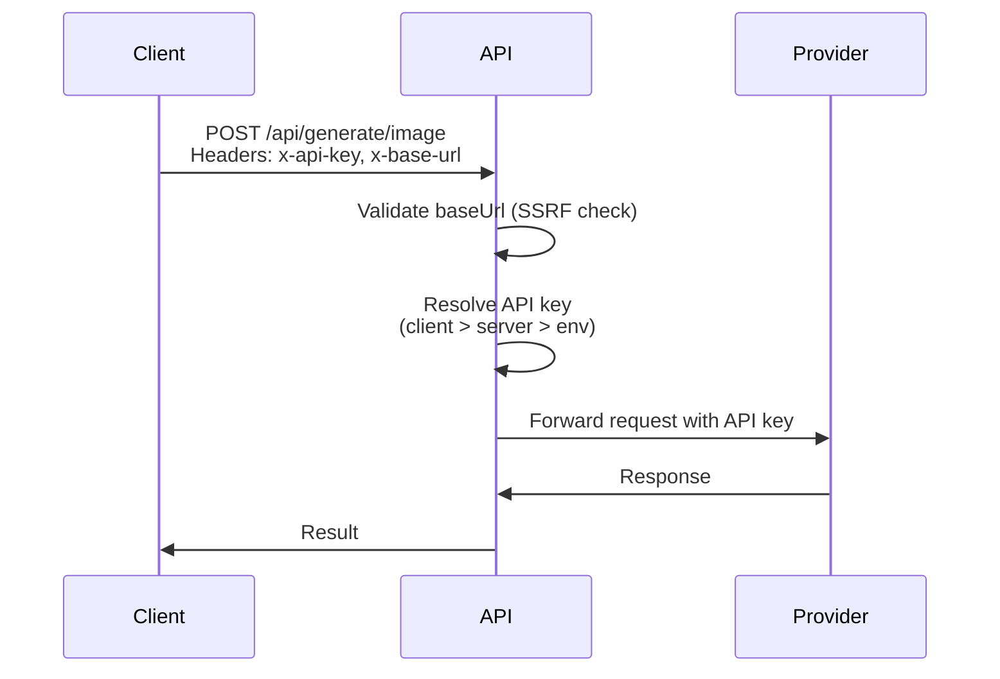
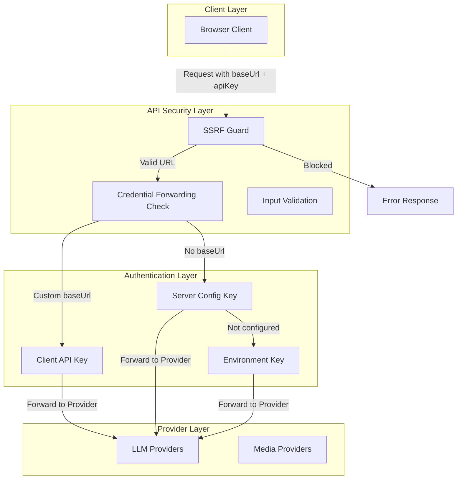
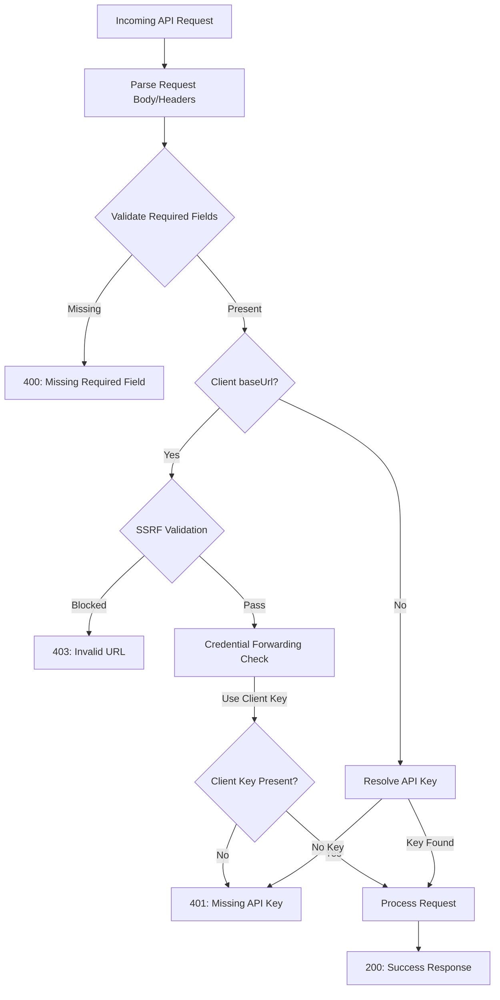
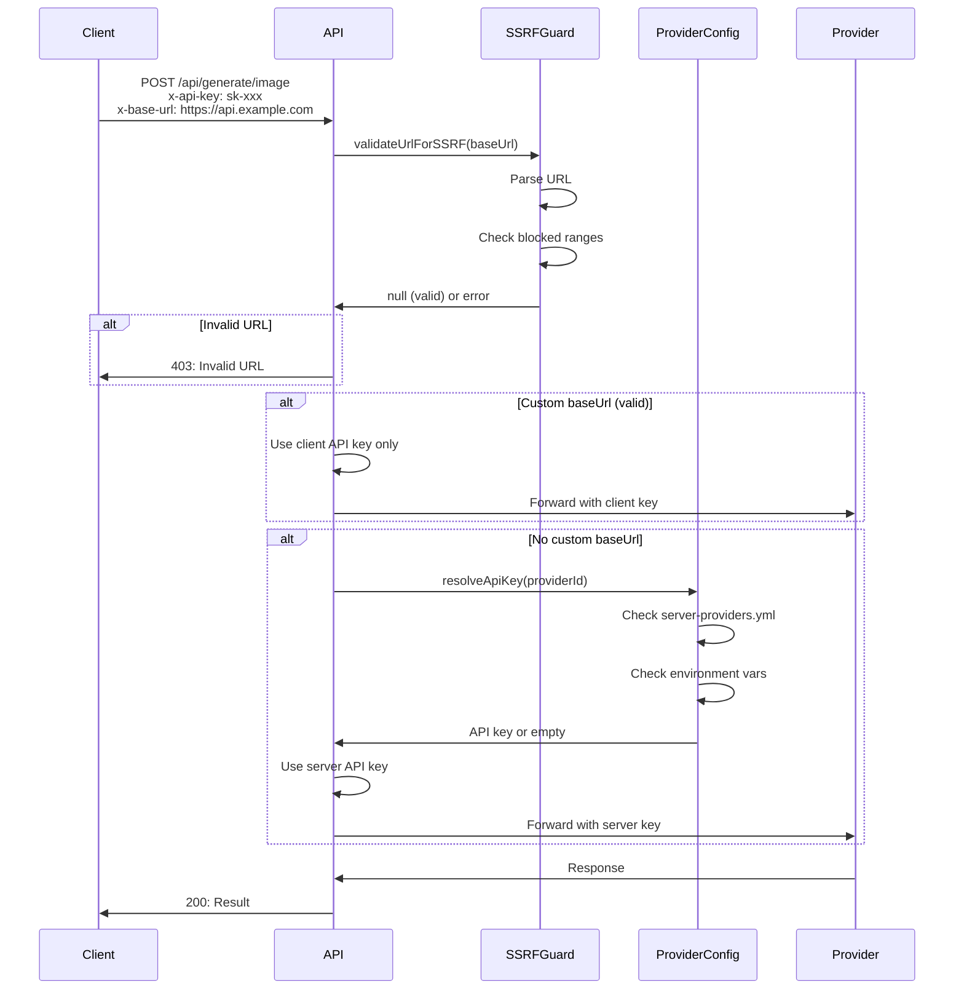

# Security Analysis - OpenMAIC

## Executive Summary

OpenMAIC implements a comprehensive security architecture designed to protect against Server-Side Request Forgery (SSRF), credential forwarding attacks, and unauthorized API access. The application follows a **stateless authentication model** with defense-in-depth principles across all API endpoints. The most recent security fix (commit 371aaee) addressed critical SSRF and credential forwarding vulnerabilities, demonstrating the project's commitment to proactive security maintenance.

---

## 1. Security Mechanisms

### 1.1 SSRF Protection

OpenMAIC implements robust SSRF protection through a dedicated guard module (`lib/server/ssrf-guard.ts`) that validates all user-supplied URLs before making server-side requests.

**Protected Endpoints:**
- `/api/chat` - Chat completion with custom baseUrl
- `/api/proxy-media` - Media proxy for CORS bypass
- `/api/generate/image` - Image generation
- `/api/generate/video` - Video generation
- `/api/generate/tts` - Text-to-speech
- `/api/parse-pdf` - PDF parsing
- `/api/transcription` - ASR transcription
- `/api/verify-model` - Model verification

**Implementation:**

```typescript
export function validateUrlForSSRF(url: string): string | null {
  let parsed: URL;
  try {
    parsed = new URL(url);
  } catch {
    return 'Invalid URL';
  }

  if (parsed.protocol !== 'https:' && parsed.protocol !== 'http:') {
    return 'Only HTTP(S) URLs are allowed';
  }

  const hostname = parsed.hostname.toLowerCase();
  if (
    hostname === 'localhost' ||
    hostname === '127.0.0.1' ||
    hostname === '::1' ||
    hostname === '0.0.0.0' ||
    hostname.startsWith('10.') ||
    hostname.startsWith('192.168.') ||
    hostname.startsWith('169.254.') ||
    isPrivate172(hostname) ||
    hostname.endsWith('.local') ||
    hostname.startsWith('fd') ||
    hostname.startsWith('fe80')
  ) {
    return 'Local/private network URLs are not allowed';
  }

  return null;
}
```

**Blocked Address Ranges:**
- `localhost`, `127.0.0.1`, `::1`, `0.0.0.0` - Loopback addresses
- `10.0.0.0/8` - Private Class A
- `172.16.0.0/12` - Private Class B (custom `isPrivate172` function)
- `192.168.0.0/16` - Private Class C
- `169.254.0.0/16` - Link-local
- `*.local` - mDNS/Bonjour
- `fd00::/8` - Unique local addresses (IPv6)
- `fe80::/10` - Link-local addresses (IPv6)

### 1.2 Credential Forwarding Prevention

A critical security fix (commit 371aaee, March 2026) prevents credential forwarding attacks by enforcing a strict security boundary when clients provide custom `baseUrl` values.

**The Vulnerability (Pre-Fix):**
Previously, if a client supplied a custom `baseUrl`, the server would:
1. Accept the custom URL
2. Use the server's configured API key for that request
3. Forward credentials to an attacker-controlled endpoint

**The Fix:**

```typescript
// When clientBaseUrl is provided, ONLY use client-provided apiKey
const effectiveApiKey = clientBaseUrl
  ? body.apiKey || ''           // Empty string if no client key
  : resolveApiKey(providerId, body.apiKey);  // Server fallback only when no custom baseUrl

const effectiveBaseUrl = clientBaseUrl
  ? clientBaseUrl               // Use client URL
  : resolveBaseUrl(providerId, body.baseUrl);  // Server fallback
```

**Security Model:**
- **Client provides baseUrl** → Client MUST provide apiKey (never use server credentials)
- **Client does NOT provide baseUrl** → Server apiKey is used
- This prevents attackers from specifying malicious URLs while stealing server credentials

### 1.3 API Key Management

OpenMAIC implements a hierarchical API key resolution system with three sources:

**Priority Order:**
1. **Client-supplied key** (highest priority) - Via request headers (`x-api-key`) or body
2. **Server-configured key** - Via `server-providers.yml` (YAML configuration)
3. **Environment variables** - Via `.env` file

**Configuration Sources:**

```typescript
// lib/server/provider-config.ts

// 1. YAML configuration (server-providers.yml)
function loadYamlFile(filename: string): YamlData {
  const filePath = path.join(process.cwd(), filename);
  const raw = fs.readFileSync(filePath, 'utf-8');
  return yaml.load(raw);
}

// 2. Environment variables fallback
const LLM_ENV_MAP: Record<string, string> = {
  OPENAI: 'openai',
  ANTHROPIC: 'anthropic',
  GOOGLE: 'google',
  // ... more providers
};

function resolveApiKey(providerId: string, clientKey?: string): string {
  if (clientKey) return clientKey;
  return getConfig().providers[providerId]?.apiKey || '';
}
```

**Security Properties:**
- Server keys never leave the server (only provider IDs exposed to client)
- Client keys are ephemeral (not stored, used per-request)
- YAML file is git-ignored (`.gitignore` includes `server-providers.yml`)
- Environment variables support for containerized deployments

### 1.4 Input Validation and Sanitization

**Request Validation:**

All API endpoints implement structured input validation:

```typescript
// Example from /api/chat
if (!body.messages || !Array.isArray(body.messages)) {
  return apiError('MISSING_REQUIRED_FIELD', 400, 'Missing required field: messages');
}

if (!body.storeState) {
  return apiError('MISSING_REQUIRED_FIELD', 400, 'Missing required field: storeState');
}

if (!body.config || !body.config.agentIds || body.config.agentIds.length === 0) {
  return apiError('MISSING_REQUIRED_FIELD', 400, 'Missing required field: config.agentIds');
}
```

**JSON Repair for AI Outputs:**

The `json-repair` library is used to sanitize malformed JSON from LLM responses, preventing parsing errors that could lead to crashes or injection:

```typescript
// lib/generation/json-repair.ts
export function tryParseJson<T>(jsonStr: string): T | null {
  try {
    return JSON.parse(jsonStr) as T;
  } catch {
    // Attempt 2: Fix LaTeX-style escapes
    fixed = fixed.replace(/"([^"]*?)"/g, (_match, content) => {
      const fixedContent = content.replace(/\\([a-zA-Z])/g, '\\\\$1');
      return `"${fixedContent}"`;
    });

    // Attempt 3: Use jsonrepair library
    try {
      const repaired = jsonrepair(jsonStr);
      return JSON.parse(repaired) as T;
    } catch {
      return null;
    }
  }
}
```

**Content-Type Validation:**

```typescript
// app/api/parse-pdf/route.ts
const contentType = req.headers.get('content-type') || '';
if (!contentType.includes('multipart/form-data')) {
  return apiError(
    'INVALID_REQUEST',
    400,
    `Invalid Content-Type: expected multipart/form-data, got "${contentType}"`,
  );
}
```

---

## 2. Authentication & Authorization

### 2.1 API Key-Based Authentication

OpenMAIC uses a **stateless, API key-based authentication** model. No user sessions or JWTs are maintained server-side.

**Authentication Flow:**



**Key Characteristics:**
- **Stateless**: No server-side session storage
- **Per-request**: Each request includes credentials
- **Provider-scoped**: Keys are scoped to individual providers (LLM, TTS, ASR, PDF, Image, Video)
- **Client-transparent**: Client knows which provider/key is being used

### 2.2 Provider Verification Endpoints

OpenMAIC exposes verification endpoints for testing provider credentials:

**Endpoints:**
- `/api/verify-model` - Test LLM provider connection
- `/api/verify-image-provider` - Test image generation provider
- `/api/verify-video-provider` - Test video generation provider
- `/api/verify-pdf-provider` - Test PDF parsing provider

**Implementation:**

```typescript
// app/api/verify-model/route.ts
export async function POST(req: NextRequest) {
  const { apiKey, baseUrl, model, providerType, requiresApiKey } = await req.json();

  const result = resolveModel({
    modelString: model,
    apiKey: apiKey || '',
    baseUrl: baseUrl || undefined,
    providerType,
    requiresApiKey,
  });

  // Send minimal test message
  const { text } = await generateText({
    model: result.model,
    prompt: 'Say "OK" if you can hear me.',
  });

  return apiSuccess({
    message: 'Connection successful',
    response: text,
  });
}
```

**Security Properties:**
- No credentials are stored after verification
- Verifications are isolated per-request
- Failed attempts are logged for monitoring

### 2.3 Session Management

**Stateless Design:**

OpenMAIC employs a deliberately stateless architecture for security:

```typescript
// app/api/chat/route.ts - Stateless Chat API
export async function POST(req: NextRequest) {
  const body: StatelessChatRequest = await req.json();

  // No server-side session - client sends full state
  // body.messages: UIMessage[]
  // body.storeState: { stage, scenes, currentSceneId, mode }
  // body.config: { agentIds, sessionType }
}
```

**Benefits:**
- No session fixation attacks
- No server-side session storage to compromise
- Horizontal scalability (any instance can handle any request)
- Automatic cleanup (no stale sessions)

**Interruption Handling:**

```typescript
// Client aborts fetch request → triggers req.signal
if (signal.aborted) {
  log.info('Request was aborted');
  break;
}
```

---

## 3. Security Middleware

### 3.1 CORS Configuration

OpenMAIC does NOT implement explicit CORS middleware. This is an **intentional design choice**:

**Rationale:**
- The application is designed for same-origin deployment
- API routes are consumed by the Next.js frontend (same origin)
- No cross-origin API access is intended

**Implications:**
- If deploying to a different domain, CORS must be configured
- Current implementation assumes production deployment to single origin

**Recommendation:**
```typescript
// next.config.ts - Add CORS headers if needed
const nextConfig: NextConfig = {
  async headers() {
    return [
      {
        source: '/api/:path*',
        headers: [
          { key: 'Access-Control-Allow-Origin', value: 'https://yourdomain.com' },
          { key: 'Access-Control-Allow-Methods', value: 'GET, POST, OPTIONS' },
          { key: 'Access-Control-Allow-Headers', value: 'Content-Type, x-api-key, x-base-url' },
        ],
      },
    ];
  },
};
```

### 3.2 Rate Limiting

**Current State: Rate limiting is NOT implemented**

**Recommendations:**

```typescript
// middleware.ts - Example rate limiting
import { Ratelimit } from '@upstash/ratelimit';
import { Redis } from '@upstash/redis';

const ratelimit = new Ratelimit({
  redis: Redis.fromEnv(),
  limiter: Ratelimit.slidingWindow(10, '10 s'),
});

export async function middleware(request: NextRequest) {
  const ip = request.ip ?? '127.0.0.1';
  const { success } = await ratelimit.limit(ip);

  if (!success) {
    return new Response('Too Many Requests', { status: 429 });
  }
}
```

**Endpoints That Need Rate Limiting:**
- `/api/generate/*` - Generation APIs (compute-intensive)
- `/api/chat` - LLM completion (cost-intensive)
- `/api/proxy-media` - Media proxy (bandwidth-intensive)

### 3.3 Error Handling Patterns

OpenMAIC implements structured error responses that avoid information leakage:

**Error Response Structure:**

```typescript
// lib/server/api-response.ts
export const API_ERROR_CODES = {
  MISSING_REQUIRED_FIELD: 'MISSING_REQUIRED_FIELD',
  MISSING_API_KEY: 'MISSING_API_KEY',
  INVALID_REQUEST: 'INVALID_REQUEST',
  INVALID_URL: 'INVALID_URL',
  REDIRECT_NOT_ALLOWED: 'REDIRECT_NOT_ALLOWED',
  CONTENT_SENSITIVE: 'CONTENT_SENSITIVE',
  UPSTREAM_ERROR: 'UPSTREAM_ERROR',
  GENERATION_FAILED: 'GENERATION_FAILED',
  TRANSCRIPTION_FAILED: 'TRANSCRIPTION_FAILED',
  PARSE_FAILED: 'PARSE_FAILED',
  INTERNAL_ERROR: 'INTERNAL_ERROR',
} as const;

export function apiError(
  code: ApiErrorCode,
  status: number,
  error: string,
  details?: string,
): NextResponse<ApiErrorBody> {
  return NextResponse.json(
    {
      success: false as const,
      errorCode: code,
      error,
      ...(details ? { details } : {}),
    },
    { status },
  );
}
```

**Security Properties:**
- Generic error codes (no stack traces exposed)
- Appropriate HTTP status codes
- Optional details field for debugging (non-sensitive info only)
- Consistent error format across all endpoints

---

## 4. Security Diagrams

### 4.1 Security Layers Diagram



### 4.2 Request Validation Flow



### 4.3 API Key Verification Flow



---

## 5. Potential Vulnerabilities Analysis

### 5.1 Recent Security Fixes

**Commit 371aaee (March 17, 2026): SSRF/Credential Forwarding Fix**

**Vulnerability Description:**
Prior to this fix, the application was vulnerable to:
1. **SSRF**: Attackers could specify internal URLs in `baseUrl` parameter
2. **Credential Forwarding**: Server API keys were forwarded to attacker-controlled endpoints

**The Fix:**
- Added `validateUrlForSSRF()` function to block private network URLs
- Modified credential resolution logic to prevent server key forwarding when custom baseUrl is provided
- Applied fix across all affected API endpoints

**Files Modified:**
- `lib/server/ssrf-guard.ts` (new file)
- `lib/server/resolve-model.ts`
- `app/api/chat/route.ts`
- `app/api/proxy-media/route.ts`
- `app/api/generate/image/route.ts`
- `app/api/generate/video/route.ts`
- `app/api/generate/tts/route.ts`
- All other provider endpoints

### 5.2 Remaining Security Considerations

**1. No Rate Limiting**
- **Risk**: DoS attacks, API cost abuse
- **Impact**: High (compute/bandwidth costs)
- **Recommendation**: Implement per-IP rate limiting for generation endpoints

**2. No Request Size Limits**
- **Risk**: Memory exhaustion via large payloads
- **Impact**: Medium
- **Recommendation**: Add body size limits in Next.js config (currently 200MB limit is very high)

```typescript
// next.config.ts - Current setting
experimental: {
  proxyClientMaxBodySize: '200mb',  // Consider reducing to 10mb for non-media endpoints
}
```

**3. No Content Security Policy (CSP)**
- **Risk**: XSS attacks if malicious content is rendered
- **Impact**: Low-Medium (depending on usage)
- **Recommendation**: Add CSP headers for production

```typescript
// next.config.ts
async headers() {
  return [
    {
      source: '/(.*)',
      headers: [
        {
          key: 'Content-Security-Policy',
          value: "default-src 'self'; script-src 'self' 'unsafe-inline'; style-src 'self' 'unsafe-inline';"
        }
      ]
    }
  ]
}
```

**4. CORS Not Configured**
- **Risk**: If deployed to different origins, browser will block requests
- **Impact**: Low (same-origin deployment assumed)
- **Recommendation**: Document CORS requirements for cross-origin deployments

**5. No Authentication for Provider Endpoints**
- **Risk**: Anyone can use server-configured API keys if they know the provider ID
- **Impact**: High (API key theft)
- **Recommendation**: Consider adding authentication tokens for server API usage

**6. Proxy Media Endpoint Abuse**
- **Risk**: `/api/proxy-media` could be used to proxy arbitrary URLs
- **Impact**: Medium (bandwidth abuse)
- **Mitigation**: SSRF guard is in place, but rate limiting recommended

**7. Error Messages May Leak Information**
- **Risk**: Detailed error messages could reveal system information
- **Impact**: Low
- **Current State**: Generic error codes are used (good)
- **Recommendation**: Ensure stack traces never reach client in production

### 5.3 Best Practices Recommendations

**Immediate (High Priority):**
1. Implement rate limiting for generation endpoints
2. Reduce max body size for non-media endpoints
3. Add authentication for server API key usage

**Short-Term (Medium Priority):**
1. Add CSP headers for production
2. Implement request logging and monitoring
3. Add API key rotation mechanism
4. Document CORS setup for cross-origin deployments

**Long-Term (Low Priority):**
1. Implement audit logging for all API calls
2. Add API key scopes and permissions
3. Consider adding API key encryption at rest
4. Implement Web Application Firewall (WAF) rules

---

## 6. Secrets Management

### 6.1 Environment Variable Usage

OpenMAIC supports comprehensive environment variable configuration:

```bash
# .env.example structure
OPENAI_API_KEY=
OPENAI_BASE_URL=
OPENAI_MODELS=

ANTHROPIC_API_KEY=
ANTHROPIC_BASE_URL=
ANTHROPIC_MODELS=

# ... more providers

# Optional server-side default model
DEFAULT_MODEL=

# Optional proxy settings
HTTP_PROXY=
HTTPS_PROXY=
```

**Environment Variable Map:**

```typescript
const LLM_ENV_MAP: Record<string, string> = {
  OPENAI: 'openai',
  ANTHROPIC: 'anthropic',
  GOOGLE: 'google',
  DEEPSEEK: 'deepseek',
  QWEN: 'qwen',
  KIMI: 'kimi',
  MINIMAX: 'minimax',
  GLM: 'glm',
  SILICONFLOW: 'siliconflow',
  DOUBAO: 'doubao',
};
```

### 6.2 .env.example Reference

The `.env.example` file serves as the template for all supported environment variables:

**Categories:**
1. **LLM Providers** - 11 providers supported
2. **TTS Providers** - 4 providers (OpenAI, Azure, GLM, Qwen)
3. **ASR Providers** - 2 providers (OpenAI Whisper, Qwen)
4. **PDF Processing** - 2 providers (UnPDF, MinerU)
5. **Image Generation** - 3 providers (Seedream, Qwen Image, Nano Banana)
6. **Video Generation** - 4 providers (Seedance, Kling, Veo, Sora)
7. **Web Search** - Tavily

**Security Properties:**
- All variables are optional (configure only what you use)
- No default values (prevents accidental secrets in code)
- `.env` files are git-ignored
- `.env.example` contains no secrets

### 6.3 YAML Configuration

For more advanced deployments, OpenMAIC supports YAML-based provider configuration:

**File: `server-providers.yml` (git-ignored)**

```yaml
providers:
  openai:
    apiKey: sk-xxx
    baseUrl: https://api.openai.com/v1
    models:
      - gpt-4o
      - gpt-4o-mini
  anthropic:
    apiKey: sk-ant-xxx
    baseUrl: https://api.anthropic.com

tts:
  openai-tts:
    apiKey: sk-xxx
    baseUrl: https://api.openai.com/v1

# ... more categories
```

**Priority: Environment Variables > YAML**

```typescript
function loadEnvSection(
  envMap: Record<string, string>,
  yamlSection: Record<string, Partial<ServerProviderEntry>> | undefined,
): Record<string, ServerProviderEntry> {
  // First, add everything from YAML as defaults
  if (yamlSection) {
    for (const [id, entry] of Object.entries(yamlSection)) {
      if (entry?.apiKey) {
        result[id] = { apiKey: entry.apiKey, baseUrl: entry.baseUrl };
      }
    }
  }

  // Then, apply env vars (env takes priority over YAML)
  for (const [prefix, providerId] of Object.entries(envMap)) {
    const envApiKey = process.env[`${prefix}_API_KEY`];
    if (envApiKey) {
      result[providerId].apiKey = envApiKey;  // Override
    }
  }
}
```

### 6.4 Deployment Security Considerations

**Container/Orchestration:**

```dockerfile
# Dockerfile (from repository)
# Use secrets management for sensitive data
# ENV vars should be injected at runtime, not baked into image

# Kubernetes example:
apiVersion: v1
kind: Secret
metadata:
  name: openmaic-secrets
type: Opaque
stringData:
  OPENAI_API_KEY: sk-xxx
  ANTHROPIC_API_KEY: sk-ant-xxx
```

**Vercel/Serverless:**

```bash
# Use vercel env CLI for secrets
vercel env add OPENAI_API_KEY production

# Or via dashboard: Settings > Environment Variables
```

**Security Checklist for Deployment:**

- [ ] Never commit `.env` or `server-providers.yml`
- [ ] Use environment-specific `.env` files (`.env.production`, `.env.staging`)
- [ ] Rotate API keys regularly
- [ ] Use different keys for development/production
- [ ] Implement secrets scanning in CI/CD
- [ ] Use secret management service (AWS Secrets Manager, Azure Key Vault)
- [ ] Audit API key usage regularly
- [ ] Implement key revocation process
- [ ] Monitor for unusual API usage patterns

---

## Conclusion

OpenMAIC demonstrates a mature security posture with:

**Strengths:**
- Comprehensive SSRF protection across all endpoints
- Effective credential forwarding prevention (recently fixed)
- Stateless authentication model (no session fixation risks)
- Structured error handling (no information leakage)
- Flexible secrets management (env vars + YAML)
- Defense-in-depth approach (multiple validation layers)

**Areas for Improvement:**
- Rate limiting not implemented
- No CSP headers
- CORS not configured for cross-origin deployments
- No authentication for server API key usage
- Request size limits too permissive

**Security Maturity:** **Medium-High**

The project's proactive response to the SSRF/credential forwarding vulnerability (commit 371aaee) demonstrates a security-conscious development culture. With the recommended improvements (especially rate limiting and authentication), OpenMAIC would achieve a high security maturity level suitable for enterprise deployment.
