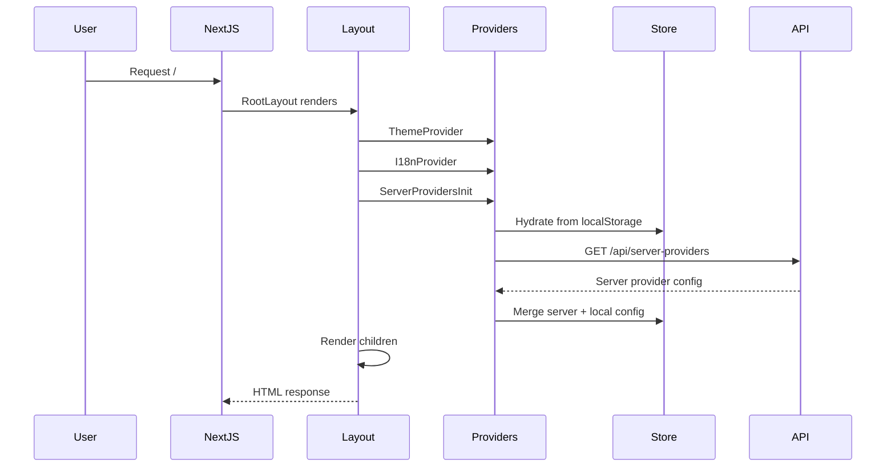
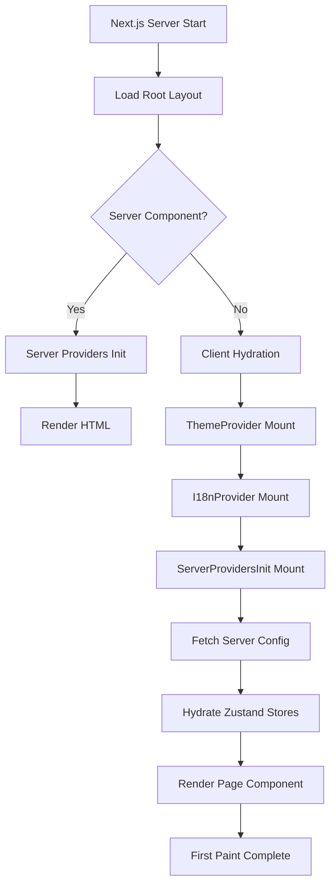
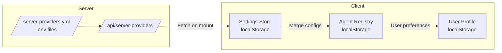
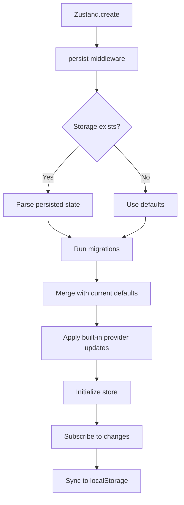

# Initialization & Tooling

This document covers the application startup flow, development tools, deployment configuration, workspace packages, OpenClaw integration, and configuration files for OpenMAIC.

## Initialization Flow

### Application Startup Sequence

OpenMAIC follows Next.js 16 App Router initialization patterns with custom provider setup:



### Root Layout Structure

The application initializes through `/app/layout.tsx`:

```tsx
// Key initialization steps:
1. Font loading (Inter, Geist Sans, Geist Mono)
2. CSS imports (Tailwind, Animate.css, KaTeX)
3. ThemeProvider wrapper (dark/light/system mode)
4. I18nProvider wrapper (zh-CN/en-US)
5. ServerProvidersInit (fetches server-side provider config)
6. Toaster component (Sonner notifications)
```

### Provider Initialization

#### Theme Provider (`lib/hooks/use-theme.tsx`)

- **Storage**: localStorage key `theme`
- **Modes**: light, dark, system
- **System detection**: Uses `prefers-color-scheme` media query
- **Hydration**: Post-mount localStorage read to avoid SSR mismatch

#### I18n Provider (`lib/hooks/use-i18n.tsx`)

- **Storage**: localStorage key `locale`
- **Supported locales**: zh-CN (default), en-US
- **Auto-detection**: Based on `navigator.language`
- **Translation**: Nested key access with fallback

#### Server Providers (`components/server-providers-init.tsx`)

A client component that fetches server-side provider configuration on mount:

```tsx
useEffect(() => {
  fetchServerProviders(); // GET /api/server-providers
}, [fetchServerProviders]);
```

This enables zero-setup classroom generation by auto-configuring providers from the server.

## Initialization Diagrams

### Application Startup Sequence



### Provider Initialization Flow



### Store Setup Flow



## Development Tools

### Testing Framework

**No formal test suite is currently configured.** The project does not include:
- Unit test frameworks (Jest, Vitest)
- E2E test frameworks (Playwright, Cypress)
- Test runner scripts in package.json

### Linting

ESLint configuration (`eslint.config.mjs`):

```javascript
// Uses Next.js recommended configs
- eslint-config-next/core-web-vitals
- eslint-config-next/typescript

// Key rule overrides:
- @next/next/no-img-element: off (allows  for dynamic AI images)
- @typescript-eslint/no-unused-vars: warn (allows _prefix pattern)

// Ignores:
- .next/**, out/**, build/**, next-env.d.ts
- packages/** (vendored code)
```

Run linting:
```bash
pnpm lint    # Check for issues
```

### Code Formatting

Prettier configuration (`.prettierrc`):

```json
{
  "printWidth": 100,
  "tabWidth": 2,
  "semi": true,
  "singleQuote": true,
  "trailingComma": "all",
  "arrowParens": "always",
  "endOfLine": "lf"
}
```

Run formatting:
```bash
pnpm check    # Check formatting
pnpm format   # Write formatted files
```

### Build Tools

| Tool | Purpose | Configuration |
|------|---------|---------------|
| **Next.js** | App Router, SSR/SSG, API routes | `next.config.ts` |
| **TypeScript** | Type checking | `tsconfig.json` |
| **Rollup** | Package bundling (workspace packages) | `rollup.config.{js,mjs}` |
| **Tailwind CSS v4** | Utility-first CSS | `@import 'tailwindcss'` |
| **PostCSS** | CSS processing | `postcss.config.mjs` |

### Build Process

```bash
# Development
pnpm dev              # Start Next.js dev server

# Production
pnpm build            # Build workspace packages + Next.js
pnpm start            # Run production server

# Individual package builds
cd packages/mathml2omml && pnpm build
cd packages/pptxgenjs && pnpm build
```

### Package Management

**pnpm workspace** (`pnpm-workspace.yaml`):

```yaml
packages:
  - "packages/*"
```

Workspace packages:
- `mathml2omml` - MathML to OMML converter
- `pptxgenjs` - PowerPoint generation library

Postinstall hook automatically builds workspace packages:
```json
"postinstall": "cd packages/mathml2omml && npm run build && cd ../pptxgenjs && npm run build"
```

## Deployment Tools

### Docker Multi-Stage Build

The `Dockerfile` uses a 4-stage build process:

```dockerfile
# Stage 1: Base
FROM node:22-alpine AS base
- Install libc6-compat
- Enable pnpm 10.28.0

# Stage 2: Dependencies
FROM base AS deps
- Native build tools for sharp, @napi-rs/canvas
- pnpm install --frozen-lockfile

# Stage 3: Builder
FROM base AS builder
- Copy node_modules and packages
- pnpm build (builds workspace + Next.js)

# Stage 4: Runner
FROM node:22-alpine AS runner
- Production environment
- Copy standalone artifacts
- Non-root nextjs user
- EXPOSE 3000
```

### Next.js Standalone Output

Configuration (`next.config.ts`):

```typescript
const nextConfig: NextConfig = {
  // Disabled on Vercel, enabled for Docker/self-hosted
  output: process.env.VERCEL ? undefined : 'standalone',

  // Transpile workspace packages for client-side use
  transpilePackages: ['mathml2omml', 'pptxgenjs'],

  // Allow large proxy bodies (200mb for file uploads)
  experimental: {
    proxyClientMaxBodySize: '200mb',
  },
};
```

Standalone output creates:
- `.next/standalone/server.js` - Minimal server entry
- `.next/static/` - Static assets
- Minimal `node_modules` (only production dependencies)

### Docker Compose

```yaml
services:
  openmaic:
    build: .
    ports: ["3000:3000"]
    env_file: .env.local
    volumes:
      - ./server-providers.yml:/app/server-providers.yml:ro  # Optional
      - openmaic-data:/app/data
    restart: unless-stopped
```

### Environment Configuration

The application supports two configuration methods:

1. **Environment Variables** (`.env.local`):
   - LLM providers: `{PROVIDER}_API_KEY`, `{PROVIDER}_BASE_URL`
   - TTS/ASR: `TTS_*_API_KEY`, `ASR_*_API_KEY`
   - PDF: `PDF_*_API_KEY`
   - Media: `IMAGE_*_API_KEY`, `VIDEO_*_API_KEY`
   - Web Search: `TAVILY_API_KEY`

2. **Server Config** (`server-providers.yml`):
   - YAML-based configuration
   - Supports API keys, base URLs, model allowlists
   - Applied server-side for zero-setup classroom generation

## Workspace Packages

### mathml2omml

**Purpose**: Convert MathML (mathematical markup) to OMML (Office Math Markup Language)

**Details**:
- Version: 0.5.0
- License: LGPL-3.0-or-later
- Source: forked from fiduswriter/mathml2omml
- Build: Rollup (ES module + CommonJS outputs)
- Used by: PowerPoint export functionality

**Build output**:
```
dist/index.js      # ES module
dist/index.cjs     # CommonJS
dist/index.d.ts    # TypeScript definitions
```

### pptxgenjs

**Purpose**: Create PowerPoint presentations programmatically in JavaScript

**Details**:
- Version: 4.0.1 (customized fork)
- License: MIT
- Source: forked from gitbrent/PptxGenJS
- Build: Rollup with TypeScript plugin

**Build outputs**:
```
dist/pptxgen.js       # IIFE (browser)
dist/pptxgen.cjs.js   # CommonJS
dist/pptxgen.es.js    # ES module
types/                # TypeScript definitions
```

**Customization**:
- Modified for OpenMAIC's slide export requirements
- Bundled as workspace package for version control

### Package Interdependencies

```
openmaic (main)
├── mathml2omml (workspace:*)
│   └── Used for LaTeX → PowerPoint conversion
└── pptxgenjs (workspace:*)
    └── Used for .pptx file generation
```

Both packages are transpiled by Next.js for client-side use via `transpilePackages`.

## OpenClaw Integration

OpenMAIC provides an OpenClaw skill for zero-setup classroom generation via messaging platforms.

### Skills Directory Structure

```
skills/
└── openmaic/
    ├── SKILL.md                  # Skill definition and SOP
    └── references/
        ├── clone.md              # Repository cloning guide
        ├── hosted-mode.md        # Hosted OpenMAIC usage
        ├── startup-modes.md      # Dev/prod Docker modes
        ├── provider-keys.md      # Provider configuration
        └── generate-flow.md      # Classroom generation flow
```

### Skill Definition

**Metadata** (`SKILL.md`):
```yaml
name: openmaic
description: Guided SOP for setting up and using OpenMAIC from OpenClaw
user-invocable: true
metadata:
  openclaw:
    emoji: 🏫
```

**Core Rules**:
- Move one phase at a time
- Require confirmation before state changes
- Detect existing local state
- Prefer config file edits over pasting API keys
- Server-side config controls classroom generation
- No request-time model/provider overrides

### SOP Phases

The skill guides users through:

1. **Choose Mode** - Hosted (access code) vs Local (clone repo)
2. **Clone or Reuse Repo** - Git operations and directory selection
3. **Choose Startup Mode** - Dev server vs Docker
4. **Configure Provider Keys** - `.env` or `server-providers.yml`
5. **Start and Verify** - Service health check
6. **Generate Classroom** - PDF upload and requirements

### Messaging App Integrations

OpenClaw supports multiple messaging platforms:

| Platform | Integration Type | Use Case |
|----------|-----------------|----------|
| **Feishu** | Webhook/API | Enterprise classroom creation |
| **Slack** | Slash commands | Team collaboration workflows |
| **Discord** | Bot commands | Community-driven generation |
| **Telegram** | Bot commands | Mobile-friendly access |

### Zero-Setup Classroom Generation

The skill enables server-side provider configuration:

```yaml
# server-providers.yml example
anthropic:
  apiKey: sk-ant-xxx
  baseUrl: https://api.anthropic.com
  models:
    - claude-3-5-sonnet-20241022

openai:
  apiKey: sk-xxx
  baseUrl: https://api.openai.com
  models:
    - gpt-4o
```

When configured, users can generate classrooms without any client-side API keys.

## Configuration Files

### next.config.ts

```typescript
{
  output: process.env.VERCEL ? undefined : 'standalone',
  transpilePackages: ['mathml2omml', 'pptxgenjs'],
  serverExternalPackages: [],
  experimental: {
    proxyClientMaxBodySize: '200mb',
  },
}
```

**Key settings**:
- Standalone output for Docker deployments
- Transpile workspace packages for browser compatibility
- 200MB proxy limit for large PDF/file uploads

### tsconfig.json

```json
{
  "compilerOptions": {
    "target": "ES2017",
    "lib": ["dom", "dom.iterable", "esnext"],
    "strict": true,
    "module": "esnext",
    "moduleResolution": "bundler",
    "jsx": "react-jsx",
    "paths": {
      "@/*": ["./*"]
    },
    "plugins": [{ "name": "next" }]
  },
  "include": ["**/*.ts", "**/*.tsx", ".next/types/**/*.ts"],
  "exclude": ["node_modules", "dist", "packages/*/src", "openclaw"]
}
```

**Notable**:
- Path alias `@/*` for clean imports
- Next.js plugin for enhanced type checking
- Excludes workspace source directories

### components.json (shadcn/ui)

```json
{
  "style": "radix-vega",
  "rsc": true,
  "tsx": true,
  "tailwind": {
    "css": "app/globals.css",
    "baseColor": "neutral",
    "cssVariables": true
  },
  "iconLibrary": "lucide",
  "aliases": {
    "components": "@/components",
    "utils": "@/lib/utils",
    "ui": "@/components/ui",
    "lib": "@/lib",
    "hooks": "@/hooks"
  },
  "registries": {
    "@ai-elements": "https://registry.ai-sdk.dev/{name}.json"
  }
}
```

**Features**:
- Radix UI primitives with Vega styling
- CSS variables for theming
- Lucide icons
- AI SDK components registry

### .env.example Variables

The template includes 120+ lines covering:

```bash
# LLM Providers
OPENAI_API_KEY=
ANTHROPIC_API_KEY=
GOOGLE_API_KEY=
DEEPSEEK_API_KEY=
QWEN_API_KEY=
KIMI_API_KEY=
MINIMAX_API_KEY=
GLM_API_KEY=
SILICONFLOW_API_KEY=
DOUBAO_API_KEY=

# TTS Providers
TTS_OPENAI_API_KEY=
TTS_AZURE_API_KEY=
TTS_GLM_API_KEY=
TTS_QWEN_API_KEY=

# ASR Providers
ASR_OPENAI_API_KEY=
ASR_QWEN_API_KEY=

# PDF Processing
PDF_UNPDF_API_KEY=
PDF_MINERU_API_KEY=

# Image Generation
IMAGE_SEEDREAM_API_KEY=
IMAGE_QWEN_IMAGE_API_KEY=
IMAGE_NANO_BANANA_API_KEY=

# Video Generation
VIDEO_SEEDANCE_API_KEY=
VIDEO_KLING_API_KEY=
VIDEO_VEO_API_KEY=
VIDEO_SORA_API_KEY=

# Web Search
TAVILY_API_KEY=

# Optional
DEFAULT_MODEL=
LOG_LEVEL=
LOG_FORMAT=
LLM_THINKING_DISABLED=
```

**All variables are optional** - configure only the providers you use.

### vercel.json

```json
{
  "framework": "nextjs",
  "installCommand": "pnpm install",
  "buildCommand": "pnpm build",
  "functions": {
    "app/api/**/*.ts": {
      "maxDuration": 300
    }
  }
}
```

**Settings**:
- 5-minute timeout for API routes (classroom generation)
- pnpm package manager
- Framework detection for auto-configuration

## Summary

OpenMAIC's initialization and tooling stack provides:

- **Provider-based initialization** with server-side configuration sync
- **Zustand + localStorage persistence** for all client state
- **Zero-setup deployment** via Docker with standalone Next.js output
- **Workspace monorepo** for customized dependencies
- **OpenClaw skill** for messaging platform integration
- **Comprehensive linting/formatting** without formal testing
- **Multi-stage Docker build** for production optimization
- **Environment + YAML configuration** for flexible deployment

The architecture prioritizes developer experience (hot reload, TypeScript), deployment flexibility (Vercel, Docker, self-hosted), and end-user simplicity (zero-setup classroom generation via server config).
