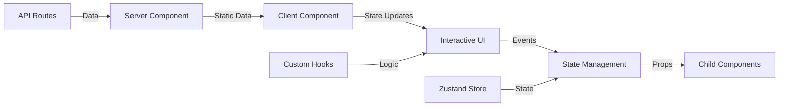

# 7. Component Catalog

## Overview

The OpenMAIC project implements a sophisticated component architecture with over 200 component files organized into logical directories. The architecture follows a modular design pattern with clear separation of concerns, supporting both canvas-based presentations and interactive AI-powered experiences.

## 1. UI Components (`components/` directory)

### 1.1 Slide Renderer Components (`components/slide-renderer/`)

The slide renderer is the core presentation engine built on a canvas-based architecture:

#### **Core Architecture**
- **Canvas Editor**: Main editing interface for slide elements
- **Element System**: Modular components for different media types
- **Prosemirror Integration**: Advanced rich text editing
- **Canvas Operations**: State management for element manipulation

#### **Element Types** (`components/slide-renderer/components/element/`)

| Element Type | Component | Features |
|--------------|-----------|----------|
| **Text Elements** | `TextElement/index.tsx` | Auto-resizing, rich text editing, vertical/horizontal layout, font styling |
| **Image Elements** | `ImageElement/` | Image upload, resize, rotation, filters, outline effects |
| **Shape Elements** | `ShapeElement/` | Geometric shapes, color fills, borders, shadows |
| **Chart Elements** | `ChartElement/` | Dynamic chart rendering, data visualization |
| **Table Elements** | `TableElement/` | Responsive tables, cell editing, styling |
| **Video Elements** | `VideoElement/` | Video playback controls, inline video embedding |
| **LaTeX Elements** | `LatexElement/` | Mathematical formula rendering, equation editing |
| **Line Elements** | `LineElement/` | Drawing tools, connectors, arrows |

#### **Canvas Editor** (`components/slide-renderer/Editor/`)

- **`Canvas/`**: Core canvas rendering and interaction
  - `EditableElement.tsx`: Base component for all editable elements
  - `AlignmentLine.tsx`: Visual guides for element alignment
  - `GridLines.tsx`: Grid system for precise positioning
  - `ElementCreateSelection.tsx`: Selection area for creating elements
  - `hooks/`: Custom hooks for canvas operations

### 1.2 Scene Renderers (`components/scene-renderers/`)

#### **Quiz Renderer** (`components/scene-renderers/quiz/`)
- Interactive quiz system with multiple question types
- Real-time feedback and scoring
- Progress tracking

#### **Interactive Renderer** (`components/scene-renderers/`)
- Dynamic content presentation
- User interaction handling
- State management for interactive elements

#### **PBL Renderer** (`components/scene-renderers/pbl/`)
- Problem-based learning interface
- Collaborative features
- Multi-user sessions

### 1.3 Agent Components (`components/agent/`)

| Component | Purpose | Key Features |
|-----------|---------|--------------|
| **`agent-avatar.tsx`** | Visual representation | Avatar display, name, color theming, responsive sizes |
| **`agent-bar.tsx`** | Agent management | Agent listing, status indicators, quick actions |
| **`agent-config-panel.tsx`** | Configuration | Agent settings, personality traits, voice selection |
| **`agent-reveal-modal.tsx`** | Agent introduction | Sequential reveal, animations, context information |

### 1.4 Chat Components (`components/chat/`)

| Component | Purpose | Key Features |
|-----------|---------|--------------|
| **`chat-area.tsx`** | Main chat interface | Tabbed interface (Lecture/Chat), drag-to-resize, session management |
| **`chat-session.tsx`** | Individual chat sessions | Message display, streaming support, branch navigation |
| **`session-list.tsx`** | Session management | Session listing, expansion/collapse, status indicators |
| **`lecture-notes-view.tsx`** | Lecture notes | Scene-based notes, timeline view, action items |
| **`proactive-card.tsx`** | AI suggestions | Context-aware recommendations, proactive assistance |
| **`process-sse-stream.ts`** | Streaming handling | Server-sent events, real-time updates, buffering |

### 1.5 Settings Components (`components/settings/`)

- Theme configuration
- Model settings
- Audio/Video preferences
- Export options
- User profile management

### 1.6 Whiteboard Components (`components/whiteboard/`)

- Canvas-based drawing
- Shape tools
- Text annotations
- Layer management
- Export functionality

### 1.7 AI Elements (`components/ai-elements/`)

| Component | Purpose | Features |
|-----------|---------|----------|
| **`message.tsx`** | Chat messages | Streaming content, branches, attachments, actions |
| **`artifact.tsx`** | AI-generated content | Code blocks, files, structured output |
| **`chain-of-thought.tsx`** | Reasoning display | Step-by-step thinking process |
| **`checkpoint.tsx`** | Save points | State preservation, navigation |
| **`code-block.tsx`** | Code rendering | Syntax highlighting, copy functionality |
| **`confirmation.tsx`** | User confirmation | Choice selection, actions |
| **`connection.tsx`** | Relationship mapping | Visual connections between concepts |
| **`context.tsx`** | Context display | Background information, references |
| **`controls.tsx`** | AI controls | Playback, navigation, settings |
| **`conversation.tsx`** | Chat interface | Message flow, typing indicators |
| **`edge.tsx`** | Visual connections | Graph edges, flow diagrams |
| **`image.tsx`** | Image display | Gallery view, metadata, actions |
| **`inline-citation.tsx`** | References | Source attribution, links |
| **`loader.tsx`** | Loading states | Animated indicators, progress |

## 2. Component Hierarchy Diagram

```mermaid
graph TD
    A[App] --> B[SlideRenderer]
    A --> C[SceneRenderer]
    A --> D[ChatArea]

    B --> B1[Canvas Editor]
    B1 --> B2[Element System]
    B2 --> B2a[TextElement]
    B2 --> B2b[ImageElement]
    B2 --> B2c[ShapeElement]
    B2 --> B2d[ChartElement]
    B2 --> B2e[TableElement]
    B2 --> B2f[VideoElement]
    B2 --> B2g[LaTeXElement]
    B2 --> B2h[LineElement]

    B1 --> B3[Canvas Operations]
    B3 --> B3a[useCanvasOperations]
    B3 --> B3b[useElementShadow]
    B3 --> B3c[ProsemirrorEditor]

    C --> C1[QuizRenderer]
    C --> C2[InteractiveRenderer]
    C --> C3[PBLRenderer]

    D --> D1[Chat Sessions]
    D1 --> D1a[SessionList]
    D1 --> D1b[Message Components]
    D1 --> D1c[Lecture Notes]

    E[Agent Components] --> E1[AgentAvatar]
    E --> E2[AgentBar]
    E --> E3[AgentConfigPanel]

    F[AI Elements] --> F1[Message]
    F --> F2[Artifact]
    F --> F3[ChainOfThought]
    F --> F4[CodeBlock]
    F --> F5[Confirmation]

    G[UI Components] --> G1[Button]
    G --> G2[Combobox]
    G --> G3[Dialog]
    G --> G4[DropdownMenu]
    G --> G5[Tooltip]

    H[Canvas Store] --> H1[Element Selection]
    H --> H2[Viewport State]
    H --> H3[Toolbar State]
    H --> H4[Format Painter]

    I[Scene Context] --> I1[Scene Data]
    I --> I2[Active State]
    I --> I3[Stage State]

    J[Settings Store] --> J1[Theme]
    J --> J2[Model Config]
    J --> J3[Audio/Video]

    K[Hooks] --> K1[useCanvasOperations]
    K --> K2[useSceneGenerator]
    K --> K3[useStreamingText]
    K --> K4[useHistorySnapshot]
    K --> K5[useTheme]
```



## 3. React Hooks (`lib/hooks/`)

### 3.1 State Management Hooks

| Hook | Purpose | Key Features |
|------|---------|--------------|
| **`use-canvas-operations.ts`** | Canvas element CRUD | Add, update, delete elements, grouping, alignment, spotlight effects |
| **`use-history-snapshot.ts`** | History management | Undo/redo functionality, state snapshots |
| **`use-draft-cache.ts`** | Draft caching | Temporary state preservation |
| **`use-scene-generator.ts`** | Scene generation | API calls, TTS generation, error handling, abort control |

### 3.2 AI Interaction Hooks

| Hook | Purpose | Key Features |
|------|---------|--------------|
| **`use-streaming-text.ts`** | Text animation | Character-by-character display, speed control, skip functionality |
| **`use-audio-recorder.ts`** | Audio capture | Recording, encoding, upload |
| **`use-browser-asr.ts`** | Speech recognition | Real-time transcription, punctuation |
| **`use-browser-tts.ts`** | Text-to-speech | Playback control, voices, speed |

### 3.3 Canvas & Editing Hooks

| Hook | Purpose | Key Features |
|------|---------|--------------|
| **`use-canvas-operations.ts`** | Element operations | CRUD operations, grouping, alignment, effects |
| **`use-element-shadow.ts`** | Shadow effects | Dynamic shadow calculation, styling |
| **`use-order-element.ts`** | Z-order management | Move up/down, bring to front, send to back |
| **`use-slide-background-style.ts`** | Background styling | Gradient, image, color backgrounds |

### 3.4 Utility Hooks

| Hook | Purpose | Key Features |
|------|---------|--------------|
| **`use-i18n.tsx`** | Internationalization | Translation management, locale switching |
| **`use-theme.tsx`** | Theme management | Dark/light mode, custom themes |
| **`use-prosemirror.ts`** | Rich text editing | Prosemirror integration, custom formatting |

## 4. Server vs Client Components

### 4.1 Client Components ('use client')

#### **Interactive Components**
- **`components/agent/`**: All agent components require client-side interactivity
- **`components/chat/`**: Chat functionality requires real-time updates
- **`components/canvas/`**: Canvas operations need user interactions
- **`components/slide-renderer/`**: Element editing requires direct manipulation
- **`components/ai-elements/`**: Dynamic AI content rendering

#### **Hooks Usage**
- All custom hooks in `lib/hooks/` are client-side only
- State management hooks (Zustand stores)
- User interaction handlers

### 4.2 Server Components (Default)

#### **Layout Components**
- Main page layouts
- Static content sections
- API route handlers

#### **Data Fetching**
- Initial data loading
- Static generation
- Server-side rendering

### 4.3 Component Boundaries



### 4.4 Waterfall Considerations

#### **Minimized Waterfalls**
- Data fetching at the server level
- Client components receive necessary props
- State management centralized in stores

#### **Optimization Strategies**
- Memoization of expensive components
- Lazy loading of heavy features
- Debounced event handlers
- Virtual scrolling for long lists

## 5. Shadcn/ui Integration

### 5.1 Radix Components Used

| Radix Package | Component | Usage |
|--------------|-----------|-------|
| **@radix-ui/react-dialog** | Dialog | Modal dialogs, confirmations |
| **@radix-ui/react-dropdown-menu** | DropdownMenu | Context menus, action selection |
| **@radix-ui/react-tooltip** | Tooltip | Help text, action hints |
| **@radix-ui/react-tabs** | Tabs | Tabbed interfaces |
| **@radix-ui/react-select** | Combobox | Selection dropdowns |
| **@radix-ui/react-slot** | Slot | Component composition |
| **@base-ui/react** | Combobox | Advanced selection |
| **@radix-ui/react-avatar** | Avatar | User representations |

### 5.2 Custom Component Variations

#### **Button Component** (`components/ui/button.tsx`)
```typescript
const buttonVariants = cva(
  "focus-visible:border-ring focus-visible:ring-ring/50 ...",
  {
    variants: {
      variant: {
        default: 'bg-primary text-primary-foreground hover:bg-primary/80',
        outline: 'border-border bg-background hover:bg-muted ...',
        secondary: 'bg-secondary text-secondary-foreground hover:bg-secondary/80',
        ghost: 'hover:bg-muted hover:text-foreground ...',
        destructive: 'bg-destructive/10 hover:bg-destructive/20 ...',
        link: 'text-primary underline-offset-4 hover:underline',
      },
      size: {
        default: 'h-9 gap-1.5 px-2.5',
        xs: "h-6 gap-1 rounded-[min(var(--radius-md),8px)] px-2",
        sm: 'h-8 gap-1 rounded-[min(var(--radius-md),10px)] px-2.5',
        lg: 'h-10 gap-1.5 px-2.5',
        icon: 'size-9',
      },
    },
  }
);
```

#### **Combobox Component** (`components/ui/combobox.tsx`)
- Enhanced with custom trigger and clear buttons
- Integration with input-group components
- Icon indicators and selection feedback

### 5.3 Theme Configuration

#### **CSS Variables**
```css
:root {
  --primary: 255 255 255;
  --primary-foreground: 17 24 39;
  --secondary: 243 244 246;
  --secondary-foreground: 17 24 39;
  --background: 255 255 255;
  --foreground: 17 24 39;
  --border: 229 231 235;
  --ring: 219 234 254;
}
```

#### **Dark Mode Support**
- Automatic theme switching
- Custom color palettes
- Component-specific styling

### 5.4 Integration Patterns

#### **Composition Pattern**
```typescript
<Combobox>
  <ComboboxTrigger>
    <Button variant="outline">
      <ChevronDownIcon className="w-4 h-4" />
    </Button>
  </ComboboxTrigger>
  <ComboboxContent>
    {/* Options */}
  </ComboboxContent>
</Combobox>
```

#### **Styling Consistency**
- Utility-based styling with Tailwind CSS
- CVA (Class Variance Authority) for variants
- cn() utility for className merging
- Consistent spacing and sizing tokens

## Key Design Principles

1. **Modularity**: Components are self-contained and reusable
2. **Composition**: Complex UI built from simple components
3. **State Management**: Centralized state with Zustand stores
4. **Performance**: Optimized with memoization and lazy loading
5. **Accessibility**: Built on Radix primitives for ARIA compliance
6. **Type Safety**: Full TypeScript integration with proper types
7. **Customization**: Theming and variant system for flexibility
