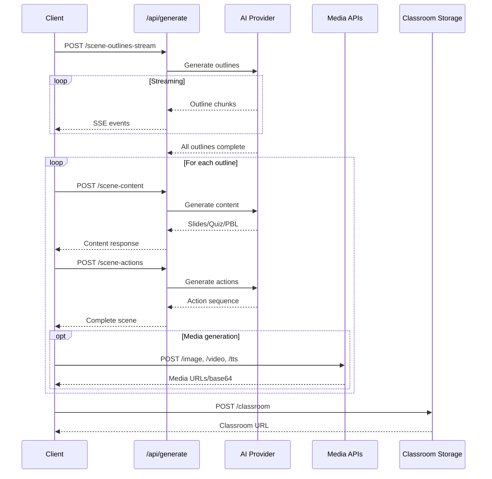
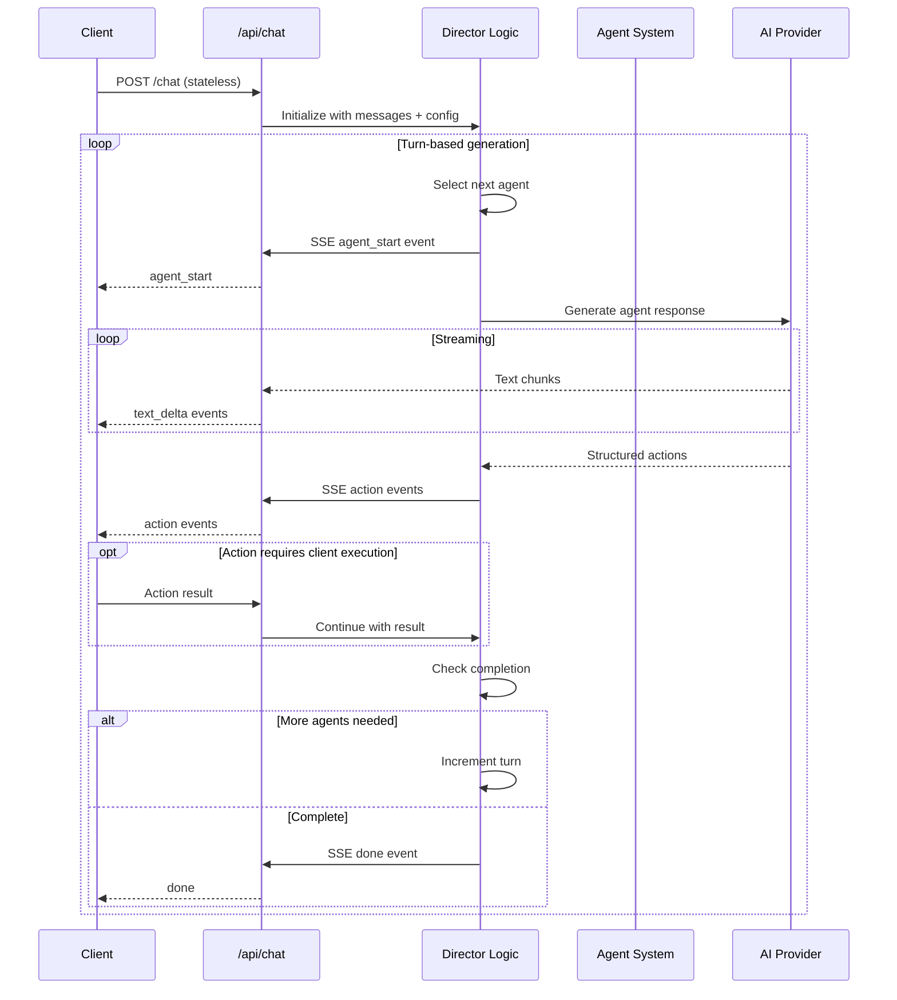
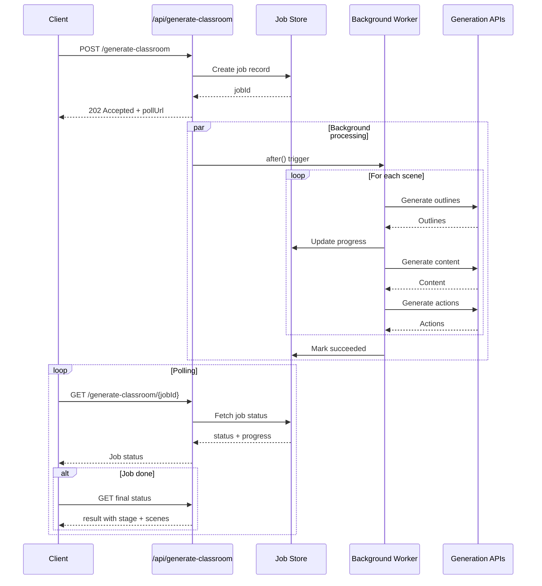
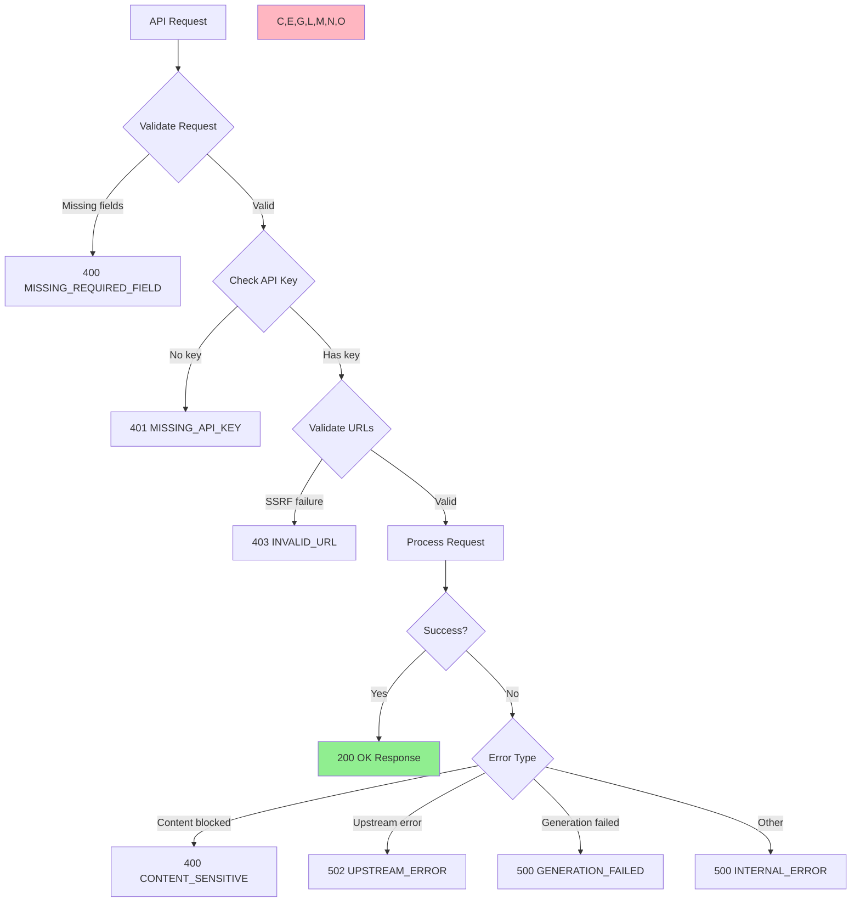

# OpenMAIC API Reference

**Version:** 0.1.0
**Base URL:** `/api`
**Content Type:** `application/json`

## Table of Contents

1. [Overview](#overview)
2. [Authentication](#authentication)
3. [Error Handling](#error-handhandling)
4. [API Categories](#api-categories)
   - [Health APIs](#health-apis)
   - [Generation APIs](#generation-apis)
   - [Chat APIs](#chat-apis)
   - [Media APIs](#media-apis)
   - [Classroom APIs](#classroom-apis)
   - [Configuration APIs](#configuration-apis)
   - [Utility APIs](#utility-apis)
5. [Type Definitions](#type-definitions)
6. [Usage Examples](#usage-examples)
7. [API Interaction Diagrams](#api-interaction-diagrams)

---

## Overview

OpenMAIC provides a comprehensive REST API for AI-powered educational content generation, multi-agent orchestration, media processing, and classroom management. The API follows a stateless design pattern where clients maintain state.

**Key Features:**
- Two-stage content generation (outlines → full scenes)
- Multi-agent chat orchestration with SSE streaming
- Media generation (images, videos, TTS, transcription)
- PDF parsing with OCR capabilities
- Classroom persistence and retrieval
- Provider configuration and verification

---

## Authentication

### API Key Authentication

Most endpoints require an API key for LLM providers. The API key can be provided via:

1. **Request Body** (for stateless endpoints):
   ```json
   {
     "apiKey": "sk-...",
     "baseUrl": "https://api.openai.com/v1"
   }
   ```

2. **Request Headers** (for media/generation endpoints):
   ```
   x-api-key: sk-...
   x-base-url: https://api.openai.com/v1
   ```

### Server-Side Fallback

When no client API key is provided, the server attempts to use environment variables:

- `OPENAI_API_KEY` for OpenAI models
- `ANTHROPIC_API_KEY` for Claude models
- Provider-specific keys for media services

### SSRF Protection

All URLs (`baseUrl`, custom provider URLs) are validated for SSRF attacks in production mode. The following are blocked:
- Local/private network addresses (127.0.0.1, localhost, 10.x.x.x, 192.168.x.x, etc.)
- Internal URLs (file://, data://, etc.)
- HTTP redirects to protected addresses

---

## Error Handling

### Standard Error Response

All errors follow this structure:

```typescript
interface ApiErrorBody {
  success: false;
  errorCode: ApiErrorCode;
  error: string;
  details?: string;
}
```

### Error Codes

| Error Code | HTTP Status | Description |
|------------|-------------|-------------|
| `MISSING_REQUIRED_FIELD` | 400 | Required request field is missing |
| `MISSING_API_KEY` | 401 | API key is required but not provided |
| `INVALID_REQUEST` | 400 | Request validation failed |
| `INVALID_URL` | 403 | URL failed SSRF validation |
| `REDIRECT_NOT_ALLOWED` | 403 | HTTP redirect to protected address |
| `CONTENT_SENSITIVE` | 400 | Content blocked by safety filters |
| `UPSTREAM_ERROR` | 502 | External service error |
| `GENERATION_FAILED` | 500 | Content generation failed |
| `TRANSCRIPTION_FAILED` | 500 | Audio transcription failed |
| `PARSE_FAILED` | 500 | Response parsing failed |
| `INTERNAL_ERROR` | 500 | Server internal error |

---

## API Categories

---

## Health APIs

### GET /api/health

Health check endpoint.

**Request:** None

**Response (200 OK):**
```json
{
  "success": true,
  "status": "ok",
  "version": "0.1.0"
}
```

**cURL Example:**
```bash
curl -X GET https://your-domain.com/api/health
```

---

## Generation APIs

### POST /api/generate/scene-outlines-stream

Generate scene outlines via Server-Sent Events (SSE). Streams individual outlines as they're generated.

**Endpoint Type:** SSE Stream
**Max Duration:** 300 seconds

**Request Body:**
```typescript
interface SceneOutlinesRequest {
  requirements: {
    requirement: string;      // Course topic/description
    language: 'zh-CN' | 'en-US';
    userNickname?: string;
    userBio?: string;
    webSearch?: boolean;
  };
  pdfText?: string;           // Extracted PDF text
  pdfImages?: PdfImage[];     // Images from PDF
  imageMapping?: ImageMapping; // image_id -> base64 URL
  researchContext?: string;   // Web search results
  agents?: AgentInfo[];       // Agent profiles
}
```

**Request Headers:**
```
Content-Type: application/json
x-model: gpt-4o-mini (optional, default)
x-image-generation-enabled: true (optional)
x-video-generation-enabled: true (optional)
x-api-key: sk-... (optional)
x-base-url: https://... (optional)
```

**SSE Events:**

```typescript
// Individual outline (streamed as parsed)
type OutlineEvent = {
  type: 'outline';
  data: SceneOutline;
  index: number;
};

// All outlines complete
type DoneEvent = {
  type: 'done';
  outlines: SceneOutline[];
};

// Retry attempt
type RetryEvent = {
  type: 'retry';
  attempt: number;
  maxAttempts: number;
};

// Error
type ErrorEvent = {
  type: 'error';
  error: string;
};

// Heartbeat (every 15s)
type HeartbeatEvent = ":heartbeat";
```

**Response Stream:**
```
data: {"type":"outline","data":{"id":"...","title":"..."},"index":0}

data: {"type":"done","outlines":[...]}

:heartbeat
```

**cURL Example:**
```bash
curl -N -X POST https://your-domain.com/api/generate/scene-outlines-stream \
  -H "Content-Type: application/json" \
  -H "x-api-key: sk-..." \
  -d '{
    "requirements": {
      "requirement": "Introduction to Machine Learning",
      "language": "en-US"
    }
  }'
```

---

### POST /api/generate/scene-content

Generate full scene content (slides/quiz/interactive/pbl) from an outline.

**Endpoint Type:** HTTP POST
**Max Duration:** 300 seconds

**Request Body:**
```typescript
interface SceneContentRequest {
  outline: SceneOutline;
  allOutlines: SceneOutline[];
  stageInfo: {
    name: string;
    description?: string;
    language?: 'zh-CN' | 'en-US';
    style?: string;
  };
  stageId: string;
  pdfImages?: PdfImage[];
  imageMapping?: ImageMapping;
  agents?: AgentInfo[];
}
```

**Request Headers:**
```
Content-Type: application/json
x-model: gpt-4o-mini (optional)
x-api-key: sk-... (optional)
x-base-url: https://... (optional)
```

**Response (200 OK):**
```json
{
  "success": true,
  "content": {
    "elements": [...],      // PPTElement[] for slides
    "background": {...},    // SlideBackground
    "remark": "..."
  },
  "effectiveOutline": {...}
}
```

**cURL Example:**
```bash
curl -X POST https://your-domain.com/api/generate/scene-content \
  -H "Content-Type: application/json" \
  -H "x-api-key: sk-..." \
  -d '{
    "outline": {
      "id": "scene_1",
      "type": "slide",
      "title": "Introduction",
      "description": "Course introduction",
      "keyPoints": ["Point 1", "Point 2"]
    },
    "allOutlines": [...],
    "stageInfo": {
      "name": "Machine Learning Course",
      "language": "en-US"
    },
    "stageId": "stage_123"
  }'
```

---

### POST /api/generate/scene-actions

Generate actions for a scene and assemble the complete scene object.

**Endpoint Type:** HTTP POST
**Max Duration:** 60 seconds

**Request Body:**
```typescript
interface SceneActionsRequest {
  outline: SceneOutline;
  allOutlines: SceneOutline[];
  content: GeneratedSlideContent | GeneratedQuizContent | GeneratedInteractiveContent | GeneratedPBLContent;
  stageId: string;
  agents?: AgentInfo[];
  previousSpeeches?: string[];  // For cross-scene coherence
  userProfile?: string;
}
```

**Response (200 OK):**
```json
{
  "success": true,
  "scene": {
    "id": "scene_1",
    "type": "slide",
    "title": "Introduction",
    "order": 1,
    "content": {...},
    "actions": [...]
  },
  "previousSpeeches": ["..."]
}
```

---

### POST /api/generate/agent-profiles

Generate AI agent profiles (teacher, assistants, students) for a course.

**Endpoint Type:** HTTP POST
**Max Duration:** 120 seconds

**Request Body:**
```typescript
interface AgentProfilesRequest {
  stageInfo: {
    name: string;
    description?: string;
  };
  sceneOutlines?: {
    title: string;
    description?: string;
  }[];
  language: 'zh-CN' | 'en-US';
  availableAvatars: string[];
}
```

**Response (200 OK):**
```json
{
  "success": true,
  "agents": [
    {
      "id": "gen-abc123",
      "name": "Teacher Alice",
      "role": "teacher",
      "persona": "An experienced educator...",
      "avatar": "avatar_1",
      "color": "#3b82f6",
      "priority": 10
    },
    {
      "id": "gen-def456",
      "name": "Student Bob",
      "role": "student",
      "persona": "A curious learner...",
      "avatar": "avatar_2",
      "color": "#10b981",
      "priority": 5
    }
  ]
}
```

---

### POST /api/generate/image

Generate an image from a text prompt.

**Endpoint Type:** HTTP POST
**Max Duration:** 60 seconds

**Request Headers:**
```
Content-Type: application/json
x-image-provider: seedream | openai-dalle | stability (default: seedream)
x-image-model: <model name> (optional)
x-api-key: <provider API key> (optional)
x-base-url: <provider base URL> (optional)
```

**Request Body:**
```typescript
interface ImageGenerationRequest {
  prompt: string;
  negativePrompt?: string;
  width?: number;        // Auto-resolved from aspectRatio if not set
  height?: number;
  aspectRatio?: '16:9' | '4:3' | '1:1' | '9:16';
  style?: string;
}
```

**Response (200 OK):**
```json
{
  "success": true,
  "result": {
    "url": "https://...",
    "width": 1024,
    "height": 1024
  }
}
```

**Error Responses:**
- `400 CONTENT_SENSITIVE` - Content blocked by safety filters

---

### POST /api/generate/video

Generate a video from a text prompt.

**Endpoint Type:** HTTP POST
**Max Duration:** 300 seconds

**Request Headers:**
```
Content-Type: application/json
x-video-provider: seedance | runway (default: seedance)
x-video-model: <model name> (optional)
x-api-key: <provider API key> (optional)
x-base-url: <provider base URL> (optional)
```

**Request Body:**
```typescript
interface VideoGenerationRequest {
  prompt: string;
  duration?: number;      // seconds
  aspectRatio?: '16:9' | '9:16' | '1:1';
  resolution?: '720p' | '1080p';
}
```

**Response (200 OK):**
```json
{
  "success": true,
  "result": {
    "url": "https://...",
    "width": 1920,
    "height": 1080,
    "duration": 5
  }
}
```

---

### POST /api/generate/tts

Generate text-to-speech audio (single text string).

**Endpoint Type:** HTTP POST
**Max Duration:** 30 seconds

**Request Body:**
```typescript
interface TTSRequest {
  text: string;
  audioId: string;        // Unique identifier for this audio
  ttsProviderId: TTSProviderId;
  ttsVoice: string;
  ttsSpeed?: number;      // default 1.0
  ttsApiKey?: string;
  ttsBaseUrl?: string;
}
```

**Response (200 OK):**
```json
{
  "success": true,
  "audioId": "audio_123",
  "base64": "<base64-encoded audio data>",
  "format": "mp3"
}
```

**Error Responses:**
- `400 INVALID_REQUEST` - browser-native-tts must be handled client-side

---

### POST /api/generate-classroom

Generate a complete classroom (async job pattern).

**Endpoint Type:** HTTP POST
**Max Duration:** 30 seconds (initial response)

**Request Body:**
```typescript
interface GenerateClassroomRequest {
  requirement: string;
  pdfContent?: string;
  language?: 'zh-CN' | 'en-US';
}
```

**Response (202 Accepted):**
```json
{
  "success": true,
  "jobId": "abc123xyz",
  "status": "pending",
  "step": "initializing",
  "message": "Job created",
  "pollUrl": "/api/generate-classroom/abc123xyz",
  "pollIntervalMs": 5000
}
```

---

### GET /api/generate-classroom/{jobId}

Poll the status of a classroom generation job.

**Endpoint Type:** HTTP GET

**Response (200 OK):**
```json
{
  "success": true,
  "jobId": "abc123xyz",
  "status": "processing" | "succeeded" | "failed",
  "step": "generating-outlines",
  "progress": 45,
  "message": "Generating scene outlines...",
  "pollUrl": "/api/generate-classroom/abc123xyz",
  "pollIntervalMs": 5000,
  "scenesGenerated": 2,
  "totalScenes": 5,
  "result": {...},    // Present when status === "succeeded"
  "error": "...",     // Present when status === "failed"
  "done": false
}
```

---

## Chat APIs

### POST /api/chat

Stateless multi-agent chat with SSE streaming. Client maintains all state.

**Endpoint Type:** SSE Stream
**Max Duration:** 60 seconds

**Request Body:**
```typescript
interface StatelessChatRequest {
  messages: UIMessage<ChatMessageMetadata>[];
  storeState: {
    stage: Stage | null;
    scenes: Scene[];
    currentSceneId: string | null;
    mode: 'autonomous' | 'playback';
    whiteboardOpen: boolean;
  };
  config: {
    agentIds: string[];
    sessionType?: 'qa' | 'discussion';
    discussionTopic?: string;
    discussionPrompt?: string;
    triggerAgentId?: string;
    agentConfigs?: AgentConfig[];
  };
  directorState?: {
    turnCount: number;
    agentResponses: AgentTurnSummary[];
    whiteboardLedger: WhiteboardActionRecord[];
  };
  userProfile?: {
    nickname?: string;
    bio?: string;
  };
  apiKey: string;
  baseUrl?: string;
  model?: string;
}
```

**SSE Events:**

```typescript
// Agent starts speaking
type AgentStartEvent = {
  type: 'agent_start';
  data: {
    messageId: string;
    agentId: string;
    agentName: string;
    agentAvatar?: string;
    agentColor?: string;
  };
};

// Text delta (streaming)
type TextDeltaEvent = {
  type: 'text_delta';
  data: {
    content: string;
    messageId?: string;
  };
};

// Tool/action call
type ActionEvent = {
  type: 'action';
  data: {
    actionId: string;
    actionName: string;
    params: Record<string, unknown>;
    agentId: string;
    messageId?: string;
  };
};

// Director/agent thinking
type ThinkingEvent = {
  type: 'thinking';
  data: {
    stage: 'director' | 'agent_loading';
    agentId?: string;
  };
};

// Prompt user for input
type CueUserEvent = {
  type: 'cue_user';
  data: {
    fromAgentId?: string;
    prompt?: string;
  };
};

// Generation complete
type DoneEvent = {
  type: 'done';
  data: {
    totalActions: number;
    totalAgents: number;
    agentHadContent?: boolean;
    directorState?: DirectorState;
  };
};

// Error
type ErrorEvent = {
  type: 'error';
  data: {
    message: string;
  };
};
```

**Response Stream:**
```
data: {"type":"thinking","data":{"stage":"director"}}

data: {"type":"agent_start","data":{"messageId":"msg_1","agentId":"teacher","agentName":"Teacher Alice"}}

data: {"type":"text_delta","data":{"content":"Hello","messageId":"msg_1"}}

data: {"type":"text_delta","data":{"content":" students!","messageId":"msg_1"}}

data: {"type":"action","data":{"actionId":"act_1","actionName":"spotlight","params":{"elementId":"elem_1"},"agentId":"teacher"}}

data: {"type":"done","data":{"totalActions":5,"totalAgents":2}}

:heartbeat
```

**cURL Example:**
```bash
curl -N -X POST https://your-domain.com/api/chat \
  -H "Content-Type: application/json" \
  -d '{
    "messages": [{
      "role": "user",
      "content": "What is machine learning?"
    }],
    "storeState": {
      "stage": null,
      "scenes": [],
      "currentSceneId": null,
      "mode": "autonomous",
      "whiteboardOpen": false
    },
    "config": {
      "agentIds": ["teacher_1", "student_1"]
    },
    "apiKey": "sk-..."
  }'
```

---

### POST /api/pbl/chat

PBL (Project-Based Learning) runtime chat. Students @mention agents for responses.

**Endpoint Type:** HTTP POST

**Request Body:**
```typescript
interface PBLChatRequest {
  message: string;
  agent: PBLAgent;
  currentIssue: PBLIssue | null;
  recentMessages: {
    agent_name: string;
    message: string;
  }[];
  userRole?: string;
  agentType?: 'question' | 'judge';
}
```

**Response (200 OK):**
```json
{
  "success": true,
  "message": "That's a great question! Let me explain...",
  "agentName": "Teacher Alice"
}
```

---

## Media APIs

### POST /api/parse-pdf

Parse a PDF file to extract text, images, and metadata.

**Endpoint Type:** HTTP POST (multipart/form-data)

**Request Body (FormData):**
```
pdf: <File>
providerId: unpdf | azure-doc-intelligence | llama-parse (default: unpdf)
apiKey: <optional>
baseUrl: <optional>
```

**Response (200 OK):**
```json
{
  "success": true,
  "data": {
    "text": "Extracted text content...",
    "markdown": "# Markdown formatted content",
    "images": [
      {
        "id": "img_1",
        "pageNumber": 1,
        "description": "Diagram showing...",
        "width": 800,
        "height": 600
      }
    ],
    "metadata": {
      "pageCount": 10,
      "fileName": "document.pdf",
      "fileSize": 102400
    }
  }
}
```

**cURL Example:**
```bash
curl -X POST https://your-domain.com/api/parse-pdf \
  -F "pdf=@document.pdf" \
  -F "providerId=unpdf"
```

---

### POST /api/transcription

Transcribe audio file to text using ASR providers.

**Endpoint Type:** HTTP POST (multipart/form-data)
**Max Duration:** 60 seconds

**Request Body (FormData):**
```
audio: <File>
providerId: openai-whisper | azure-speech | deepgram | fish-audio (default: openai-whisper)
language: zh | en | auto (default: auto)
apiKey: <optional>
baseUrl: <optional>
```

**Response (200 OK):**
```json
{
  "success": true,
  "text": "Transcribed text from audio..."
}
```

**cURL Example:**
```bash
curl -X POST https://your-domain.com/api/transcription \
  -F "audio=@recording.mp3" \
  -F "providerId=openai-whisper" \
  -F "language=en"
```

---

### POST /api/proxy-media

Server-side proxy for fetching remote media URLs (bypasses CORS).

**Endpoint Type:** HTTP POST
**Max Duration:** 60 seconds

**Request Body:**
```typescript
interface ProxyMediaRequest {
  url: string;
}
```

**Response:** Binary blob with appropriate Content-Type

**Error Responses:**
- `403 INVALID_URL` - URL failed SSRF validation
- `403 REDIRECT_NOT_ALLOWED` - HTTP redirect blocked
- `502 UPSTREAM_ERROR` - Remote server error

---

### POST /api/web-search

Perform web search using Tavily API.

**Endpoint Type:** HTTP POST

**Request Body:**
```typescript
interface WebSearchRequest {
  query: string;
  apiKey?: string;
}
```

**Response (200 OK):**
```json
{
  "success": true,
  "answer": "Answer to the query...",
  "sources": [
    {
      "title": "Article Title",
      "url": "https://...",
      "score": 0.95
    }
  ],
  "context": "Formatted context for LLM...",
  "query": "original query",
  "responseTime": 1500
}
```

**Error Responses:**
- `400 MISSING_API_KEY` - Tavily API key not configured

---

### POST /api/azure-voices

Fetch available TTS voices from Azure Speech Services.

**Endpoint Type:** HTTP POST
**Max Duration:** 30 seconds

**Request Body:**
```typescript
interface AzureVoicesRequest {
  apiKey: string;
  baseUrl: string;  // Azure Speech Services endpoint
}
```

**Response (200 OK):**
```json
{
  "success": true,
  "voices": [
    {
      "name": "en-US-JennyNeural",
      "locale": "en-US",
      "gender": "Female",
      "description": "Jenny"
    }
  ]
}
```

---

## Classroom APIs

### POST /api/classroom

Persist a classroom (stage + scenes) to storage.

**Endpoint Type:** HTTP POST

**Request Body:**
```typescript
interface PersistClassroomRequest {
  stage: Stage;
  scenes: Scene[];
}
```

**Response (201 Created):**
```json
{
  "success": true,
  "id": "classroom_abc123",
  "url": "https://your-domain.com/classroom/classroom_abc123"
}
```

---

### GET /api/classroom

Retrieve a persisted classroom.

**Endpoint Type:** HTTP GET

**Query Parameters:**
- `id` (required): Classroom ID

**Response (200 OK):**
```json
{
  "success": true,
  "classroom": {
    "id": "classroom_abc123",
    "stage": {...},
    "scenes": [...]
  }
}
```

**Error Responses:**
- `400 INVALID_REQUEST` - Invalid classroom ID
- `404 NOT_FOUND` - Classroom not found

---

## Configuration APIs

### GET /api/server-providers

List all configured server-side providers.

**Endpoint Type:** HTTP GET

**Response (200 OK):**
```json
{
  "success": true,
  "providers": [
    {
      "id": "openai",
      "name": "OpenAI",
      "models": ["gpt-4o", "gpt-4o-mini"]
    }
  ],
  "tts": [...],
  "asr": [...],
  "pdf": [...],
  "image": [...],
  "video": [...],
  "webSearch": [...]
}
```

---

### POST /api/verify-model

Verify LLM model connectivity.

**Endpoint Type:** HTTP POST

**Request Body:**
```typescript
interface VerifyModelRequest {
  apiKey: string;
  baseUrl?: string;
  model: string;
  providerType?: string;
  requiresApiKey?: boolean;
}
```

**Response (200 OK):**
```json
{
  "success": true,
  "message": "Connection successful",
  "response": "OK"
}
```

**Error Responses:**
- `401 INVALID_REQUEST` - Invalid API key
- `500 INTERNAL_ERROR` - Connection failed with details

---

### POST /api/verify-image-provider

Verify image generation provider connectivity.

**Endpoint Type:** HTTP POST

**Request Headers:**
```
x-image-provider: seedream | openai-dalle | stability
x-image-model: <model name> (optional)
x-api-key: <provider API key> (optional)
x-base-url: <provider base URL> (optional)
```

**Response (200 OK):**
```json
{
  "success": true,
  "message": "Connection successful"
}
```

---

### POST /api/verify-video-provider

Verify video generation provider connectivity.

**Endpoint Type:** HTTP POST

**Request Headers:**
```
x-video-provider: seedance | runway
x-video-model: <model name> (optional)
x-api-key: <provider API key> (optional)
x-base-url: <provider base URL> (optional)
```

**Response (200 OK):**
```json
{
  "success": true,
  "message": "Connection successful"
}
```

---

### POST /api/verify-pdf-provider

Verify PDF parsing provider connectivity.

**Endpoint Type:** HTTP POST

**Request Body:**
```typescript
interface VerifyPDFProviderRequest {
  providerId: 'unpdf' | 'azure-doc-intelligence' | 'llama-parse';
  apiKey?: string;
  baseUrl?: string;
}
```

**Response (200 OK):**
```json
{
  "success": true,
  "message": "Connection successful",
  "status": 200
}
```

---

## Utility APIs

### POST /api/quiz-grade

Grade short-answer quiz questions using LLM.

**Endpoint Type:** HTTP POST

**Request Body:**
```typescript
interface QuizGradeRequest {
  question: string;
  userAnswer: string;
  points: number;
  commentPrompt?: string;
  language?: 'zh-CN' | 'en-US';
}
```

**Response (200 OK):**
```json
{
  "success": true,
  "score": 8,
  "comment": "Good answer! You covered most key points."
}
```

---

## Type Definitions

### Scene Types

```typescript
type SceneType = 'slide' | 'quiz' | 'interactive' | 'pbl';

interface SceneOutline {
  id: string;
  type: SceneType;
  title: string;
  description: string;
  keyPoints: string[];
  teachingObjective?: string;
  estimatedDuration?: number;
  order: number;
  language?: 'zh-CN' | 'en-US';
  suggestedImageIds?: string[];
  mediaGenerations?: MediaGenerationRequest[];
  quizConfig?: {
    questionCount: number;
    difficulty: 'easy' | 'medium' | 'hard';
    questionTypes: ('single' | 'multiple' | 'text')[];
  };
  interactiveConfig?: {
    conceptName: string;
    conceptOverview: string;
    designIdea: string;
    subject?: string;
  };
  pblConfig?: {
    projectTopic: string;
    projectDescription: string;
    targetSkills: string[];
    issueCount?: number;
    language: 'zh-CN' | 'en-US';
  };
}
```

### Action Types

```typescript
type Action =
  | SpotlightAction      // Focus on element
  | LaserAction          // Point at element
  | PlayVideoAction      // Play video element
  | SpeechAction         // TTS speech
  | WbOpenAction         // Open whiteboard
  | WbDrawTextAction     // Draw text on whiteboard
  | WbDrawShapeAction    // Draw shape on whiteboard
  | WbDrawChartAction    // Draw chart on whiteboard
  | WbDrawLatexAction    // Draw LaTeX on whiteboard
  | WbDrawTableAction    // Draw table on whiteboard
  | WbDrawLineAction     // Draw line on whiteboard
  | WbClearAction        // Clear whiteboard
  | WbDeleteAction       // Delete whiteboard element
  | WbCloseAction        // Close whiteboard
  | DiscussionAction;    // Trigger multi-agent discussion

interface SpeechAction {
  id: string;
  type: 'speech';
  text: string;
  audioId?: string;
  voice?: string;
  speed?: number;
}
```

### Stage & Scene

```typescript
interface Stage {
  id: string;
  name: string;
  description?: string;
  createdAt: number;
  updatedAt: number;
  language?: string;
  style?: string;
  whiteboard?: Whiteboard[];
}

interface Scene {
  id: string;
  stageId: string;
  type: SceneType;
  title: string;
  order: number;
  content: SceneContent;
  actions?: Action[];
  whiteboards?: Slide[];
  multiAgent?: {
    enabled: boolean;
    agentIds: string[];
    directorPrompt?: string;
  };
  createdAt?: number;
  updatedAt?: number;
}
```

### Quiz Types

```typescript
interface QuizQuestion {
  id: string;
  type: 'single' | 'multiple' | 'short_answer';
  question: string;
  options?: QuizOption[];
  answer?: string[];
  analysis?: string;
  commentPrompt?: string;
  hasAnswer?: boolean;
  points?: number;
}

interface QuizOption {
  label: string;
  value: string;  // "A", "B", "C", "D"
}
```

---

## Usage Examples

### Complete Generation Workflow

```typescript
// Step 1: Generate outlines
const outlinesResponse = await fetch('/api/generate/scene-outlines-stream', {
  method: 'POST',
  headers: { 'Content-Type': 'application/json' },
  body: JSON.stringify({
    requirements: {
      requirement: 'Introduction to Machine Learning',
      language: 'en-US'
    }
  })
});

const reader = outlinesResponse.body.getReader();
const outlines = [];

while (true) {
  const { done, value } = await reader.read();
  if (done) break;

  const chunk = new TextDecoder().decode(value);
  const lines = chunk.split('\n');

  for (const line of lines) {
    if (line.startsWith('data: ')) {
      const event = JSON.parse(line.slice(6));
      if (event.type === 'outline') {
        outlines.push(event.data);
      } else if (event.type === 'done') {
        // All outlines received
      }
    }
  }
}

// Step 2: Generate content for each outline
for (const outline of outlines) {
  const contentResponse = await fetch('/api/generate/scene-content', {
    method: 'POST',
    headers: { 'Content-Type': 'application/json' },
    body: JSON.stringify({
      outline,
      allOutlines: outlines,
      stageInfo: {
        name: 'ML Course',
        language: 'en-US'
      },
      stageId: 'stage_123'
    })
  });

  const { content } = await contentResponse.json();

  // Step 3: Generate actions
  const actionsResponse = await fetch('/api/generate/scene-actions', {
    method: 'POST',
    headers: { 'Content-Type': 'application/json' },
    body: JSON.stringify({
      outline,
      allOutlines: outlines,
      content,
      stageId: 'stage_123'
    })
  });

  const { scene } = await actionsResponse.json();
  allScenes.push(scene);
}

// Step 4: Persist classroom
await fetch('/api/classroom', {
  method: 'POST',
  headers: { 'Content-Type': 'application/json' },
  body: JSON.stringify({
    stage: { id: 'stage_123', name: 'ML Course' },
    scenes: allScenes
  })
});
```

### Multi-Agent Chat

```typescript
const chatResponse = await fetch('/api/chat', {
  method: 'POST',
  headers: { 'Content-Type': 'application/json' },
  body: JSON.stringify({
    messages: [{
      role: 'user',
      content: 'Explain neural networks'
    }],
    storeState: {
      stage: null,
      scenes: [],
      currentSceneId: null,
      mode: 'autonomous',
      whiteboardOpen: false
    },
    config: {
      agentIds: ['teacher_1', 'assistant_1']
    },
    apiKey: 'sk-...'
  })
});

const reader = chatResponse.body.getReader();

while (true) {
  const { done, value } = await reader.read();
  if (done) break;

  const chunk = new TextDecoder().decode(value);
  const lines = chunk.split('\n');

  for (const line of lines) {
    if (line.startsWith('data: ')) {
      const event = JSON.parse(line.slice(6));

      switch (event.type) {
        case 'agent_start':
          console.log(`${event.data.agentName} is speaking...`);
          break;
        case 'text_delta':
          // Append to message content
          currentMessage += event.data.content;
          break;
        case 'action':
          // Execute action (spotlight, whiteboard, etc.)
          executeAction(event.data);
          break;
        case 'done':
          console.log('Generation complete');
          break;
      }
    }
  }
}
```

### Image Generation

```bash
curl -X POST https://your-domain.com/api/generate/image \
  -H "Content-Type: application/json" \
  -H "x-image-provider: openai-dalle" \
  -H "x-api-key: sk-..." \
  -d '{
    "prompt": "A classroom with students learning AI",
    "aspectRatio": "16:9",
    "style": "realistic"
  }'
```

### PDF Parsing

```bash
curl -X POST https://your-domain.com/api/parse-pdf \
  -F "pdf=@textbook.pdf" \
  -F "providerId=unpdf"
```

---

## API Interaction Diagrams

### Complete Generation Flow



### Multi-Agent Chat Flow



### Classroom Generation Job Flow



### Error Handling Flow



---

## Rate Limits

Current implementation does not enforce rate limits. Consider implementing:

- Per-IP rate limiting for public endpoints
- Per-API-key rate limiting for LLM endpoints
- Concurrent request limits for resource-intensive operations (PDF parsing, media generation)

---

## Best Practices

### 1. SSE Stream Handling

Always handle:
- `error` events - Connection failures
- Heartbeats (`:heartbeat`) - Keep connection alive
- `done` events - Stream completion

### 2. State Management

The `/api/chat` endpoint is stateless. Client must:
- Maintain `messages` array
- Track `directorState` between requests
- Handle interruption via `AbortController`

### 3. Error Recovery

- Implement retry logic for `502 UPSTREAM_ERROR`
- Validate URLs client-side before sending
- Handle `CONTENT_SENSITIVE` errors gracefully

### 4. Media Generation

- Generate media in parallel (client-side orchestration)
- Use `proxy-media` endpoint for CORS-bypassed downloads
- Cache results in IndexedDB for persistence

### 5. PDF Processing

- Use `unpdf` for local parsing (no API key needed)
- Use `azure-doc-intelligence` for best OCR accuracy
- Extract images separately for vision-enabled models

---

## API Versioning

Current version: **v0.1.0** (no versioning in URL)

Future versions will include `/api/v{version}/` prefix.

---

## Support

For issues or questions:
- GitHub: [OpenMAIC Repository](https://github.com/your-org/openmaic)
- Documentation: See `/analysis-report/` directory
