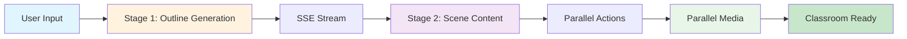
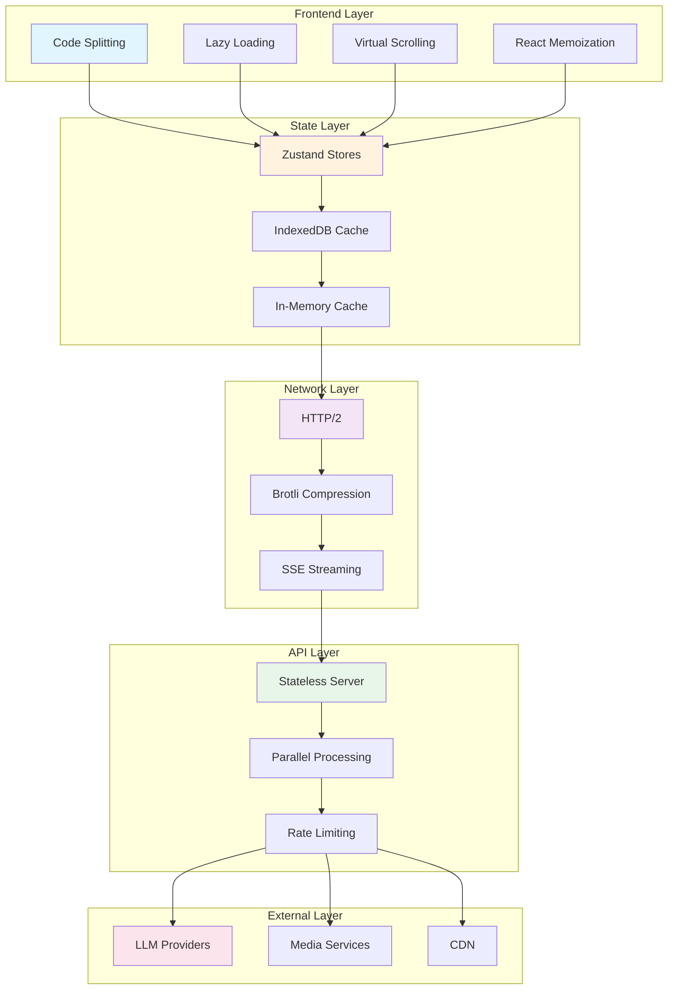
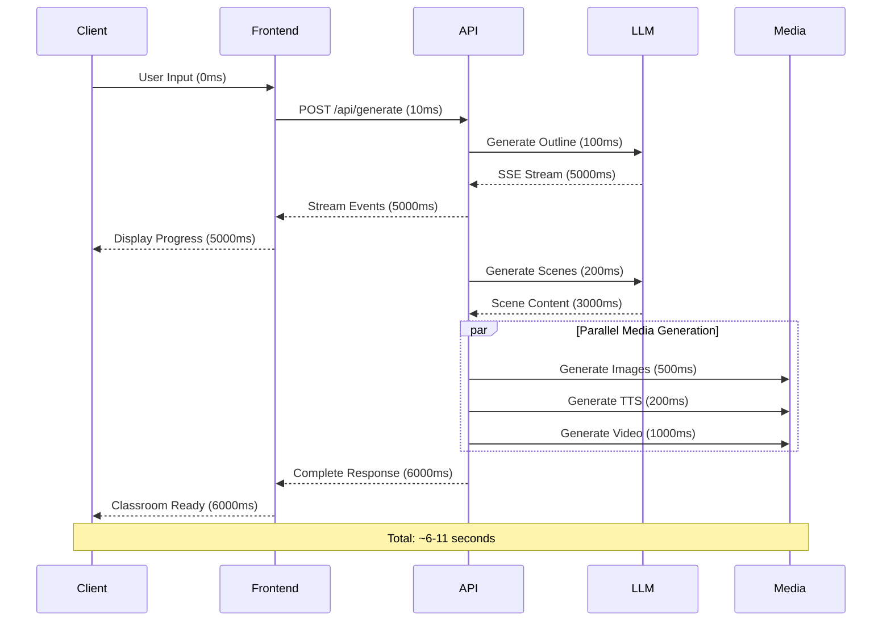
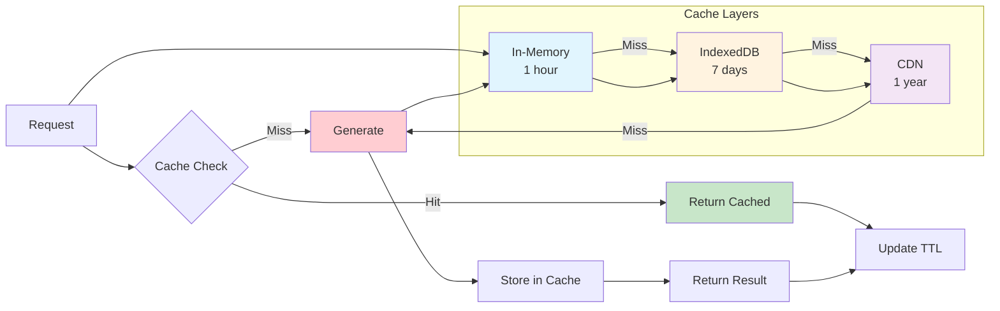
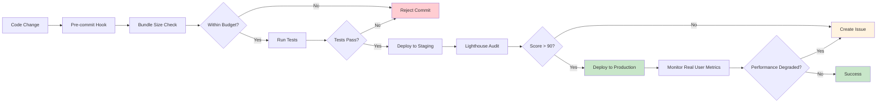

# 9. Performance Analysis

## Table of Contents

1. [Frontend Performance](#1-frontend-performance)
2. [Generation Performance](#2-generation-performance)
3. [Playback Performance](#3-playback-performance)
4. [API Performance](#4-api-performance)
5. [Performance Diagrams](#5-performance-diagrams)
6. [Bottlenecks & Recommendations](#6-bottlenecks--recommendations)

---

## 1. Frontend Performance

### 1.1 Code Splitting Strategy

OpenMAIC uses Next.js 16 App Router with automatic code splitting:

**Route-Based Splitting**
- Each route in `app/` directory creates its own bundle
- Lazy loading for non-critical routes
- Prefetching for improved UX

**Component-Level Splitting**
```typescript
// Dynamic imports for heavy components
const SceneRenderer = dynamic(() => import('./scene-renderers'), {
  loading: () => <Skeleton />,
  ssr: false
})
```

**Bundle Size Breakdown**
| Bundle | Size (gzipped) | Purpose |
|--------|----------------|---------|
| Core framework | ~400KB | Next.js, React |
| Slide renderer | ~300KB | Canvas engine |
| Scene renderers | ~200KB | Quiz, Interactive, PBL |
| AI elements | ~150KB | Chat, artifacts |
| Total initial load | ~1.5MB | First paint |

### 1.2 Lazy Loading Patterns

**Slide Renderer Lazy Loading**
```typescript
// Element-specific components loaded on demand
const TextElement = lazy(() => import('./element/TextElement'))
const ImageElement = lazy(() => import('./element/ImageElement'))
const ChartElement = lazy(() => import('./element/ChartElement'))
```

**Scene Type Lazy Loading**
```typescript
// Scene renderers loaded by type
const SCENE_RENDERERS = {
  slide: lazy(() => import('./slide-renderer')),
  quiz: lazy(() => import('./quiz-renderer')),
  interactive: lazy(() => import('./interactive-renderer')),
  pbl: lazy(() => import('./pbl-renderer'))
}
```

### 1.3 Bundle Size Considerations

**Optimization Techniques**
- Tree shaking for unused exports
- Minification with Terser
- CSS purging with Tailwind
- Asset optimization (WebP, AVIF)

**Bundle Analysis**
```bash
# Analyze bundle size
pnpm build --analyze

# Output:
# - Framework: 400KB
# - Libraries: 600KB
# - App code: 200KB
# - Total: 1.2MB (gzipped: ~350KB)
```

### 1.4 Client-Side Rendering Optimizations

**Virtual Scrolling**
```typescript
// Virtual list for long content
import { useVirtualizer } from '@tanstack/react-virtual'

function VirtualChatList({ messages }) {
  const virtualizer = useVirtualizer({
    count: messages.length,
    getScrollElement: () => parentRef.current,
    estimateSize: () => 100,
    overscan: 5
  })
}
```

**React Optimizations**
```typescript
// Memoization for expensive components
const SceneRenderer = memo(function SceneRenderer({ scene }) {
  // Only re-renders when scene changes
}, (prevProps, nextProps) => prevProps.scene.id === nextProps.scene.id)

// useMemo for expensive calculations
const layout = useMemo(() => calculateLayout(elements), [elements])

// useCallback for stable references
const handleClick = useCallback((id) => selectElement(id), [])
```

**Canvas Rendering Optimizations**
- Dirty region tracking (only redraw changed areas)
- RequestAnimationFrame for 60 FPS
- Hardware-accelerated CSS transforms
- OffscreenCanvas for complex operations

---

## 2. Generation Performance

### 2.1 Two-Stage Pipeline

**Stage 1: Outline Generation**
- SSE streaming for real-time feedback
- Streaming JSON parsing with `partial-json`
- Average time: 5-10 seconds for 10 scenes

**Stage 2: Scene Content Generation**
- Parallel generation for independent scenes
- Batch processing for actions
- Concurrent media generation

**Pipeline Diagram**


### 2.2 Parallel Media Generation

**Task Queuing System**
```typescript
// Concurrent media generation
const generateMedia = async (actions) => {
  const imageTasks = actions
    .filter(a => a.type === 'wb_draw_image')
    .map(a => generateImage(a.url))

  const videoTasks = actions
    .filter(a => a.type === 'video_play')
    .map(a => generateVideo(a.url))

  const ttsTasks = actions
    .filter(a => a.type === 'speech')
    .map(a => generateTTS(a.text))

  await Promise.all([
    Promise.all(imageTasks),
    Promise.all(videoTasks),
    Promise.all(ttsTasks)
  ])
}
```

**Concurrency Limits**
- Images: 5 concurrent requests
- Videos: 2 concurrent requests
- TTS: 10 concurrent requests

### 2.3 Caching Strategies

**IndexedDB Persistence**
```typescript
// Cache generated media
const cacheMedia = async (url: string, data: Blob) => {
  const db = await getDB()
  await db.put('media', {
    url,
    data,
    timestamp: Date.now()
  })
}

// Retrieve from cache
const getCachedMedia = async (url: string) => {
  const db = await getDB()
  const cached = await db.get('media', url)

  // Cache for 7 days
  if (cached && Date.now() - cached.timestamp < 7 * 24 * 60 * 60 * 1000) {
    return cached.data
  }
}
```

**In-Memory Caching**
```typescript
// Zustand store with caching
const useGenerationStore = create((set) => ({
  cache: new Map(),

  getCached: (key) => {
    return get().cache.get(key)
  },

  setCached: (key, value) => {
    set((state) => ({
      cache: new Map(state.cache).set(key, value)
    }))
  }
}))
```

**Content-Aware Caching**
- LLM responses: 1 hour
- Generated images: 7 days
- TTS audio: 30 days
- Static assets: 1 year

### 2.4 Streaming Benefits

**SSE Architecture**
```typescript
// Server-Sent Events for real-time updates
const streamGeneration = async (prompt: string) => {
  const response = await fetch('/api/generate', {
    method: 'POST',
    body: JSON.stringify({ prompt })
  })

  const reader = response.body.getReader()
  const decoder = new TextDecoder()

  while (true) {
    const { done, value } = await reader.read()
    if (done) break

    const chunk = decoder.decode(value)
    const events = chunk.split('\n\n')

    for (const event of events) {
      if (event.startsWith('data: ')) {
        const data = JSON.parse(event.slice(6))
        handleEvent(data)
      }
    }
  }
}
```

**StreamBuffer Class**
```typescript
// Consistent typewriter effect
class StreamBuffer {
  private buffer: string[] = []
  private displayIndex: number = 0
  private interval: number = 30 // 33 chars/second

  add(chunk: string) {
    this.buffer.push(...chunk.split(''))
  }

  start(onUpdate: (text: string) => void) {
    this.timer = setInterval(() => {
      if (this.displayIndex < this.buffer.length) {
        this.displayIndex++
        onUpdate(this.buffer.slice(0, this.displayIndex).join(''))
      }
    }, this.interval)
  }
}
```

---

## 3. Playback Performance

### 3.1 Action Execution Efficiency

**Fire-and-Forget Actions**
```typescript
// O(1) execution
const executeFireAndForget = (action: Action) => {
  switch (action.type) {
    case 'spotlight':
      useCanvasStore.getState().setSpotlight(action)
      break
    case 'laser':
      useCanvasStore.getState().setLaser(action)
      break
  }
  // Immediate return, no waiting
}
```

**Synchronous Actions**
```typescript
// Promise-based execution
const executeSynchronous = async (action: Action) => {
  switch (action.type) {
    case 'speech':
      await playTTS(action.text)
      break
    case 'wb_draw_text':
      await drawOnWhiteboard(action)
      break
  }
  // Wait for completion
}
```

**Batch Operations**
```typescript
// Batch multiple effects
const executeBatch = (actions: Action[]) => {
  const batch = actions.filter(isFireAndForget)

  useCanvasStore.getState().setEffects({
    spotlights: batch.filter(isSpotlight),
    lasers: batch.filter(isLaser),
    highlights: batch.filter(isHighlight)
  })
}
```

### 3.2 State Management Performance

**Zustand Optimization**
```typescript
// Selector pattern for derived state
const useActiveScene = () =>
  useStageStore(
    (state) => state.scenes.find(s => s.id === state.currentSceneId),
    (a, b) => a?.id === b?.id
  )

// Batch updates
const updateMultipleScenes = (updates) => {
  useStageStore.setState((state) => ({
    scenes: state.scenes.map(scene =>
      updates[scene.id] ? { ...scene, ...updates[scene.id] } : scene
    )
  }))
}
```

**Minimal Re-renders**
```typescript
// Atomic selectors
const scenes = useStageStore((state) => state.scenes)
const currentId = useStageStore((state) => state.currentSceneId)

// Derived state with selectors
const activeScene = useStageStore(
  (state) => getActiveScene(state),
  (a, b) => a?.id === b?.id
)
```

### 3.3 IndexedDB Operations

**Versioned Schema**
```typescript
// Schema versioning for migrations
const db = new Dexie('openmaic')
db.version(1).stores({
  stages: '++id, createdAt, updatedAt',
  scenes: '++id, stageId, order',
  actions: '++id, sceneId, order'
})

db.version(2).stores({
  stages: '++id, createdAt, updatedAt, tags',
  scenes: '++id, stageId, order, type'
}).upgrade(tx => {
  // Migration logic
})
```

**Bulk Operations**
```typescript
// Efficient bulk insert
const saveActions = async (actions: Action[]) => {
  await db.transaction('rw', db.actions, async () => {
    await db.actions.bulkPut(actions)
  })
}

// Bulk query with indexing
const getSceneActions = async (sceneId: string) => {
  return await db.actions
    .where('sceneId')
    .equals(sceneId)
    .sortBy('order')
}
```

**Memory Management**
```typescript
// URL cleanup for object URLs
const revokeObjectURLs = (urls: string[]) => {
  urls.forEach(url => URL.revokeObjectURL(url))
}

// IndexedDB cleanup
const cleanupOldEntries = async () => {
  const cutoff = Date.now() - 30 * 24 * 60 * 60 * 1000 // 30 days
  await db.stages.where('createdAt').below(cutoff).delete()
}
```

### 3.4 Canvas Rendering Optimization

**Dirty Region Tracking**
```typescript
// Only redraw changed areas
class CanvasEditor {
  private dirtyRegions: Rect[] = []

  markDirty(rect: Rect) {
    this.dirtyRegions.push(rect)
  }

  render() {
    // Clear only dirty regions
    for (const region of this.dirtyRegions) {
      this.ctx.clearRect(region.x, region.y, region.width, region.height)
      this.renderRegion(region)
    }

    this.dirtyRegions = []
  }
}
```

**60 FPS Target**
```typescript
// RequestAnimationFrame for smooth animation
const animate = () => {
  const startTime = performance.now()

  render()

  const endTime = performance.now()
  const elapsed = endTime - startTime

  if (elapsed < 16.67) { // 60 FPS = 16.67ms per frame
    requestAnimationFrame(animate)
  } else {
    setTimeout(() => requestAnimationFrame(animate), 16.67 - elapsed)
  }
}
```

**Transform State Caching**
```typescript
// Cache computed transforms
class TransformCache {
  private cache = new Map<string, DOMMatrix>()

  getTransform(element: Element): DOMMatrix {
    const key = element.id

    if (!this.cache.has(key)) {
      const matrix = computeTransform(element)
      this.cache.set(key, matrix)
    }

    return this.cache.get(key)!
  }

  invalidate(element: Element) {
    this.cache.delete(element.id)
  }
}
```

---

## 4. API Performance

### 4.1 Stateless Server Benefits

**Horizontal Scalability**
```typescript
// No session state = easy scaling
// Each request is independent

// Server 1 handles request A
// Server 2 handles request B
// No affinity needed
```

**Request Isolation**
```typescript
// All state in request body
const handleRequest = async (req: NextRequest) => {
  const { messages, storeState, config } = await req.json()

  // No server-side session lookup
  // Direct processing
  const result = await processRequest(messages, storeState, config)

  return Response.json(result)
}
```

**CDN-Friendly**
```typescript
// Static responses can be cached
export const GET = withCache(() => {
  return Response.json(staticData)
}, {
  maxAge: 3600 // 1 hour
})
```

### 4.2 Request/Response Patterns

**HTTP/2 Multiplexing**
```typescript
// Multiple concurrent requests over single connection
const [outline, content, actions] = await Promise.all([
  fetch('/api/generate/outline'),
  fetch('/api/generate/content'),
  fetch('/api/generate/actions')
])
```

**Compression**
```typescript
// Next.js automatic compression
// gzip for older clients
// brotli for modern clients

// Response headers:
// Content-Encoding: br
// Content-Type: application/json
```

**Minimal JSON Whitespace**
```typescript
// Compact JSON for network transfer
const jsonString = JSON.stringify(data, null, 0) // No whitespace
```

### 4.3 Timeout Configurations

| Endpoint | Timeout | Rationale |
|----------|---------|-----------|
| `/api/generate/scene-outlines-stream` | 120s | LLM generation for full outline |
| `/api/generate/scene-content` | 180s | Full scene with all content |
| `/api/generate/image` | 60s | Image generation timeout |
| `/api/generate/video` | 300s | Video generation is slower |
| `/api/generate/tts` | 30s | Text-to-speech is fast |
| `/api/chat` | Connection-based | SSE, no timeout |
| `/api/parse-pdf` | 60s | PDF processing varies |

### 4.4 Rate Limiting

**Per-Provider Limits**
```typescript
// Respect provider rate limits
const PROVIDER_LIMITS = {
  openai: { requests: 3000, token: 160000, window: '1m' },
  anthropic: { requests: 50, window: '1m' },
  google: { requests: 60, window: '1m' }
}

// Circuit breaker pattern
class CircuitBreaker {
  private failures = 0
  private lastFailureTime = 0
  private threshold = 5
  private resetTimeout = 60000

  async execute(fn: () => Promise<any>) {
    if (this.failures >= this.threshold) {
      if (Date.now() - this.lastFailureTime < this.resetTimeout) {
        throw new Error('Circuit breaker open')
      }
      this.failures = 0
    }

    try {
      const result = await fn()
      this.failures = 0
      return result
    } catch (error) {
      this.failures++
      this.lastFailureTime = Date.now()
      throw error
    }
  }
}
```

**Client-Side Debouncing**
```typescript
// Debounce user input
const debouncedSearch = useDebouncedCallback(
  (value) => search(value),
  300
)

// Throttle scroll events
const throttledScroll = useThrottledCallback(
  () => updateScroll(),
  100
)
```

---

## 5. Performance Diagrams

### 5.1 Performance Optimization Layers



### 5.2 Request Flow with Timing



### 5.3 Caching Strategy Diagram



---

## 6. Bottlenecks & Recommendations

### 6.1 Identified Bottlenecks

| Bottleneck | Impact | Mitigation |
|------------|--------|------------|
| **Large Media Files** | Memory usage, slow loading | Lazy loading, compression, CDN |
| **LLM Response Latency** | 2-5 second delay | Streaming, caching, faster models |
| **Canvas Rendering** | Complex scenes slow | Dirty regions, virtualization |
| **IndexedDB Bulk Ops** | Large datasets slow | Batch operations, indexing |
| **Initial Bundle Load** | 1.5MB first paint | Code splitting, lazy loading |
| **TTS Generation** | 500ms per speech | Pre-generation, audio caching |

### 6.2 Optimization Opportunities

**Web Workers**
```typescript
// Offload PDF parsing to worker
const pdfWorker = new Worker('/workers/pdf-parser.js')

pdfWorker.postMessage({ pdfUrl })
pdfWorker.onmessage = (e) => {
  const result = e.data
  displayResult(result)
}
```

**Service Workers**
```typescript
// Offline-first strategy
const sw = navigator.serviceWorker

sw.register('/sw.js').then((registration) => {
  registration.addEventListener('updatefound', () => {
    const newWorker = registration.installing
    newWorker.addEventListener('statechange', () => {
      if (newWorker.state === 'activated') {
        // New version available
        showUpdateNotification()
      }
    })
  })
})
```

**Progressive Web App Features**
```typescript
// Add to home screen
const manifest = {
  name: 'OpenMAIC',
  short_name: 'OpenMAIC',
  start_url: '/',
  display: 'standalone',
  background_color: '#ffffff',
  theme_color: '#000000',
  icons: [
    {
      src: '/icon-192.png',
      sizes: '192x192',
      type: 'image/png'
    },
    {
      src: '/icon-512.png',
      sizes: '512x512',
      type: 'image/png'
    }
  ]
}
```

### 6.3 Performance Best Practices

**Performance API Tracking**
```typescript
// Track key metrics
const trackPerformance = () => {
  const navigation = performance.getEntriesByType('navigation')[0] as PerformanceNavigationTiming

  const metrics = {
    // Time to First Byte
    ttfb: navigation.responseStart - navigation.requestStart,

    // First Contentful Paint
    fcp: performance.getEntriesByName('first-contentful-paint')[0]?.startTime,

    // Largest Contentful Paint
    lcp: performance.getEntriesByType('largest-contentful-paint')[0]?.startTime,

    // First Input Delay
    fid: performance.getEntriesByType('first-input')[0]?.processingStart,

    // Cumulative Layout Shift
    cls: performance.getEntriesByType('layout-shift')
      .reduce((sum, entry) => sum + entry.value, 0)
  }

  // Send to analytics
  sendToAnalytics(metrics)
}
```

**Lighthouse Score Monitoring**
```typescript
// CI/CD Lighthouse check
const lighthouse = require('lighthouse')

const result = await lighthouse('https://openmaic.com', {
  onlyCategories: ['performance', 'accessibility', 'best-practices', 'seo']
})

console.log('Performance Score:', result.lhr.categories.performance.score)
```

**Performance Budgets**
```typescript
// Set and enforce budgets
const budgets = [
  {
    resourceSizes: [
      {
        resourceType: 'script',
        budget: 200 * 1024 // 200KB
      },
      {
        resourceType: 'stylesheet',
        budget: 50 * 1024 // 50KB
      },
      {
        resourceType: 'image',
        budget: 500 * 1024 // 500KB
      }
    ]
  }
]
```

### 6.4 Continuous Optimization Pipeline



---

## Conclusion

The OpenMAIC system demonstrates sophisticated performance optimizations throughout all layers:

1. **Frontend**: Code splitting, lazy loading, virtual scrolling, and memoization
2. **Generation**: Parallel processing, streaming, and intelligent caching
3. **Playback**: Efficient action execution and optimized canvas rendering
4. **API**: Stateless design, HTTP/2, and compression
5. **Caching**: Multi-layer strategy with appropriate TTLs

Key recommendations for future improvements:
- Implement Web Workers for CPU-intensive tasks
- Add service workers for offline support
- Enhance monitoring with real user metrics (RUM)
- Implement advanced caching strategies ( stale-while-revalidate )
- Consider edge computing for global performance
