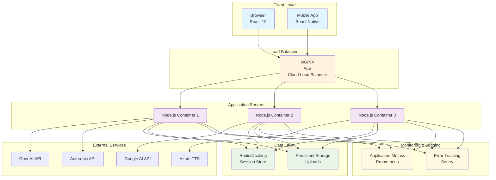

# 10. Deployment Guide

## Table of Contents

1. [Deployment Options](#1-deployment-options)
2. [Environment Configuration](#2-environment-configuration)
3. [Docker Deployment](#3-docker-deployment)
4. [Production Checklist](#4-production-checklist)
5. [Deployment Diagram](#5-deployment-diagram)
6. [Troubleshooting Common Issues](#6-troubleshooting-common-issues)
7. [Scaling Considerations](#7-scaling-considerations)

---

## 1. Deployment Options

OpenMAIC supports multiple deployment methods to suit different infrastructure needs and preferences.

### 1.1 Self-Hosted Deployment

**Best for**: Full control over infrastructure, custom configurations, on-premises deployments.

**Prerequisites**:
- Node.js 20.9.0 or higher
- pnpm 10.28.0 or higher
- System resources: 2GB RAM minimum, 4GB recommended

**Steps**:
```bash
# Clone the repository
git clone https://github.com/THU-MAIC/OpenMAIC.git
cd OpenMAIC

# Install dependencies
pnpm install

# Configure environment
cp .env.example .env.local
# Edit .env.local with your API keys and settings

# Build the application
pnpm build

# Start in production mode
pnpm start
```

### 1.2 Vercel Deployment

**Best for**: Serverless deployment, automatic scaling, CI/CD integration.

**Prerequisites**:
- Vercel account
- GitHub repository connected
- API keys configured in Vercel environment variables

**Steps**:
1. Push your code to GitHub
2. Import the project on [Vercel](https://vercel.com)
3. Configure environment variables in the Vercel dashboard
4. Deploy automatically via the dashboard or CLI

**Vercel Configuration**:
- **Framework**: Next.js
- **Build Command**: `pnpm build`
- **Install Command**: `pnpm install`
- **Output Directory**: `.next`
- **Functions Max Duration**: 300 seconds (configured in `vercel.json`)

### 1.3 Docker Deployment

**Best for**: Containerized environments, consistent deployments, Kubernetes orchestration.

See [Docker Deployment](#3-docker-deployment) section for detailed instructions.

### 1.4 Cloud Providers

#### AWS (Amazon Web Services)

**Options**:
- **ECS (Elastic Container Service)**: For Docker containers
- **EKS (Elastic Kubernetes Service)**: For Kubernetes orchestration
- **EC2**: For self-managed instances
- **Lightsail**: Simple VPS instances

**Architecture**:
```
┌─────────────────┐    ┌─────────────────┐    ┌─────────────────┐
│   Load Balancer │    │   Auto Scaling   │    │    Health Check  │
│     (ALB)       │────│     Group       │────│                 │
└─────────────────┘    └─────────────────┘    └─────────────────┘
                                │
                         ┌──────┴───────┐
                         │  ECS Cluster │
                         │              │
                         │ ┌───────────┐ │
                         │ │ Container │ │
                         │ │ (OpenMAIC) │ │
                         │ └───────────┘ │
                         └───────────────┘
```

#### GCP (Google Cloud Platform)

**Options**:
- **Cloud Run**: Serverless containers
- **GKE (Google Kubernetes Engine)**: Managed Kubernetes
- **Compute Engine**: Virtual machines

**Cloud Run Deployment**:
```bash
# Build and push to Container Registry
gcloud builds submit --tag gcr.io/PROJECT-ID/openmaic

# Deploy to Cloud Run
gcloud run deploy openmaic \
  --image gcr.io/PROJECT-ID/openmaic \
  --platform managed \
  --region us-central1 \
  --allow-unauthenticated
```

#### Azure

**Options**:
- **Azure Container Instances**: Simple containers
- **AKS (Azure Kubernetes Service)**: Managed Kubernetes
- **App Service**: PaaS for web apps

**Azure Container Apps**:
```bash
# Deploy with Container Apps
az containerapp create \
  --name openmaic \
  --resource-group myResourceGroup \
  --image myacr.azurecr.io/openmaic:latest \
  --ingress external \
  --target-port 3000
```

---

## 2. Environment Configuration

### 2.1 Environment Variables

Copy `.env.example` to `.env.local` and configure the required variables:

```bash
# Create environment file
cp .env.example .env.local
```

#### Required Variables
All provider-related variables are optional. Only configure the providers you intend to use.

#### LLM Provider Variables
```bash
# OpenAI
OPENAI_API_KEY=sk-your-openai-key
OPENAI_BASE_URL=https://api.openai.com/v1
OPENAI_MODELS=gpt-4-turbo,gpt-4,gpt-3.5-turbo

# Anthropic
ANTHROPIC_API_KEY=sk-ant-api03-...
ANTHROPIC_BASE_URL=
ANTHROPIC_MODELS=claude-3-5-sonnet-20241022,claude-3-haiku-20240307

# Google
GOOGLE_API_KEY=your-google-api-key
GOOGLE_BASE_URL=https://generativelanguage.googleapis.com/v1beta
GOOGLE_MODELS=gemini-1.5-flash,gemini-1.5-pro

# DeepSeek
DEEPSEEK_API_KEY=your-deepseek-key
DEEPSEEK_BASE_URL=https://api.deepseek.com
DEEPSEEK_MODELS=deepseek-chat,deepseek-coder

# Qwen (Alibaba)
QWEN_API_KEY=your-qwen-key
QWEN_BASE_URL=https://dashscope.aliyuncs.com/compatible-mode/v1
QWEN_MODELS=qwen-max,qwen-turbo,qwen-plus
```

#### TTS (Text-to-Speech) Variables
```bash
# OpenAI TTS
TTS_OPENAI_API_KEY=your-tts-openai-key
TTS_OPENAI_BASE_URL=https://api.openai.com/v1

# Azure TTS
TTS_AZURE_API_KEY=your-azure-key
TTS_AZURE_BASE_URL=https://region.tts.speech.microsoft.com/

# GLM TTS
TTS_GLM_API_KEY=your-glm-key
TTS_GLM_BASE_URL=https://open.bigmodel.cn/api/paas/v4
```

#### ASR (Automatic Speech Recognition) Variables
```bash
# OpenAI Whisper
ASR_OPENAI_API_KEY=your-whisper-key
ASR_OPENAI_BASE_URL=https://api.openai.com/v1

# Qwen ASR
ASR_QWEN_API_KEY=your-qwen-asr-key
ASR_QWEN_BASE_URL=https://dashscope.aliyuncs.com/api/v1
```

#### PDF Processing Variables
```bash
# UnPDF
PDF_UNPDF_API_KEY=your-unpdf-key
PDF_UNPDF_BASE_URL=

# MineRU
PDF_MINERU_API_KEY=your-mineru-key
PDF_MINERU_BASE_URL=
```

#### Image Generation Variables
```bash
# SeeDream
IMAGE_SEEDREAM_API_KEY=your-seedream-key
IMAGE_SEEDREAM_BASE_URL=

# Qwen Image
IMAGE_QWEN_IMAGE_API_KEY=your-qwen-image-key
IMAGE_QWEN_IMAGE_BASE_URL=

# Nano Banana
IMAGE_NANO_BANANA_API_KEY=your-nano-key
IMAGE_NANO_BANANA_BASE_URL=
```

#### Video Generation Variables
```bash
# SeeDance
VIDEO_SEEDANCE_API_KEY=your-seedance-key
VIDEO_SEEDANCE_BASE_URL=

# Kling
VIDEO_KLING_API_KEY=your-kling-key
VIDEO_KLING_BASE_URL=

# VEO (Google)
VIDEO_VEO_API_KEY=your-veo-key
VIDEO_VEO_BASE_URL=

# Sora
VIDEO_SORA_API_KEY=your-sora-key
VIDEO_SORA_BASE_URL=
```

#### Web Search Variables
```bash
# Tavily
TAVILY_API_KEY=your-tavily-key
```

#### Optional Variables
```bash
# Default model for API routes
DEFAULT_MODEL=anthropic:claude-3-5-haiku-20241022

# Logging configuration
LOG_LEVEL=info
LOG_FORMAT=pretty

# Disable LLM thinking (for debugging)
LLM_THINKING_DISABLED=false

# Proxy settings
HTTP_PROXY=
HTTPS_PROXY=
```

### 2.2 Provider Configuration via YAML

For better organization, you can use `server-providers.yml` for provider configuration:

```yaml
# server-providers.yml
providers:
  openai:
    apiKey: ${OPENAI_API_KEY}
    baseUrl: ${OPENAI_BASE_URL}
    models: ["gpt-4-turbo", "gpt-4"]
  anthropic:
    apiKey: ${ANTHROPIC_API_KEY}
    models: ["claude-3-5-sonnet-20241022"]

tts:
  azure-tts:
    apiKey: ${TTS_AZURE_API_KEY}
    baseUrl: ${TTS_AZURE_BASE_URL}

asr:
  openai-whisper:
    apiKey: ${ASR_OPENAI_API_KEY}
```

The system loads from `server-providers.yml` first, then falls back to environment variables. Environment variables take precedence over YAML values.

### 2.3 API Keys Security

**Best Practices**:
- Never commit API keys to version control
- Use environment variables or secure secret management
- Rotate keys regularly
- Use service accounts for cloud provider keys
- Implement IP whitelisting where possible

**AWS Secrets Manager Example**:
```javascript
import { SecretsManagerClient, GetSecretValueCommand } from '@aws-sdk/client-secrets-manager';

const client = new SecretsManagerClient({ region: 'us-east-1' });
const secretName = 'openmaic/api-keys';

const secretValue = await client.send(
  new GetSecretValueCommand({ SecretId: secretName })
);
const apiKeys = JSON.parse(secretValue.SecretString);
```

**GCP Secret Manager**:
```bash
# Access secret in production
echo $GCP_SECRET_NAME | gcloud secrets versions access latest --secret=$GCP_SECRET_NAME
```

---

## 3. Docker Deployment

### 3.1 Multi-Stage Build

The Dockerfile uses a multi-stage build for optimized production images:

**Stage 1: Base**
- Node.js 22 Alpine
- Corepack for pnpm
- System dependencies

**Stage 2: Dependencies**
- Native build tools for Sharp and Canvas
- All npm dependencies installed
- Layer caching optimization

**Stage 3: Builder**
- Source code copied
- Application built
- Artifacts generated

**Stage 4: Runner**
- Minimal runtime environment
- Non-root user (nextjs:nodejs)
- Production optimizations

### 3.2 Docker Compose Usage

Basic setup with environment and persistent storage:

```yaml
version: '3.8'

services:
  openmaic:
    build:
      context: .
      dockerfile: Dockerfile
    ports:
      - "3000:3000"
    environment:
      - NODE_ENV=production
      - PORT=3000
    env_file:
      - .env.local
    volumes:
      # Optional: mount server-providers.yml
      - ./server-providers.yml:/app/server-providers.yml:ro
      # Persistent data for uploads
      - openmaic-data:/app/data
    restart: unless-stopped
    healthcheck:
      test: ["CMD", "curl", "-f", "http://localhost:3000/api/health"]
      interval: 30s
      timeout: 10s
      retries: 3
      start_period: 40s

volumes:
  openmaic-data:
```

### 3.3 Production Container Setup

#### Production Docker Compose
```yaml
version: '3.8'

services:
  openmaic:
    image: openmaic:latest
    ports:
      - "80:3000"
    environment:
      - NODE_ENV=production
      - PORT=3000
      - HOSTNAME=0.0.0.0
    env_file:
      - .env.production
    volumes:
      - ./server-providers.yml:/app/server-providers.yml:ro
      - openmaic-data:/app/data
      - /etc/localtime:/etc/localtime:ro
    restart: unless-stopped
    deploy:
      replicas: 3
      resources:
        limits:
          memory: 1G
        reservations:
          memory: 512M
    networks:
      - openmaic-network

  # Nginx reverse proxy (optional)
  nginx:
    image: nginx:alpine
    ports:
      - "443:443"
      - "80:80"
    volumes:
      - ./nginx.conf:/etc/nginx/nginx.conf:ro
      - ./ssl:/etc/nginx/ssl:ro
    depends_on:
      - openmaic
    restart: unless-stopped
    networks:
      - openmaic-network

networks:
  openmaic-network:
    driver: bridge

volumes:
  openmaic-data:
```

#### Kubernetes Deployment
```yaml
# openmaic-deployment.yaml
apiVersion: apps/v1
kind: Deployment
metadata:
  name: openmaic
spec:
  replicas: 3
  selector:
    matchLabels:
      app: openmaic
  template:
    metadata:
      labels:
        app: openmaic
    spec:
      containers:
      - name: openmaic
        image: openmaic:latest
        ports:
        - containerPort: 3000
        env:
        - name: NODE_ENV
          value: "production"
        - name: PORT
          value: "3000"
        volumeMounts:
        - name: config
          readOnly: true
          mountPath: /app/server-providers.yml
          subPath: server-providers.yml
        - name: data
          mountPath: /app/data
        resources:
          requests:
            memory: "512Mi"
            cpu: "250m"
          limits:
            memory: "1Gi"
            cpu: "500m"
        livenessProbe:
          httpGet:
            path: /api/health
            port: 3000
          initialDelaySeconds: 30
          periodSeconds: 10
        readinessProbe:
          httpGet:
            path: /api/health
            port: 3000
          initialDelaySeconds: 5
          periodSeconds: 5
      volumes:
      - name: config
        configMap:
          name: openmaic-config
      - name: data
        persistentVolumeClaim:
          claimName: openmaic-data
---
apiVersion: v1
kind: Service
metadata:
  name: openmaic-service
spec:
  selector:
    app: openmaic
  ports:
    - protocol: TCP
      port: 80
      targetPort: 3000
  type: LoadBalancer
---
apiVersion: v1
kind: PersistentVolumeClaim
metadata:
  name: openmaic-data
spec:
  accessModes:
    - ReadWriteOnce
  resources:
    requests:
      storage: 10Gi
```

#### Building and Pushing
```bash
# Build image
docker build -t openmaic:latest .

# Tag for registry
docker tag openmaic:latest your-registry/openmaic:latest

# Push to registry
docker push your-registry/openmaic:latest

# Build specific version
docker build -t openmaic:v1.0.0 --build-arg NODE_ENV=production .

# Multi-architecture build
docker buildx build --platform linux/amd64,linux/arm64 -t openmaic:latest .
```

---

## 4. Production Checklist

### 4.1 Security Configurations

#### Environment Variables
- [ ] All sensitive data in environment variables
- [ ] API keys rotated regularly
- [ ] No hardcoded secrets in code
- [ ] Different configs for dev/staging/production

#### Network Security
- [ ] HTTPS enabled (SSL/TLS certificates)
- [ ] Firewall rules configured
- [ ] IP whitelisting for API endpoints
- [ ] CORS configured for allowed domains
- [ ] Rate limiting implemented

#### Application Security
- [ ] Helmet.js or similar security headers
- [ ] CSRF protection enabled
- [ ] XSS protection in place
- [ ] Input validation for all user data
- [ ] File upload restrictions

#### Monitoring and Logging
- [ ] Application logging configured
- [ ] Error tracking implemented (Sentry, etc.)
- [ ] Security event logging
- [ ] Regular security audits

### 4.2 Performance Optimizations

#### Build Optimizations
- [ ] Production build with `pnpm build`
- [ ] Static assets optimized (images, fonts)
- [ ] Code splitting configured
- [ ] Bundle analyzer run to check sizes

#### Runtime Optimizations
- [ ] Compression enabled (gzip/brotli)
- [ ] Caching configured properly
- [ ] Critical CSS inlined
- [ ] Lazy loading for non-critical components

#### Resource Management
- [ ] Memory limits set appropriately
- [ ] Connection pooling configured
- [ ] Caching strategy implemented

### 4.3 Monitoring Setup

#### Application Monitoring
```javascript
// Example monitoring integration
import { monitorApiRoute } from '@/lib/monitoring';

export const GET = monitorApiRoute(async (req) => {
  // Monitored API endpoint
  return Response.json({ status: 'ok' });
});
```

#### Health Checks
```javascript
// app/api/health/route.ts
export async function GET() {
  const checks = {
    uptime: process.uptime(),
    memory: process.memoryUsage(),
    timestamp: new Date().toISOString(),
  };

  return Response.json({
    status: 'healthy',
    checks,
  });
}
```

### 4.4 Backup Strategies

#### Data Backup
- [ ] Regular backups of user uploads
- [ ] Configuration files versioned
- [ ] Offsite backup storage

#### Disaster Recovery
- [ ] Recovery procedures documented
- [ ] Failover plan in place
- [ ] Backup restoration tested

---

## 5. Deployment Diagram



---

## 6. Troubleshooting Common Issues

### 6.1 Build Failures

#### Error: "Failed to resolve: @napi-rs/canvas"
**Cause**: Missing native dependencies
```bash
# Install system dependencies
# Ubuntu/Debian
sudo apt-get install build-essential libcairo2-dev libpango1.0-dev libjpeg-dev libgif-dev librsvg2-dev

# macOS
brew install cairo pango libjpeg libgif librsvg
```

#### Error: "Sharp: libvips..."
**Cause**: Missing native dependencies
```bash
# Install vips
# Ubuntu
sudo apt-get install libvips-dev

# macOS
brew install vips
```

### 6.2 Runtime Errors

#### Error: "Cannot find module 'react'"
**Cause**: Node version mismatch
```bash
# Check Node version
node -v  # Should be >= 20.9.0
```

#### Error: "API key not provided"
**Cause**: Missing environment variables
```bash
# Check environment
cat .env | grep OPENAI_API_KEY
```

---

## 7. Scaling Considerations

### 7.1 Horizontal Scaling

#### Stateless Design
- **No session state**: All data stored client-side
- **Stateless API**: Each request independent
- **Load balancer ready**: Sticky sessions not required

### 7.2 Load Balancing

#### Load Balancer Setup
```nginx
# nginx.conf
upstream openmaic {
    least_conn;
    server 10.0.0.1:3000;
    server 10.0.0.2:3000;
    server 10.0.0.3:3000;
}

server {
    listen 80;
    location / {
        proxy_pass http://openmaic;
        proxy_set_header Host $host;
        proxy_set_header X-Real-IP $remote_addr;
    }
}
```

### 7.3 CDN Setup

#### Cloudflare Configuration
```javascript
// CDN headers for caching
const cacheHeaders = {
  'Cache-Control': 'public, max-age=31536000, immutable',
};
```

---

## Conclusion

This deployment guide covers the essential aspects of deploying OpenMAIC across various platforms and environments. Always test deployments thoroughly in staging environments before moving to production.
