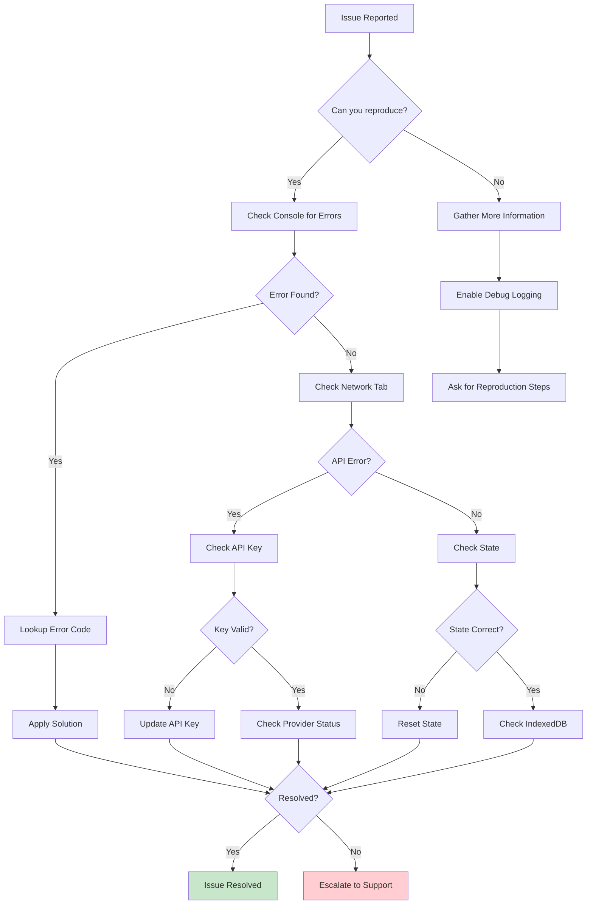
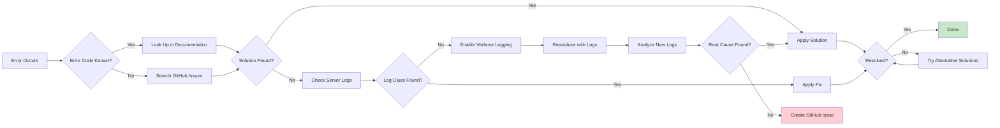

# 11. Troubleshooting Guide

## Table of Contents

1. [Common Issues by Category](#1-common-issues-by-category)
2. [Debug Tools & Techniques](#2-debug-tools--techniques)
3. [Error Codes Reference](#3-error-codes-reference)
4. [Provider-Specific Issues](#4-provider-specific-issues)
5. [Performance Issues](#5-performance-issues)
6. [Diagnostic Flows](#6-diagnostic-flows)
7. [Getting Help](#7-getting-help)

---

## 1. Common Issues by Category

### 1.1 Installation/Setup Issues

#### Node.js Version Incompatible
**Symptom**: Build fails with module resolution errors
```bash
Error: Cannot find module 'next'
```

**Solution**:
```bash
# Check Node version
node -v  # Must be >= 20.9.0

# Use nvm to switch versions
nvm install 20
nvm use 20

# Verify
node -v  # Should show v20.x.x
```

#### pnpm Not Found
**Symptom**: `pnpm: command not found`

**Solution**:
```bash
# Install pnpm
npm install -g pnpm

# Or use corepack (recommended)
corepack enable
corepack prepare pnpm@latest --activate

# Verify
pnpm -v  # Should show 10.28.0 or higher
```

#### Port Already in Use
**Symptom**: `Error: listen EADDRINUSE: address already in use :::3000`

**Solution**:
```bash
# Find process using port 3000
# Linux/macOS
lsof -ti:3000 | xargs kill -9

# Windows
netstat -ano | findstr :3000
taskkill /PID <PID> /F

# Or use different port
PORT=3001 pnpm dev
```

#### Environment Variables Not Loading
**Symptom**: `API key not provided` errors

**Solution**:
```bash
# Verify .env file exists
ls -la .env*

# Check file permissions
chmod 600 .env.local

# Restart dev server after changes
pnpm dev
```

### 1.2 Build/Compile Errors

#### TypeScript Errors
**Symptom**: Type errors during build

**Solution**:
```bash
# Check TypeScript version
pnpm list typescript

# Clean build
rm -rf .next
pnpm build

# Specific type checking
pnpm tsc --noEmit
```

#### Module Not Found
**Symptom**: `Module not found: Can't resolve '@/components/xxx'`

**Solution**:
```bash
# Check tsconfig.json paths
cat tsconfig.json | grep -A 10 paths

# Verify file exists at expected location
ls -la src/components/xxx

# Reinstall dependencies
rm -rf node_modules pnpm-lock.yaml
pnpm install
```

#### CSS Import Errors
**Symptom**: CSS module resolution fails

**Solution**:
```bash
# Check Tailwind configuration
cat tailwind.config.ts

# Verify PostCSS configuration
cat postcss.config.mjs

# Rebuild CSS
rm -rf .next/cache
pnpm build
```

### 1.3 Runtime Errors

#### SSRF Protection Error
**Symptom**: `Invalid baseUrl: private IP addresses not allowed`

**Cause**: Attempting to use localhost/private IP as LLM baseUrl

**Solution**:
```bash
# Use public endpoint
OPENAI_BASE_URL=https://api.openai.com/v1

# NOT: http://localhost:11434/v1
```

#### Missing Required Fields
**Symptom**: `Field required: messages` or similar

**Solution**:
```typescript
// Ensure all required fields are present
const request = {
  messages: [...],      // Required
  apiKey: '...',        // Required
  model: '...'          // Required
}
```

#### Canvas Rendering Errors
**Symptom**: `Cannot read properties of undefined (reading 'getContext')`

**Solution**:
```typescript
// Ensure canvas is mounted before use
useEffect(() => {
  if (canvasRef.current) {
    const ctx = canvasRef.current.getContext('2d')
    // Safe to use ctx
  }
}, [])
```

### 1.4 API/Provider Errors

#### OpenAI API Key Invalid
**Symptom**: `Incorrect API key provided`

**Solution**:
```bash
# Verify API key
echo $OPENAI_API_KEY

# Regenerate key if needed
# https://platform.openai.com/api-keys

# Test key
curl https://api.openai.com/v1/models \
  -H "Authorization: Bearer $OPENAI_API_KEY"
```

#### Anthropic Rate Limit
**Symptom**: `Rate limit exceeded`

**Solution**:
```typescript
// Implement retry with exponential backoff
import { backoff } from '@/lib/retry'

const result = await backoff(
  () => callAnthropicAPI(prompt),
  { maxAttempts: 3, delay: 1000 }
)
```

#### Content Policy Violation
**Symptom**: `Content policy violation error`

**Solution**:
```typescript
// Sanitize input
const sanitized = prompt
  .replace(/<script>/g, '')
  .substring(0, 10000)

// Add system prompt for safety
const safePrompt = `Respond safely. User input: ${sanitized}`
```

### 1.5 Media Generation Issues

#### TTS Generation Fails
**Symptom**: Audio not generated

**Solution**:
```typescript
// Check TTS provider configuration
const config = {
  providerId: 'openai-tts',
  apiKey: process.env.TTS_OPENAI_API_KEY,
  voice: 'alloy',
  speed: 1.0
}

// Test directly
await generateTTS(config, 'Hello world')
```

#### Image Generation Timeout
**Symptom**: `Image generation timeout after 60s`

**Solution**:
```typescript
// Increase timeout
const result = await generateImage({
  ...config,
  timeout: 120000 // 2 minutes
})
```

#### Video Encoding Error
**Symptom**: Video fails to encode

**Solution**:
```bash
# Check video format
# Supported: mp4, webm, mov

# Convert if needed
ffmpeg -i input.mov -c:v libx264 -c:a aac output.mp4
```

### 1.6 Playback Problems

#### Audio Sync Issues
**Symptom**: Audio not synchronized with visuals

**Solution**:
```typescript
// Use audio-sync events
audio.addEventListener('timeupdate', () => {
  const progress = audio.currentTime / audio.duration
  updatePlaybackProgress(progress)
})
```

#### SSE Stream Disconnection
**Symptom**: Chat stream stops unexpectedly

**Solution**:
```typescript
// Implement reconnection
let retryCount = 0
const maxRetries = 3

eventSource.onerror = () => {
  if (retryCount < maxRetries) {
    retryCount++
    setTimeout(() => reconnect(), 1000 * retryCount)
  }
}
```

#### Action Execution Failure
**Symptom**: Actions not executing during playback

**Solution**:
```typescript
// Check action engine initialization
const engine = new ActionEngine(canvasStore)

// Verify action format
const isValidAction = (action) => {
  return action.type && action.id
}

// Log failed actions
engine.on('error', (error, action) => {
  console.error('Action failed:', action, error)
})
```

---

## 2. Debug Tools & Techniques

### 2.1 Browser DevTools

#### Network Tab
**Purpose**: Inspect API requests and responses

**Usage**:
1. Open DevTools (F12)
2. Go to Network tab
3. Filter by `fetch` or `XHR`
4. Click request to see:
   - Request headers
   - Request payload
   - Response headers
   - Response body

#### Console Tab
**Purpose**: View logs and errors

**Usage**:
```javascript
// Enable verbose logging
localStorage.setItem('debug', 'openmaic:*')

// Log API calls
console.log('API Request:', { url, body })

// Log state changes
useStageStore.subscribe((state) => {
  console.log('State changed:', state)
})
```

#### Performance Tab
**Purpose**: Analyze rendering performance

**Usage**:
1. Open Performance tab
2. Click Record
3. Interact with application
4. Stop recording
5. Analyze:
   - Frame rate
   - Long tasks
   - Layout shifts

### 2.2 Server Logs

#### Access Server Logs
```bash
# Development logs
pnpm dev 2>&1 | tee dev.log

# Production logs
pnpm start 2>&1 | tee production.log

# Docker logs
docker logs -f openmaic
```

#### Log Configuration
```typescript
// Configure logging levels
const LOG_LEVEL = process.env.LOG_LEVEL || 'info'

const logger = {
  debug: (...args) => LOG_LEVEL === 'debug' && console.log('[DEBUG]', ...args),
  info: (...args) => console.log('[INFO]', ...args),
  warn: (...args) => console.warn('[WARN]', ...args),
  error: (...args) => console.error('[ERROR]', ...args)
}
```

#### Structured Logging
```typescript
// Use structured logs for analysis
logger.info('api_request', {
  endpoint: '/api/chat',
  method: 'POST',
  duration: 1234,
  status: 200
})
```

### 2.3 SSE Stream Debugging

#### Manual SSE Testing
```bash
# Test SSE endpoint
curl -N -X POST http://localhost:3000/api/chat \
  -H "Content-Type: application/json" \
  -d '{"messages":[{"role":"user","content":"Hello"}],"apiKey":"..."}'

# Expected output:
# data: {"type":"agent_start",...}
#
# data: {"type":"text_delta",...}
#
# data: {"type":"done"}
```

#### Stream Inspector
```typescript
// Inspect SSE events
const inspectSSE = (response) => {
  const reader = response.body.getReader()
  const decoder = new TextDecoder()

  while (true) {
    const { done, value } = await reader.read()
    if (done) break

    const chunk = decoder.decode(value)
    console.log('SSE Chunk:', chunk)

    // Parse events
    const events = chunk.split('\n\n')
    events.forEach(event => {
      if (event.startsWith('data: ')) {
        const data = JSON.parse(event.slice(6))
        console.log('SSE Event:', data.type, data)
      }
    })
  }
}
```

### 2.4 State Inspection

#### Zustand DevTools
```typescript
// Enable Zustand devtools
import { devtools } from 'zustand/middleware'

const useStageStore = create(
  devtools(
    (set) => ({
      // store implementation
    }),
    { name: 'StageStore' }
  )
)

// Access store state
const state = useStageStore.getState()
console.log('Current state:', state)
```

#### Manual State Inspection
```typescript
// Inspect specific store
const scenes = useStageStore.getState().scenes
const currentSceneId = useStageStore.getState().currentSceneId

// Listen to changes
useStageStore.subscribe(
  (state) => state.scenes,
  (scenes) => console.log('Scenes updated:', scenes)
)
```

### 2.5 IndexedDB Inspection

#### DevTools Application Tab
1. Open DevTools
2. Go to Application tab
3. Expand IndexedDB
4. Select database
5. Browse object stores

#### Manual IndexedDB Query
```typescript
// Query IndexedDB directly
const db = await openDB('openmaic', 1)

const allStages = await db.getAll('stages')
console.log('All stages:', allStages)

const specificStage = await db.get('stages', 'stage-id')
console.log('Specific stage:', specificStage)
```

---

## 3. Error Codes Reference

### 3.1 API Error Codes

| Code | HTTP Status | Description | Resolution |
|------|-------------|-------------|------------|
| `MISSING_API_KEY` | 401 | No API key provided | Add API key to request |
| `INVALID_API_KEY` | 401 | API key is invalid | Verify API key is correct |
| `RATE_LIMIT_EXCEEDED` | 429 | Too many requests | Implement backoff retry |
| `SSRF_INVALID_URL` | 400 | Private IP in baseUrl | Use public endpoint |
| `MISSING_REQUIRED_FIELD` | 400 | Required field missing | Add required field |
| `CONTENT_POLICY_VIOLATION` | 400 | Content violates policy | Modify user input |
| `MODEL_NOT_FOUND` | 404 | Model doesn't exist | Check model name |
| `GENERATION_TIMEOUT` | 504 | Generation took too long | Increase timeout |
| `INSUFFICIENT_QUOTA` | 429 | API quota exceeded | Check usage limits |
| `PROVIDER_ERROR` | 502 | External provider error | Check provider status |
| `UNKNOWN_ERROR` | 500 | Unexpected error | Check server logs |

### 3.2 Error Response Format

```typescript
// Standard error response
interface ErrorResponse {
  error: {
    code: string
    message: string
    details?: Record<string, unknown>
  }
}

// Example
{
  "error": {
    "code": "MISSING_API_KEY",
    "message": "API key is required",
    "details": {
      "provider": "openai",
      "required": true
    }
  }
}
```

---

## 4. Provider-Specific Issues

### 4.1 OpenAI API

#### Quota Exceeded
**Error**: `You exceeded your current quota`

**Solution**:
```bash
# Check usage at: https://platform.openai.com/usage
# Add payment method or wait for reset
```

#### Model Not Available
**Error**: `Model not found`

**Solution**:
```typescript
// Check available models
const models = ['gpt-4-turbo', 'gpt-4', 'gpt-3.5-turbo']

// Use correct model name
const model = 'gpt-4-turbo'  // NOT 'gpt4'
```

### 4.2 Anthropic API

#### Content Filtering
**Error**: `Content filtered by safety system`

**Solution**:
```typescript
// Add safety guidelines
const safePrompt = `
  Respond safely and appropriately.
  Avoid harmful content.
  User input: ${userInput}
`
```

#### Message Too Long
**Error**: `Prompt too long`

**Solution**:
```typescript
// Truncate context
const maxTokens = 100000
const truncated = messages.slice(-10) // Keep last 10 messages
```

### 4.3 TTS/ASR Providers

#### Azure TTS Authentication
**Error**: `401 Unauthorized`

**Solution**:
```bash
# Verify region matches key
# Key from East US should use eastus.tts.speech.microsoft.com
```

#### Whisper API Timeout
**Error**: `Request timeout`

**Solution**:
```typescript
// Use faster model
const model = 'whisper-1' // Faster than base

// Limit audio length
const maxDuration = 30 // seconds
```

---

## 5. Performance Issues

### 5.1 Slow Generation

#### LLM Response Latency
**Symptom**: Generation takes 10+ seconds

**Solutions**:
```typescript
// Use faster model
const model = 'gpt-3.5-turbo' // Faster than gpt-4

// Reduce context
const messages = messages.slice(-5)

// Enable streaming
await generateStreaming(prompt)
```

#### Batch Processing Delay
**Symptom**: Scenes generate sequentially

**Solution**:
```typescript
// Parallel generation
const scenes = await Promise.all(
  outlines.map(outline => generateScene(outline))
)
```

### 5.2 Playback Lag

#### Animation Frame Drops
**Symptom**: Playback stutters

**Solution**:
```typescript
// Use requestAnimationFrame
const animate = () => {
  render()
  requestAnimationFrame(animate)
}

// Optimize renders
const Renderer = memo(({ data }) => {
  // Only re-render when data changes
})
```

#### Memory Leak
**Symptom**: Memory usage increases over time

**Solution**:
```typescript
// Cleanup effects
useEffect(() => {
  const subscription = subscribe()
  return () => subscription.unsubscribe()
}, [])

// Revoke object URLs
useEffect(() => {
  return () => {
    objectURLs.forEach(url => URL.revokeObjectURL(url))
  }
}, [])
```

### 5.3 Bundle Size Issues

#### Large Initial Bundle
**Symptom**: First paint takes 5+ seconds

**Solution**:
```bash
# Analyze bundle
pnpm build --analyze

# Lazy load routes
const HeavyPage = lazy(() => import('./pages/heavy'))

# Code split by route
```

---

## 6. Diagnostic Flows

### 6.1 Issue Diagnosis Flow



### 6.2 Error Resolution Flow



---

## 7. Getting Help

### 7.1 Community Resources

- **GitHub Discussions**: https://github.com/THU-MAIC/OpenMAIC/discussions
- **Feishu Community**: (Chinese)
- **Discord**: (if available)

### 7.2 Debug Log Collection

#### What to Include
1. **Environment Information**
```bash
node -v
pnpm -v
Operating system
Browser name and version
```

2. **Error Messages**
```javascript
// Copy full error stack
console.error(error)
```

3. **Reproduction Steps**
```markdown
1. Navigate to /classroom/abc123
2. Click "Generate" button
3. Enter prompt: "Test prompt"
4. Observe error
```

4. **Relevant Logs**
```bash
# Server logs
tail -n 100 production.log

# Browser console
# Copy all red error messages
```

### 7.3 GitHub Issue Template

```markdown
## Description
Brief description of the issue

## Steps to Reproduce
1. Go to...
2. Click on...
3. Scroll to...
4. See error

## Expected Behavior
What should happen

## Actual Behavior
What actually happens

## Environment
- Node.js version:
- pnpm version:
- OS:
- Browser:

## Error Messages
```
Paste error messages here
```

## Additional Context
Screenshots, logs, etc.
```

### 7.4 Escalation Process

1. **Check Documentation**: Review this guide and README
2. **Search Issues**: Check existing GitHub issues
3. **Community Help**: Ask in Discussions or chat
4. **Create Issue**: If no solution found, create bug report
5. **Emergency Contact**: For production outages

---

## Quick Reference

### Common Commands
```bash
# Check environment
node -v && pnpm -v

# Clean rebuild
rm -rf .next node_modules pnpm-lock.yaml
pnpm install && pnpm build

# Check logs
tail -f production.log

# Test API
curl http://localhost:3000/api/health
```

### Environment Checklist
```bash
# Required environment variables
- OPENAI_API_KEY or ANTHROPIC_API_KEY
- NODE_ENV=production
- PORT=3000
```

### Health Check
```bash
# Verify service is running
curl http://localhost:3000/api/health

# Expected response:
{"status":"ok","uptime":1234}
```

---

This troubleshooting guide should help resolve most common issues with OpenMAIC. For additional help, refer to the community resources or create a GitHub issue.
