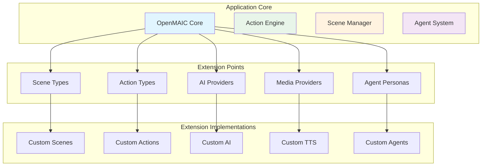
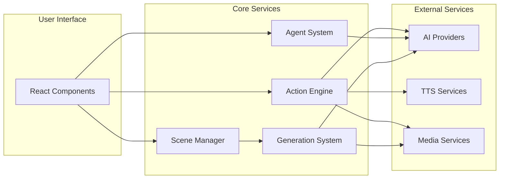

# 12. Extension Development Guide

## Table of Contents

1. [Architecture Extension Points](#1-architecture-extension-points)
2. [Step-by-Step Guides](#2-step-by-step-guides)
3. [Code Examples](#3-code-examples)
4. [Extension Diagrams](#4-extension-diagrams)
5. [Best Practices](#5-best-practices)
6. [OpenClaw Integration](#6-openclaw-integration)
7. [Contributing Guidelines](#7-contributing-guidelines)

---

## 1. Architecture Extension Points

OpenMAIC is designed with extensibility in mind. The following are the primary extension points:

### 1.1 Scene Types

OpenMAIC supports four main scene types: `slide`, `quiz`, `interactive`, and `pbl`. Adding new scene types requires:

1. Define scene content interface
2. Create scene renderer component
3. Register scene type in type system
4. Add generation logic
5. Update export handlers

### 1.2 Action Types

Actions are the mechanism for agents to interact with the presentation. Two categories:

- **Fire-and-forget**: spotlight, laser (immediate execution)
- **Synchronous**: speech, whiteboard actions (wait for completion)

### 1.3 AI Providers

The AI provider system uses a registry pattern with the Vercel AI SDK. Supported provider types:

- OpenAI-compatible
- Anthropic
- Google (Gemini)
- Custom implementations

### 1.4 Media Providers

Separate provider systems for:

- **TTS** (Text-to-Speech)
- **ASR** (Automatic Speech Recognition)
- **Image Generation**
- **Video Generation**
- **PDF Processing**

### 1.5 Agent Personas

Agent configurations include:

- Name and role
- Persona (system prompt)
- Avatar and color
- Allowed actions
- Priority settings

---

## 2. Step-by-Step Guides

### 2.1 Adding a Custom Scene Type

#### Step 1: Define Scene Type

```typescript
// lib/types/stage.ts
export type SceneType = 'slide' | 'quiz' | 'interactive' | 'pbl' | 'vr-scene';

export interface VRSceneContent {
  type: 'vr-scene';
  vrModel: string;
  interactionPoints: Array<{
    id: string;
    position: [number, number, number];
    description: string;
  }>;
  educationalContent: string;
}
```

#### Step 2: Create Renderer Component

```tsx
// components/vr-scene/VRScene.tsx
'use client';

import { Scene } from '@/lib/types/stage';

interface VRSceneProps {
  scene: Scene & { content: VRSceneContent };
  onAction?: (action: Action) => void;
}

export function VRScene({ scene, onAction }: VRSceneProps) {
  return (
    <div className="vr-scene-container">
      <VRModelViewer model={scene.content.vrModel} />
      <InteractionPoints points={scene.content.interactionPoints} />
      <EducationalContent content={scene.content.educationalContent} />
    </div>
  );
}
```

#### Step 3: Register Renderer

```typescript
// components/scene-renderers/index.ts
export const SCENE_RENDERERS: Record<SceneType, React.ComponentType<any>> = {
  slide: SlideScene,
  quiz: QuizScene,
  interactive: InteractiveScene,
  pbl: PBLScene,
  'vr-scene': VRScene,
};
```

### 2.2 Adding a Custom Action

#### Step 1: Define Action Interface

```typescript
// lib/types/action.ts
export interface VRHighlightAction extends ActionBase {
  type: 'vr_highlight';
  elementId: string;
  color?: string;
  duration?: number;
}
```

#### Step 2: Implement in Action Engine

```typescript
// lib/action/engine.ts
case 'vr_highlight':
  return this.executeVRHighlight(action as VRHighlightAction);

private async executeVRHighlight(action: VRHighlightAction): Promise<void> {
  useCanvasStore.getState().setVRHighlight(action.elementId, {
    color: action.color || '#00ff00',
    duration: action.duration || 3000,
  });

  setTimeout(() => {
    useCanvasStore.getState().clearVRHighlight(action.elementId);
  }, action.duration);
}
```

### 2.3 Integrating a New LLM Provider

#### Step 1: Register Provider

```typescript
// lib/ai/providers.ts
export const PROVIDERS: Record<ProviderId, ProviderConfig> = {
  'custom-llm': {
    id: 'custom-llm',
    name: 'Custom LLM',
    type: 'openai',
    defaultBaseUrl: 'https://api.custom-llm.com/v1',
    requiresApiKey: true,
    icon: '/logos/custom-llm.svg',
    models: [
      {
        id: 'custom-v1',
        name: 'Custom Model V1',
        contextWindow: 200000,
        outputWindow: 65536,
        capabilities: {
          streaming: true,
          tools: true,
          vision: false,
        },
      },
    ],
  },
};
```

### 2.4 Creating Custom Agent Personas

```typescript
// lib/orchestration/registry/store.ts
const customAgent: AgentConfig = {
  id: 'custom-agent',
  name: 'Custom Agent',
  role: 'Custom Role',
  persona: `You are a custom agent with specialized knowledge...`,
  avatar: '🤖',
  color: '#8B5CF6',
  allowedActions: ['wb_draw_text', 'wb_draw_shape', 'vr_highlight'],
  priority: 5,
  customFields: {
    specialty: 'Custom Domain',
    experience: 5,
  },
};
```

---

## 3. Code Examples

### 3.1 TypeScript Interfaces

```typescript
// Custom scene interface
export interface CustomScene {
  id: string;
  type: 'custom-scene';
  title: string;
  config: {
    theme: 'light' | 'dark';
    interactive: boolean;
    components: CustomComponent[];
  };
  data: CustomData;
}

// Custom action interface
export interface CustomAction extends ActionBase {
  type: 'custom_interaction';
  targetId: string;
  interactionType: 'click' | 'hover' | 'drag';
  parameters: {
    duration?: number;
    easing?: string;
  };
}
```

### 3.2 Registration Patterns

```typescript
// Provider registry
export class ProviderRegistry<T extends { id: string }> {
  private providers: Map<string, T> = new Map();

  register(provider: T): void {
    this.providers.set(provider.id, provider);
  }

  get(id: string): T | undefined {
    return this.providers.get(id);
  }
}
```

---

## 4. Extension Diagrams

### 4.1 Extension Architecture



### 4.2 Integration Points Map



---

## 5. Best Practices

### 5.1 Code Organization

```
lib/extensions/
├── custom-scene/
│   ├── types.ts
│   ├── engine.ts
│   ├── renderer.tsx
│   └── index.ts
├── custom-action/
│   ├── types.ts
│   ├── executor.ts
│   └── index.ts
└── custom-provider/
    ├── types.ts
    ├── client.ts
    └── index.ts
```

### 5.2 Type Safety

```typescript
import { z } from 'zod';

export const CustomSceneConfigSchema = z.object({
  theme: z.enum(['light', 'dark']).default('light'),
  interactive: z.boolean().default(true),
  components: z.array(z.object({
    id: z.string(),
    type: z.enum(['text', 'image', 'chart']),
  })),
});

export type CustomSceneConfig = z.infer<typeof CustomSceneConfigSchema>;
```

### 5.3 Testing Guidelines

```typescript
describe('CustomAction', () => {
  it('should execute custom action', async () => {
    const action: CustomAction = {
      id: 'test-action',
      type: 'custom_interaction',
      targetId: 'element-1',
      interactionType: 'click',
    };

    await expect(actionEngine.execute(action)).resolves.not.toThrow();
  });
});
```

---

## 6. OpenClaw Integration

### 6.1 Webhook Handler

```typescript
// api/openclaw/webhook.ts
export async function handleOpenClawWebhook(req: NextRequest) {
  const body = await req.json();
  const signature = req.headers.get('x-signature');

  if (!verifyWebhookSignature(body, signature)) {
    return new Response('Invalid signature', { status: 401 });
  }

  switch (body.event) {
    case 'message':
      await handleMessageEvent(body.data);
      break;
  }

  return new Response('OK');
}
```

### 6.2 Skill Development

```typescript
// lib/integrations/openclaw/skills.ts
export interface OpenClawSkill {
  id: string;
  name: string;
  triggers: string[];
  execute: (context: SkillContext) => Promise<SkillResult>;
}

export const navigationSkill: OpenClawSkill = {
  id: 'next-scene',
  name: 'Next Scene',
  triggers: ['next', 'forward', '下一个'],
  execute: async (context) => {
    return {
      success: true,
      actions: [{ type: 'navigate', direction: 'next' }],
    };
  },
};
```

---

## 7. Contributing Guidelines

### 7.1 Code Style

```typescript
// Use PascalCase for interfaces
interface UserProfile {
  id: string;
  name: string;
}

// Use camelCase for variables
const getUserProfile = (id: string): UserProfile => {
  // Implementation
};

// Use UPPER_SNAKE_CASE for constants
const MAX_RETRY_ATTEMPTS = 3;
```

### 7.2 Pull Request Process

**PR Checklist**:
- [ ] Feature/branch is up to date with main
- [ ] All tests pass
- [ ] Code follows style guide
- [ ] Documentation is updated

### 7.3 Feature Proposal Template

```markdown
# Feature Proposal

## Problem Statement
Describe the problem this feature solves.

## Proposed Solution
Describe the solution and how it addresses the problem.

## Implementation Plan
### High-Level Architecture
- Describe the architecture
- List components involved
- Integration points

## Impact Assessment
### Positive Impact
- Improves user experience
- Increases functionality

### Potential Issues
- Breaking changes
- Performance implications
```

---

This extension development guide provides everything needed to extend OpenMAIC with custom features, from architecture understanding to implementation best practices.
